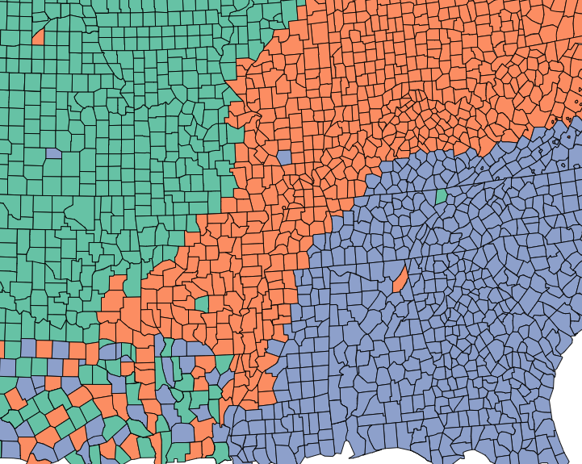

# Spatial autocorrelation

```{r 04-spatial-distribution-qual-data, echo=FALSE, fig.align='center', out.width='80%', fig.cap='Spatial distribution of qualitative data taken from the [Colorbrewer 2.0 website](https://colorbrewer2.org/#type=qualitative&scheme=Set2&n=3).'}

```

This week, we focus on the first of two key properties of spatial data: spatial dependence. Spatial dependence is the idea, as introduced in the first week via Tobler’s Law (1970), that the observed value of a variable in one location is often dependent (to some degree) on the observed value of the same value in a nearby location. For spatial analysis, this dependence can be assessed and measured statistically by considering the level of spatial autocorrelation between values of a specific variable, observed in either different locations or between pairs of variables observed at the same location. Spatial autocorrelation occurs when these values are not independent of one another and instead cluster together across geographic space. A critical first step of spatial autocorrelation is to define the criteria under which a spatial unit (e.g. an areal or point unit) can be understood as a "neighbor" to another unit. As highlighted in the previous week, spatial properties can often take on several meanings, and as a result, have an impact on the validity and accuracy of spatial analysis. This multiplicity also can be applied to the concept of spatial neighbours which can be defined through adjacency, contiguity or distance-based measures. As the specification of these criteria can impact the results, the definition followed therefore need to be grounded in particular theory that aims to represent the process and variable investigated. 

This week looks at spatial dependence and autocorrelation in detail, focusing on the different methods of assessment. As part of this, we look at the multiple methods to defining spatial neighbours and their suitability of use across different spatial phenomena – and how this approach is used to generate spatial weights for use within these spatial autocorrelation methods as well as their potential to generate spatially-explicit variables. 

We put these learnings into practice through an analysis of spatial dependence of our areal crime data from Week 2, experimenting with the deployment of different neighbours and the impact of their analyses. For this practical we will look at the distribution of thefts from persons in the borough of Camden, home of the main UCL Campus, and birthplace of [Alfie Long](https://github.com/aclong) (statue forthcoming).

## Neighbours
If we want to come up with quantifiable descriptions of variables and how they vary over space, then we need to find ways of quantifying the distance from point to point. When you attach values to the polygons of wards in London, and visualise them, different patterns appear, and the different shapes and sizes of the polygons effect what these patterns look like. There can appear to be clusters, or the distribution can be random. If you want to explain and discuss variables, the underlying causes, and the possible solutions to issues, it becomes useful to quantify how clustered, or at the opposite end, how random these distributions are. This issue is known as spatial autocorrelation.

> "Things are more like things that are closer to them."
 - Tobler(ish)

In raster data, variables are measured at regular spatial intervals (or interpolated to be represented as such). Each measurement is regularly spaced from its neighbours, like the pixels on the screen you are reading this from.

With vector data, the distance of measurement to measurement, and the size and shape of the "pixel" of measurement becomes part of the captured information. Whilst this can allow for more nuanced representations of spatial phenomena, it also means that the quantity and type of distance between measurements needs to be acknowledged. Quantify the relationship of "neighbour" allows this to be done systematically. 

If you want to calculate the relative spatial relation of distributions, knowledge of what counts as a "neighbour" becomes useful. Neighbours can be neighbours due to euclidean distance (distance in space), or they can be due to shares relationships, like a shared boundary, or they can simply be the nearest neighbour, if there aren't many other vectors around. Depending on the variable you are measuring the appropriateness of neighbourhood calculation techniques can change.

### Setting up the environment

To begin let's load the libraries needed for this practical.

``` {r 04-a-loading-in-libraries, warning=FALSE}

# for spatial objects and operations
library(sf)

# for finding nearest neighbours in sf objects
library(nngeo)

# for reading and quantifying data
library(data.table)

# for visualising spatial data
library(tmap)

```

Download the data and put it in a folder we can find. We will use the same structure as the data directory from the previous week. If you are using the same directory for this weeks work then you can put these files in the same directories. If not make new ones with names that work. Alternatively you can make your own structure and use that. 

To follow along with the code as it is and not edit the file paths there should be a folder called "raw/" in your project working directory, if not best to make one. Inside this create a folder called "crime". You can download the crime data we will be working with from [here](https://julie.geog.ucl.ac.uk/~aclong/psa-course-data/raw/crime/2019_camden_theft_from_person.csv) and put it in the crime folder. 

Inside the "raw" directory there should be a directory called "administrative_boundaries". In here make a folder called "camden_oas_2011/". You can download the shape data we will be using from [here](https://julie.geog.ucl.ac.uk/~aclong/psa-course-data/raw/administrative_boundaries/camden_oas_2011/).

To check that you have all the files you need have a look at what's in these directories. We can create variables that hold a text version of the filepath, you can edit these to contain the filepath of your own copy of the data.

``` {r 04-aa-listing-files}

# make the filepath objects
shapefile_dir_path <- "raw/boundaries/camden_oas_2011/"
crime_data_dir_path <- "raw/crime/"

# we can use list.files() with the direcotry names to find their contents
# check for the files within these folders
list.files(shapefile_dir_path)
list.files(crime_data_dir_path)

# then we can assign the filenames to variables as well
shapefile_name <- "OAs_camden_2011.shp"
crimedata_filename <- "2019_camden_theft_from_person.csv"

# you can use paste0() to add these together as complete filepaths
paste0(shapefile_dir_path, shapefile_name)
paste0(crime_data_dir_path, crimedata_filename)

```

Now we know the data is there we can load and plot the shape data.

Plot the output areas of the borough Camden.

``` {r 04-b-plotting-camden-OAs}

# first read in the data
camden_oas <- st_read(paste0(shapefile_dir_path, shapefile_name), 
                      # the filename of the shapefile
                      crs=27700
                      # the projection information of the shape
                      # as we know it is in British National Grid
                      )

# plot it to have a look
plot(st_geometry(camden_oas))

```

You can see how one of these output areas could have many more neighbours than others, they vary a great deal in size and shape. The dimensions of these objects change over space, as a result the measurements within them must change too.

Output areas are designed to convey and contain census information, so they are created in a way that maintains a similar number of residents in each one. The more sparsely populated an OA the larger it is. Output Areas are designed to cover the entirety of the land of England and Wales so they stretch over places where there are no people. In the north of Camden the largest Ouput Areas span over Hampstead Heath, a large park.

Let's explore how to find different kinds of neighbours using the example of one randomly selected output area.

``` {r 04-c-highlighting-one-oa}

# we have randomly selected one OA "E00004174", the OA containing the UCL main campus 
# and coincidentally also the birthplace of Alfie Long (statue forthcoming)

# highlight it in a map using tmap
tm_shape(camden_oas) +
  tm_borders(col="black") +
  tm_shape(camden_oas[camden_oas$OA11CD=="E00004174",]) +
  tm_fill(col = "red")

```

### Euclidean neighbours

The first way we are going to call something a neighbour is by using Euclidean distance. As our OA shapefile is projected in BNG (British National Grid), the coordinates are planar, going up 1 is the same distance as going sideways 1. Even better the coordinates are in metric measurements so it's easy to make up heuristic distances. 

Let's call every output area with a centroid 500m or less away from the centroid of our chosen OA a neighbour.

``` {r 04-d-euclidean-distance-neighbour, warning=FALSE}

# make a variable for our chosen output area so that we could change 
# it and all the other code could remain the same
chosen_oa <- "E00004174"

# find only nearest neighbours to our chosen output area centroid, find all within 500 meters
# select only the the centroid of our chosen output area and all other areas (with st_centroid)
# we set the maximum number of neighbours we want to find to "50" (with parameter k)
# we set the maximum distance of calling an OA centroid a neigbour to "500" (with parameter maxdist)
# we return a sparse matrix that tells us whether each OA is a neighbour or not (with parameter sparse)
chosen_oa_neighbours <- st_nn(st_geometry(st_centroid(camden_oas[camden_oas$OA11CD==chosen_oa,])), 
                              st_geometry(st_centroid(camden_oas)),
                              sparse = TRUE,
                              k = 50,
                              maxdist = 500) 

# see the output
class(chosen_oa_neighbours)

# this is a list object that contains the row number of all the found numbers
# you can access the pure vector of these numbers by using [[1]] notation
# this can then be used to subset the OA output areas object

# get the names (codes) of these neighbours
neighbour_names <- camden_oas[chosen_oa_neighbours[[1]],]
neighbour_names <- neighbour_names$OA11CD

# plot the borough OA outlines in black with 
# the chosen oa filled in red and 
# the neighbours in green

tm_shape(camden_oas) + 
  tm_borders() +
  # highlight only the neighbours
  tm_shape(camden_oas[camden_oas$OA11CD %in% neighbour_names,]) + 
  tm_fill(col = "green") +
  # highlight only the chosen OA
  tm_shape(camden_oas[camden_oas$OA11CD==chosen_oa,]) + 
  tm_fill(col = "red") +
  tm_shape(camden_oas) + 
  # overlay the borders
  tm_borders(col="black")


```

### Shared boundary neighbours

The next way of calculating neighbours takes into account the actual shape and location of the polygons in our shapefile.

This has only recently been added to the world of `sf()`, previously we would have reverted to using the `sp()` package and others that depend on it such as `spdep()`.

I've actually taken this bit of code from an issue raised in the Git repository of the sf package. You can look at it [here](https://github.com/r-spatial/sf/issues/234#issuecomment-299013710).

We create functions that check whether any polygons share boundaries or overlap one another, and then also check by how much. These new functions are based on the `st_relate()` function.

The different cases of these are known as queen, and rook. These describe the relations in a similar way to the possible chess board movements of these pieces. 

``` {r 04-e-shared-boundary-neighbour-function-creation}

# for rook case
st_rook = function(a, b = a) st_relate(a, b, pattern = "F***1****")

# for queen case
st_queen <- function(a, b = a) st_relate(a, b, pattern = "F***T****")

# these methods are now in the documetation for st_relate()
# have a look in the examples at the bottom of the documentation

```

Now that we've created the functions lets try them out.

``` {r 04-f-shared-boundary-neighbour-example}

# let's use the same example oa as previously
# you can check that it exists and if not assign the variable again
if(exists("chosen_oa")==TRUE)
  {
  
  print(paste0("You have already selected ",chosen_oa))

  }else{
  chosen_oa <- "E00004174"
  
  print("You have not yet assigned the variable chosen_oa in this session. You have now been assigned E00004174, home of the main UCL campus and birthplace of Alfie Long (statue forthcoming).")
  
  }

# the neighbourhood assigning works in a very similar way to the way st_nn() works
# this way we will return a sparse list for the row numbers that are neighbours 
# and use that to subset the oa shapefile
chosen_oa_neighbours <- st_rook(st_geometry(camden_oas[camden_oas$OA11CD==chosen_oa,]), 
                                st_geometry(camden_oas))

# get the names of neighbours
# get the names (codes) of these neighbours
neighbour_names <- camden_oas[chosen_oa_neighbours[[1]],]
neighbour_names <- neighbour_names$OA11CD

# plot the borough OA outlines in black with 
# the chosen oa filled in red and 
# the neighbours in green

tm_shape(camden_oas) + 
  tm_borders() +
  # highlight only the neighbours
  tm_shape(camden_oas[camden_oas$OA11CD %in% neighbour_names,]) + 
  tm_fill(col = "green") +
  tm_shape(camden_oas[camden_oas$OA11CD==chosen_oa,]) + 
  # highlight only the chosen OA
  tm_fill(col = "red") +
  tm_shape(camden_oas) + 
  # overlay the borders
  tm_borders(col="black")

```

Because the tolerance of the shared boundaries in the st_rook pattern and the st_queen pattern in the example I have chosen they both assign the same neighbours. This is true for many non-square polygons as the difference is often given as whether two shapes share one or more points. Therefore the difference can have more to do with the resolution and alignment of your polygons than the actual spatial properties they represent.

They can and do find different neighbours in other situations. Follow the grid example in the `st_relate()` documentation if you want to see it working.

## Quantifying difference over space

Now that we have found the different ways of finding neighbours we can consider how they relate to one another.

There are two ways of looking at spatial autocorrelation:
 
 - **Local:** This is the difference between an area and its neighbours. You would expect neighbours to be similar, but you can find exceptional places and results by seeing if places are quantifiably mor like or dislike their neighbours than the average other place. 
  
 - **Global:** This is a way of creating a metric of how regularly or irregularly clustered the variables are over the entire area studied.

But before we start that let's get into the data we are going to use!

### Our property is theft.

We'll be using personal theft data from around camden. Our neighbourhood analysis of spatial autocorrelation should allow us to quantify the pattern of distribution of reported theft from persons in Camden in 2019.

``` {r 04-g-loading-in-crime-data}

# read in the data
camden_theft <- fread("raw/crime/2019_camden_theft_from_person.csv")

# this is a csv, and the coordinates are in columns called "X" and "Y"
# you can convert this into an sf object quite easily
camden_theft <- st_as_sf(camden_theft, coords = c("X", "Y"),
                         crs = 27700)

# have a look at these points
plot(camden_theft)

```

This is point data, but we are interested in the polygons and how this data relates to the administrative boundaries it is within.

Let's count the number of thefts in each OA. This is a spatial operation that is often called "point in polygon". As we are just counting the number of occurences in each polygon it is quite easy. In the future you may often want to aggregate over points for an area, or in reverse assign values from the polygon to the points.

``` {r 04-h-point-in-polygon}

# this code counts the lengths (number) of points that intersect each polygon
# let's add a new column to our OA sf object called n_thefts to store this
camden_oas$n_thefts <- lengths(st_intersects(camden_oas, camden_theft))

# plot a quick map of it
tm_shape(camden_oas) +
  tm_fill(col="n_thefts")

# you can see our map is massively skewed by central london
# meaning that the results in central london (the south of camden) 
# are so much larger than those in the north that it makes it harder
# to see the smaller differences between other areas
# try taking the square root of the number of thefts
# (there are 0s in data so log would return some negatives)
camden_oas$sqrt_n_thefts <- sqrt(camden_oas$n_thefts)

# plot a quick map of it
tm_shape(camden_oas) +
  tm_fill(col="sqrt_n_thefts")

# there: a much more nuanced picture

```

### Global Moran's I

With a global Moran's I we can test how "random" the spatial distribution of these values is. Global Moran's I is a metric between -1 and 1. -1 is a completely even spatial distribution of values, 0 is a "random" distribution, and 1 is a "non-random" distribution of clearly defined clusters.

To calculate the global Moran's I you need an adjacency matrix that contains the information of whether or not an OA is next to another, for an even more nuanced view you can include distance, or a distance weighting in the matrix rather than just the TRUE or FALSE, to take into account the strength of the nieghbourhoodness.

I will revisit the neighbourhood calculation used earlier then develop it from a one to all to an all to all computation. 

``` {r 04-i-global-autocorrelation-single-comparison, warning=FALSE}
# here is the previous way of calculating neighbourhoodness for our chosen OA
# but now we will add an extra argument that states we want a non-sparse adjacency matrix returned

# find only nearest neighbours to our chosen output area centroid, find all within 500 meters
# select only the the centroid of our chosen output area and all other areas (with st_centroid)
# we set the maximum number of neighbours we want to find to "50" (with parameter k)
# we set the maximum distance of calling an OA centroid a neigbour to "500" (with parameter maxdist)
# we return a non-sparse matrix that tells us whether each OA is a neighbour or not (with parameter sparse)
chosen_oa_neighbours <- st_nn(st_geometry(st_centroid(camden_oas[camden_oas$OA11CD==chosen_oa,])), 
                              st_geometry(st_centroid(camden_oas)),
                              sparse = FALSE,
                              k=50,
                              maxdist = 500) 

# check the object type
class(chosen_oa_neighbours)

# this single row matrix contains a true or false for each OA in the OA sf object indicating whether it is true or false
# if you sum() it it counts the number of TRUEs in it
sum(chosen_oa_neighbours)

```

Because of the way Moran's I functions in R it is necessary to use `sp()` and `spdep()`.

So load them in.


``` {r 04-j-load-sp-spdep, warning=FALSE}

# for doing spatial operations (now mostly superseded by sf)
library(sp)

# for our neighbourhood and Moran's I analysis
library(spdep)

```

As you will see these methods and functions have quite esoteric and complicated syntax.

Some of the operations they will do will be similar to the examples shown earlier, but the way they assign and store variables makes it much quicker to run complex spatial operations.

``` {r 04-k-converting-to-sp}

# check the current class
class(camden_oas)

# convert it to sp
camden_oas_sp <- as_Spatial(camden_oas, IDs=camden_oas$OA11CD)

# check the class of the new object
class(camden_oas_sp)

```

Now we can make the esoteric and timesaving "nb" object!

``` {r 04-l-nb-time}

# make the nb
camden_oas_nb <- poly2nb(camden_oas_sp, row.names=camden_oas_sp$OA11CD)

# what kind of object is it?
class(camden_oas_nb)

# have a look inside
str(camden_oas_nb,list.len=10)

```

It's basically the same as the sparse list of neighbours that we created before using `st_nn()` and `st_rook()`. Now, however it will work with the `spdep()` ecosystem of functions.

If you look at the output you can see that it automatically uses "queen" case.

``` {r 04-m-nb-to-matrix}

# further into the sp rabbit hole we can now create a matrix from this (like the non-sparse output of the st_nn/st_rook processes)
camden_oas_nb_mat <- nb2mat(camden_oas_nb, style='B')

# check the sum of one columnd
sum(camden_oas_nb_mat[1,])

# where nb2mat() extends this is in allowing weighting
camden_oas_nb_mat <- nb2mat(camden_oas_nb, style='W')

# check the sum of one column
sum(camden_oas_nb_mat[1,])

```

Now the sum of one row instead of being the total number of neighbours for that OA instead adds up to 1. This is important for the calculation of Moran's I, as the metric is designed to return a values between -1 and 1. If the neghbour relations are not limited to add up to one the value for Moran's I can exceed -1 and 1, and it loses meaning when compared against other cases.

Now we need to calculate a separate weights list object to use for the Moran's I calculation.

``` {r 04-n-list-weights-object}

# create the list weights object
nb_weights_list <- nb2listw(camden_oas_nb, style='B')

# have a look at the class
class(nb_weights_list)
# so it's nb AND weights

# now use that to create a quick Moran's I
moran(camden_oas_sp$n_thefts, 
      nb_weights_list, 
      n=length(nb_weights_list$neighbours), 
      S0=Szero(nb_weights_list))

```

On the scale of -1 to 1 where does it sit?

This is just a quick way to check the score. To do so properly you need to check between a randomly distributed version of the variables, and the variables as they are.

To do so you need to use the MonteCarlo method where you actually carry this out. You can specify how many times it does this to increase precision.

``` {r 04-o-monte-carlo-moran}

# run it 599 times
mc_model <- moran.mc(camden_oas_sp$n_thefts, nb_weights_list, nsim=599)

# what do we get?
mc_model

```

This model shows that our distribution of thefts differs significantly from a random distribution.

### Local Moran's I

With a measurement of local spatial autocorrelation we could find hotspots of theft that are surrounded by areas of much lower theft. According to the previous global statistic these are not randomly distributed pockets but would be outliers against the general trend of clusteredness!

These could be areas that contain very specific locations, where interventions could be made that drastically reduce the rate of crime rather than other areas where there is a high level of ambient crime.

``` {r 04-p-local-spatial-autocorrelation}

# you need the nb object and the nb and weights list
# make the nb
camden_oas_nb <- poly2nb(camden_oas_sp, row.names=camden_oas_sp$OA11CD)

# create the list weights object
# but importantly with the row stadardisation this time
nb_weights_list <- nb2listw(camden_oas_nb, style='W')

# use the localmoran() function
local_moran_camden_oa_theft <- localmoran(camden_oas_sp$n_thefts, nb_weights_list)

```

To properly utilise these local statistics and make in intuitively useful map we need to combine them with our crime count variable.

Because of the way the new variable will be calculated we need to rescale our variable so that the mean is 0. this means that the lowest values will be -ve and the highest +ve. The distribution and the relationship between the will be preserved though.

``` {r 04-q-rescale}

# rescale that variable!
camden_oas_sp$scale_n_thefts <- scale(camden_oas_sp$n_thefts)

```

To compare against its neighbours we need to create a new column that carries information about the neighbours.

This is called a spatial lag function! What fun!

The "lag" just refers to the fact you are comparing one observation against another, this can be used between timed observations. In this case, the "lag" we are looking at is between neighbours.

``` {r 04-r-spatial-lag}

# create a spatial lag variable and save it to a new column
camden_oas_sp$lag_scale_n_thefts <- lag.listw(nb_weights_list, camden_oas_sp$scale_n_thefts)

```

Now we have used sp for all it is worth it's time to head back to the safety of `sf()`!

``` {r 04-s-back-to-sf}

# convert to sf
camden_oas_moran_stats <- st_as_sf(camden_oas_sp)

```

To make a human readable version of the map we will generate some labels for our findings from the Local Moran's I stats.

This process calculates what the value of each polygon is compared to its neighbours and works out if they are similar or dissimilar and in which way, then gives them a text label to describe the relationship.

I the text label, the first term describes the area being focused on and the second represents that areas neighbours.

``` {r 04-t-conditional-labelling}

# run all of these through to assign variables

# for the statistical significance version assign a level 
# of statistical significance for the p value, column 5 of the local moran model
sig_level <- 0.1

# version with significance value
camden_oas_moran_stats$quad_sig <- ifelse(camden_oas_moran_stats$scale_n_thefts > 0 & 
                                          camden_oas_moran_stats$lag_scale_n_thefts > 0 & 
                                          local_moran_camden_oa_theft[,5] <= sig_level, 
                                          "high-high", 
                                   ifelse(camden_oas_moran_stats$scale_n_thefts <= 0 & 
                                          camden_oas_moran_stats$lag_scale_n_thefts <= 0 & 
                                          local_moran_camden_oa_theft[,5] <= sig_level, 
                                          "low-low", 
                                   ifelse(camden_oas_moran_stats$scale_n_thefts > 0 & 
                                          camden_oas_moran_stats$lag_scale_n_thefts <= 0 & 
                                          local_moran_camden_oa_theft[,5] <= sig_level, 
                                          "high-low", 
                                   ifelse(camden_oas_moran_stats$scale_n_thefts <= 0 & 
                                          camden_oas_moran_stats$lag_scale_n_thefts > 0 & 
                                          local_moran_camden_oa_theft[,5] <= sig_level, 
                                          "low-high",
                                   ifelse(local_moran_camden_oa_theft[,5] > sig_level, 
                                          "not-significant", 
                                          "not-significant")))))

# version without significance check
camden_oas_moran_stats$quad_non_sig <- ifelse(camden_oas_moran_stats$scale_n_thefts > 0 & 
                                              camden_oas_moran_stats$lag_scale_n_thefts > 0, 
                                              "high-high", 
                                       ifelse(camden_oas_moran_stats$scale_n_thefts <= 0 & 
                                              camden_oas_moran_stats$lag_scale_n_thefts <= 0, 
                                              "low-low", 
                                       ifelse(camden_oas_moran_stats$scale_n_thefts > 0 & 
                                              camden_oas_moran_stats$lag_scale_n_thefts <= 0, 
                                              "high-low", 
                                       ifelse(camden_oas_moran_stats$scale_n_thefts <= 0 & 
                                              camden_oas_moran_stats$lag_scale_n_thefts > 0,
                                              "low-high",NA))))

```

Now that the horrible looking conditional is finished we can see what we did.

To understand how this is working we can look at the data non-spatially. As we recentred the data, our axes should split the data neatly into their different area vs spatial lag relationship categories.

To do this plot we will need to use the plotting package `ggplot2`.

``` {r 04-t-ggplot-loading}

library(ggplot2)

```

Let's make the scatterplot using the scaled number of thefts for the areas in the x axis and their spatially lagged results in the y axis.

``` {r 04-v-plotting-quadrants-scatter}

# plot the results without the satistical significance
ggplot(camden_oas_moran_stats, aes(x = scale_n_thefts, 
                                   y = lag_scale_n_thefts, 
                                   color = quad_non_sig)) +
  geom_vline(xintercept = 0) + # plot vertical line
  geom_hline(yintercept = 0) + # plot horizontal line
  xlab("Scaled Thefts (n)") +
  ylab("Lagged Scaled Thefts (n)") +
  labs(colour="Relative to neighbours") +
  geom_point()

# plot the results nnw with the satistical significance
ggplot(camden_oas_moran_stats, aes(x = scale_n_thefts, 
                                   y = lag_scale_n_thefts, 
                                   color = quad_sig)) +
  geom_vline(xintercept = 0) + # plot vertical line
  geom_hline(yintercept = 0) + # plot horizontal line
  xlab("Scaled Thefts (n)") +
  ylab("Lagged Scaled Thefts (n)") +
  labs(colour="Relative to neighbours") +
  geom_point()

```

Now let's see how they are arranged spatially.

``` {r 04-s-mapping-local-moran}

# map all of the results here
tm_shape(camden_oas_moran_stats) +
  tm_fill(col = "quad_non_sig")

# map only the statistically significant results here
tm_shape(camden_oas_moran_stats) +
  tm_fill(col = "quad_sig")


```

As our data are so spatially clustered we can't see any outlier places (once we have ignored the non-significant results. This suggests that the pattern of theft from persons is not highly concentrated in very small areas or particular Output Areas, and instead is spread on a larger scale than we have used here.

To go further than we have today it would be possibe to run the exact same code but using a larger scale, perhaps LSOA, or Ward, and compare how this changes the Moran's I statistics globally and locally.

Or, to gain statistical significance in looking at the difference between areas getting more data perhaps over a longer timescale, where there are less areas with 0 thefts.

