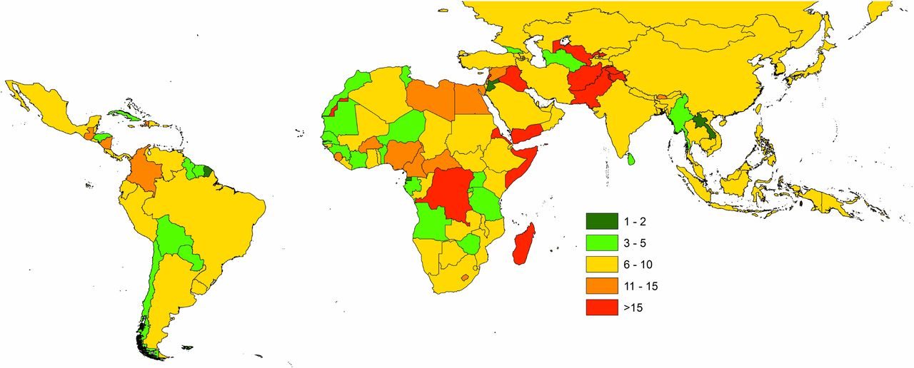
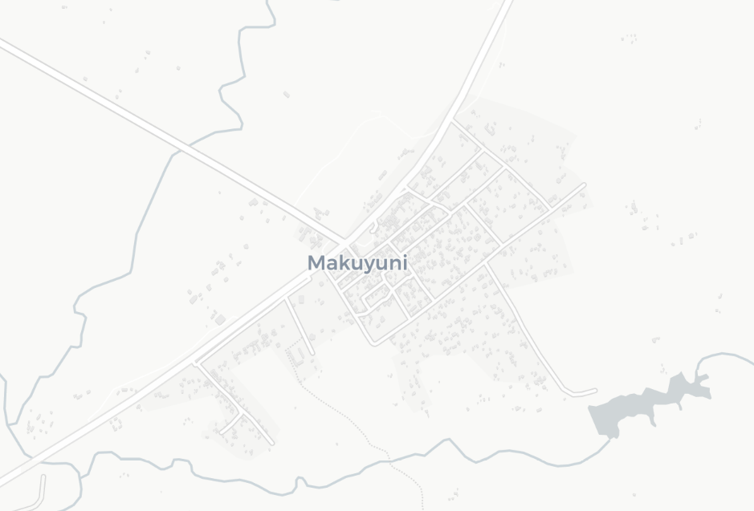
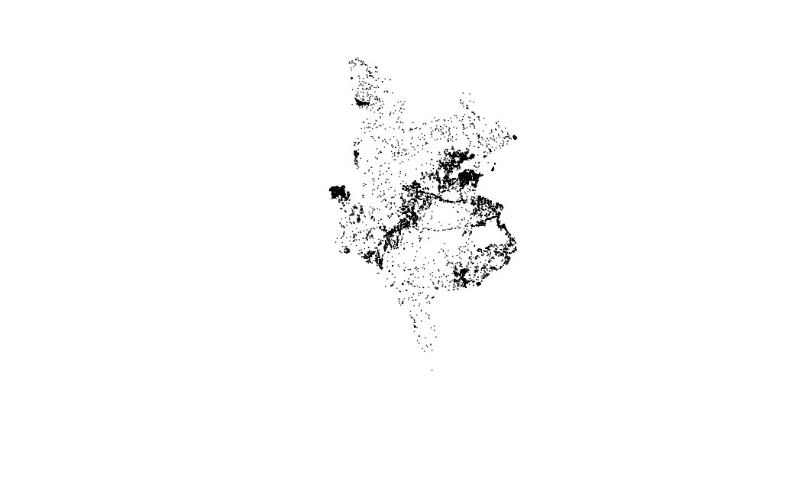
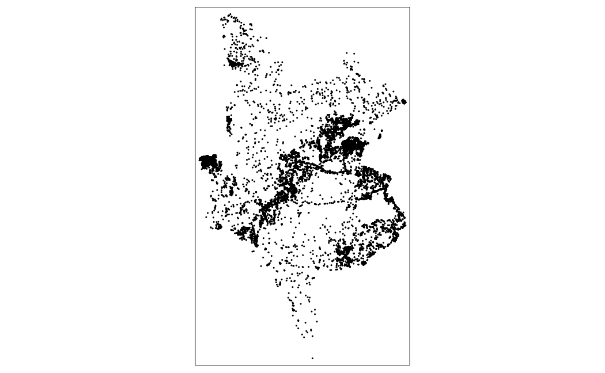
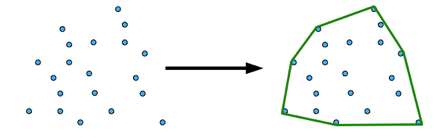

# Spatial analysis for urban (mapping) applications      

## Introduction {#introduction_w08}
For the next few weeks, we'll be looking at how you can use spatial analysis for different types of applications within geographic and social data science-oriented research, from urban mapping, to marketing and transport planning.

This week, we will focus on how spatial analysis is being used within urban mapping applications, particularly to help create new spatial mapping data.

To understand the context behind these applications and how they have emerged as an area of research, we actually need to look first at the wider sector of 'Data For Good'(also known as 'Data For Development'). 

The first part of this week's content therefore introduces you to the 'Data For Good' sector and how different types of spatial analysis are being used within the sector to create new datasets that can be utilised within sustainable developement and humanitarian applications. We will look at the different datasets concerned with population distribution and demographics, mobility and movement and social connectivity, and look at the spatial analysis techniques used to create them.

We then focus on the use of cluster analysis and a specific Point Pattern Analysis tecnhique (/algorithm) known as **DB-Scan** and look at how it is being used for innovative research within urban mapping applications. We will then deploy DB-Scan on a building data subset from the Tanzanian building dataset created by Microsoft in an attempt to detect and delineate our own settlement outlines within the dataset. 

Our seminar will discuss the advantages of spatial analysis for the 'Data For Good' sector, reflecting on the lecture and practical content. 

This week is structured by **4** short lecture videos, **2** assignments ( [assignment 1](#assignment_1_w08) / [assignment 2](#assignment_2_w08) ) that you need to do in preparation for Friday's seminar, and the practical material. As always, this [week's reading list](https://rl.talis.com/3/ucl/lists/3FB0C66A-F603-A402-A31C-28F2DA091AB6.html?lang=en-gb&login=1) is available on the UCL library reading list page for the course.

### Video: Overview {#overview_w08}
```{r 08-short-lecture-welcome, warnings=FALSE, message=FALSE, echo=FALSE}
library(vembedr)
embed_msstream('e2c33395-e3ca-44ee-b39e-69c3c74c77a5') %>% use_align('left')
```
[Lecture slides] [[Watch on MS stream](https://web.microsoftstream.com/video/e2c33395-e3ca-44ee-b39e-69c3c74c77a5)]

## Data for good: the need for data within sustainable development and humanitarian applications
Both the sustainable development and the humanitarian sectors lack comprehensive, globally applicable and up-to-date data. For example, five years after their launch, only 28% of the global data needed to monitor the SDGs is currently available ([UN Women, 2019](https://twitter.com/UN_Women/status/1186138804446470146)). This lack of data is primarily caused by the financial and logistical challenges faced with collecting data at large scales that can capture individual level socio-economic demographics. These types of data are usually collected on the ground, through censuses and household surveys, however these methods are often expensive or highly time-consuming to conduct and as a result are either scarce (either non-existent or difficult to obtain) or sparse (limited in their temporal or spatial coverage).

In some cases, the data does exist but are collected or held privately by commercial data collection agencies, governments, businesses or non-governmental organisations (NGOs). Whilst some of these datasets can be accessed at a price, it can also simply be the case that the data have ended up existing in what is known as a ‘data silo’, i.e., in a location where it is inaccessible to others, such as stored on a single computer hard drive. Finally, in some countries, even the most basic demographic and geographic data can be missing key groups or areas, inaccurate, incomplete or obsolete (outdated). Many countries have not had a recent census (see image below), whilst long delays between their enumeration and data release question their accuracy. 

```{r 08-figure-wardrop-data, echo=FALSE, fig.align='center', fig.cap='At the beginning of 2017, the number of years since the last national census in countries across Latin America, Africa, and Asia. [Wardrop et al, 2018](https://www.pnas.org/content/115/14/3529).'}

```

With poor quality data affecting high profile development efforts, those working within sustainable development are looking towards the analysis of novel datasets as well as the use of innovative methodologies to address this data scarcity and sparsity. 

In terms of data, imagery from satellites and Unmanned Aerial Vehicles (UAVs), as well as the metadata derived from the use of everyday digital technologies (e.g., mobile phones, credit cards, travel passes) and online social network data (e.g., Twitter, Facebook) have been identified as potential sources of data and information on human characteristics and behaviour that could be used to provide a better understanding of global sustainable development and new insights into variations in the vulnerability of societies. 

Their use is part of what the UN identifies as a ‘data revolution’, which aims to ensure everybody is accounted for, and uses data that reduces the invisibility of those most vulnerable as well as reduce the inequalities that are generated by having unequal data access and coverage ([UN Data Revolution Group, 2014](https://www.undatarevolution.org/wp-content/uploads/2014/12/A-World-That-Counts2.pdf)).

This optimism in the use of these novel datasets is enabled by the majority having a spatial component to them; the data can be mapped and spatially analysed as well as integrated with other datasets to derive further insights. Many of the datasets are also recent, frequently updated and in some cases openly accessible (e.g., certain types of satellite imagery and Twitter data); they are also available over significant spatial scales, as well as at fine spatial resolutions (e.g., individual level generated data, high resolution aerial imagery). These datasets therefore have significant advantages for use within many sustainable development relevant applications, including but not limited to: estimating poverty levels; studying the migration patterns resulting from climate stresses, predicting food insecurity, and determining the greatest influencers in the spread of disease.

Alternatively, there are many researchers and practitioners with the sectors that are focusing on innovative methodologies, from machine learning and intensive computational statistical methods (such as Bayesian modelling), alongside crowd-sourcing and citizen science approaches to create new datasets that can be used as part of this revolution.

One example of the latter is the use of OpenStreetMap by the Humanitarian OpenStreetMap Team (HOT) and The Missing Maps Project (TMMP) to create spatial data, such as buildings, roads and Points Of Interest (POIs) in areas and countries where this data does not exist in response to a shock or disaster (HOT) or pre-emptively for those areas considered most vulnerable or in need (TMMP). Spatial or 'mapping' data can tell us much about an area, such as its likely population as well as urban development and 'socio-economic profile' (and corresponding issues such as overcrowding) as well as provide the most basic of geographical information: where is X resource or how to get to somewhere from another place.

Whether creating data about human characteristics and behaviour or the geographical features within a country or region, the processes behind the creation of these new datasets often rely on the principles and techniques of spatial analysis, as we will see in today's lectures and practical. 

### Video: What are the Sustainable Development Goals and why are they important to us as Spatial Data Scientists?
The first lecture this week provides an introduction to the Sustainable Development Goals (SDGs). It outlines the 17 goals and their targets, as well as why data is essential for their achievement and success.

```{r 08-short-lecture-good-data, warnings=FALSE, message=FALSE, echo=FALSE}
library(vembedr)
embed_msstream('e3e47127-726b-448e-80e4-f13f3ca5bbaf') %>% use_align('left')
```
[[Lecture slides](https://liveuclac-my.sharepoint.com/:b:/g/personal/ucfailk_ucl_ac_uk/EZ3yaPmBE3dHrIOj3rhne0MB9jtr0RB7trQ6RKUQJL_reQ?e=DRD5mL)] [[Watch on MS stream](https://web.microsoftstream.com/video/e3e47127-726b-448e-80e4-f13f3ca5bbaf)]

### Data For Good sector and resulting datasets
Addressing data scarcity and sparsity across our world is therefore essential to help with the implementation,  monitoring and tracking of the SDGs. As part of this drive for data for the SDGs and the UN's 'data revolution', the Data for Good sector has emerged as an area of research, development and application for many different types of stakeholders and contributors to solve these challenges.

As explained in the following lecture, at the core of this sector are many of the datasets and capacities that we, as Spatial Data Scientists, use and possess - and thus present us with sigficant opportunity to be part of the Data for Good community:

### Video: What is the Data for Good sector?
```{r 08-short-lecture-data-good-sector, warnings=FALSE, message=FALSE, echo=FALSE}
library(vembedr)
embed_msstream('44073536-4026-423b-b3bb-26a060a2efed') %>% use_align('left')
```
[[Lecture slides](https://liveuclac-my.sharepoint.com/:b:/g/personal/ucfailk_ucl_ac_uk/EQTD6gfo3LhIqYfksk6XjHYBKPgwv_DOG0PINzFogrcVjg?e=vRbujA)] [[Watch on MS stream](https://web.microsoftstream.com/video/44073536-4026-423b-b3bb-26a060a2efed)]

As you can see from the last slide of the lecture, the Data For Good (or 'Data For Development') sector has garnered a significant amount of interest from a range of stakeholders and contributors. From the UN and its respective agencies, such as the UN's Global Pulse and World Food Programme (WFP), to academic research projects, such as the University of Southampton's WorldPop and MIT's Solve, to privately funded organisations such as the Clinton Health Access Initiative and the Gates Foundation, as well as technology companies, such as Facebook and Microsoft and collaborative initiatives such as the Data-Pop Alliance, there are many actors involved in working towards creating these datasets to enable more efficient and effective programming. *(These are just a few we've come across and can write down here, but if you're looking for a career in DFG, there are plenty more than this short list!)*

Across these stakeholders and the Data For Good sector, the main types of spatial datasets that are primarily pursued for creation include:

* Overall population distribution
* Demographic distribution across populations (e.g. age, gender)
* Socio-economic characteristics(e.g. poverty, income, education, literacy rate)
* Building, settlement and road information
* Point of Interest information (e.g. location of hospitals, schools, etc,)
* Land Use

These datasets can be used by the various development and humanitarian agencies and organisations within the sector to plan and implement their respective programming as well as be used within more general indicators to track the progress of the SDGs over fine spatial resolutions and across multiple time periods. The aim is to update these datasets on an annual basis in order to provide relevant and updated population information, such as the percentage of the population considered to be in poverty.

In addition to these relatively static datasets, in response to a stress (a long-term impactful event, such as increasing political unrest or food insecurity) or a shock (a short-term impactful event, such as a natural hazard or spread of disease), there is also a need to create temporally changing or more dynamic datasets. For example, in the case of a hazard or a disease, (near) real-time movement and mobility data generated from mobile phones and other similar sensors can be used to plan interventions or aid delivery. 

In comparision, an agency may be concerned with the mid- or long-term tracking of certain behavours or characteristics; a key goal by the World Food Programme, for example, is to find a way to predict areas that are likely to face food insecurity, whether by remotely tracking food prices through citizen science or by correlating this with a reduction in expenditures on mobile phone usage, e.g. tracking changing top-up behaviours in areas still using the 'Pay-As-You-Go' or credit-based mobile phone model. 

These dynamic data and datasets are often used in both real-time monitoring (reactive) as well as predictive modelling (pre-emptive), in conjunction with the more static datasets, to gain a greater understanding of the ongoing (operational) scenario. An example of this is the work of Flowminder in the 2015 Nepal earthquake, which you can read about more [here](http://currents.plos.org/disasters/index.html%3Fp=27109.html).

These different types of datasets - and those creating them - are explained in more detail in the second of this week's lectures.

### Video: Exploring and explaining different 'Data For Good' datasets
```{r 08-short-lecture-data-initiatives, warnings=FALSE, message=FALSE, echo=FALSE}
library(vembedr)
embed_msstream('69d2a3d6-1ca7-4228-b43d-2713b9b8befc') %>% use_align('left')
```
[[Lecture slides](https://liveuclac-my.sharepoint.com/:b:/g/personal/ucfailk_ucl_ac_uk/EeohzAOn2UdHnKanoR98RfIBRuDRiBZnqCW-Qr-yRcXfhg?e=CDwDT2)] [[Watch on MS stream](https://web.microsoftstream.com/video/69d2a3d6-1ca7-4228-b43d-2713b9b8befc)]

We'll be using one of these datasets in our practical today: building footprints derived from the automated digitisation of satellite imagery by Microsoft.

As briefly outlined in the short lecture, these datasets are created through the unsupervised classification of satellite imagery. If you'd like to learn a little more about how these footprints are derived, you can read through Microsoft's blog posts [here](https://blogs.bing.com/maps/2018-06/microsoft-releases-125-million-building-footprints-in-the-us-as-open-data) and visualise the US building footprints in your ArcGIS Online account [here](https://www.arcgis.com/home/item.html?id=f40326b0dea54330ae39584012807126). In addition, Esri provides a short tutorial on how it has developed its own Deep Learning Model to extract building footprints using machine learning and unsupervised classification. Whilst we do not cover this type of geospatial processing in our module, it may be of interest to those of you who are keen to work with satellite imagery!

### Video: Extracting Building Footprints using Esri's Deep Learning Model
```{r 08-short-lecture-building-footprints, warnings=FALSE, message=FALSE, echo=FALSE}
library(vembedr)
embed_youtube('_9URFV0Zf1M') %>% use_align('left')
```
[[Original Video](https://www.youtube.com/watch?v=_9URFV0Zf1M&feature=youtu.be)]

### Where can I find these datasets?
With all these new datasets being created, the next question is to know where you can access and download the data - and prevent the data silos mentionned above! Whilst some of the organisations maintain their own databases - such as Microsoft's Building Footprints GitHub, which we'll see shortly - 2014 saw the launch of the [**Humanitarian Data Exchange**](https://data.humdata.org) by OCHA and its partners. 

The Humanitarian Data Exchange (HDX) is an open platform for sharing data across crises and organisations. Launched in July 2014, the goal of HDX is to make humanitarian data easy to find and use for analysis. It has a growing collection of datasets that has been accessed by users in over 200 countries and territories: at the time of writing, this was approximately 18,200 datasets across 253 locations. 

On the site, you'll find data from many of the organisations mentioned above (Facebook, Flowminder, OpenStreetMap, WorldPop) as well as many other data contributors, including survey datasets from national and local governments and NGOs. 

In addition to knowing about HDX, one other key site that you should be (or become) familar with is GADM ([Global Administrative Data & Maps](https://gadm.org)), the main database for Administrative Boundaries for every country in the world. These data can be used for academic and non-commercial research/publication.

### Using spatial analysis in Data For Good
Behind many of these datasets, you'll find that spatial analysis is a prominent tool. In just the datasets mentioned above, you could come across a variety of techniques including:

- Kernel density estimation
- Interpolation
- Thiessen polygons
- Bayesian modelling 
- Network analysis

As well as a combination of them together. This was the case for Jo's second analysis in her PhD, which will be presented in the second half of our seminar this week.

Understanding how you can use spatial analysis with, or for the creation of, these datasets takes time - it relies on you learning about the different spatial analysis techniques (as you have done in the last few weeks) as well as reading up on related literature - and as well as applying some creativity (and confidence!) to determining what you think is a suitable methodology. 

We'd like you to give this a try in your first assignment this week, as we ask you to come up with a simple methodology for tracking likely food insecurity using mobile phone data.

#### Assignment 1 {#assignment_1_w08}
For the first of this week's assignment, we would like you to think through how you could use mobile phone expenditure data to help track food insecurity - and outline the methodology you might use, relying on the different types of spatial analysis techniques you have come across over the last few weeks. Here is your case scenario:

*You are a Spatial Data Scientist working at the Food Insecurity Team within the World Food Project and are looking to track food insecurity within the Gorkha district in Nepal. You have been provided with a database that details the total weekly expenditure of 10,000 SIM card users and a home location for each user (provided as a single set of coordinates). The dataset looks as follows:*

 User_ID |  HL_X  |  HL_Y  | WE1 | WE2 | WE3 | WE4 | WE5 | WE6
---------|--------|--------|-----|-----|-----|-----|-----|-----
00145624 | 27.973 | 84.548 | 320 | 310 | 280 | 260 | 220 | 230 
00112675 | 27.962 | 84.706 | 430 | 340 | 340 | 300 | 290 | 300 
00183224 | 28.011 | 84.756 | 220 | 220 | 220 | 220 | 220 | 150 
00112994 | 28.161 | 84.628 | 320 | 260 | 240 | 200 | 180 | 150 
00123324 | 28.177 | 84.630 | 400 | 410 | 410 | 400 | 380 | 380 
00154324 | 28.053 | 84.567 | 300 | 300 | 280 | 260 | 220 | 200 

*Dataset notes: The users within the dataset extends across the entire district. | The WE (weekly expenditure) data is provided in Nepalese Rupees (100 NRs [रू] = $0.85 in November 2020) - it details the total amount of money put towards credit on a user's SIM card. | The data is updated on a weekly basis and exists from January 2018 until the current previous week.*

*Your task as the Spatial Data Scientist is to provide aggregated data trends and patterns that can be used by the wider Team to help track food security and potential identify areas where food insecurity is likely. The Team would like statistics, graphs and/or maps that can show different types of changes in mobile phone expenditure that they will then use as one (of several variables) variable within their overall decision-making tool.*

*Using the form provided [here](https://forms.office.com/Pages/ResponsePage.aspx?id=_oivH5ipW0yTySEKEdmlwrFgXiSd9pNOh1CPqE7-T55UNDhYUjJSOVpQTFZEUURYMjMxRlZFU1pFVi4u), please outline a potential short methodology of how you could analyse these data to help with the Team's aims.*

*We're looking for simple short descriptions of what you could do with this data from both a statistical and spatial understanding, reflecting on what you've learnt in this module (and others!) so far. Just remember to keep it simple: 3-10 bullet points at most! Note, you do not need to provide descriptions on how you would first process it (unless it contributes to your direct analysis), nor do you need to mention any software or packages. You also do not need to download the sample data or process it. Here, we're just focusing on thinking about the techniques you might use. We'll swap methodologies (anonymously!) at the start of the seminar and see what everyone suggested!*      

### What's next for the Data For Good sector and spatial analysis?
Just from our short lectures, you can see that the Data For Good sector is growing at a considerable rate! The sector is also seeing entry from a greater diversity of stakeholders and contributors, offering early career Spatial Data Scientists many ways of getting involved!

Furthermore, the datasets derived within the above analyses are not just applicable to the sustainable development and/or humanitarian sectors, but for wider 'societal good'. We can reflect on the work and research emerging from the current pandemic; for example, the work of many geographers and Spatial Data Scientists in the UK, using similar datasets and techniques, are revealing how the pandemic is unfolding and impacting the various countries and regions within the UK differently.

With our role as researchers and academics within this sector, our main focus is therefore often to (1) identify ways to develop new datasets (Jo's PhD for example!) as well as (2) refine, evaluate and/or improve current datasets, and (3) utilise and apply these datasets within case study scenarios. 

We can refer at two recent papers that shows two of these possible avenues of academic research:

1. Archila Bustos, M.F., Hall, O., Niedomysl, T. et al. A pixel level evaluation of five multitemporal global gridded population datasets: a case study in Sweden, 1990–2015. Popul Environ 42, 255–277 (2020). https://doi.org/10.1007/s11111-020-00360-8 . 
    + The first is an analysis [paper](https://link.springer.com/article/10.1007/s11111-020-00360-8) that compares five different gridded population datasets available, focusing on the country of Sweden. 
    + The aim of this paper is to contribute to the discussion on the accuracy and fitness for use of various gridded population datasets.

2. Xiao Huang, Cuizhen Wang, Zhenlong Li & Huan Ning (2020) A 100 m population grid in the CONUS by disaggregating census data with open-source Microsoft building footprints, Big Earth Data, DOI: 10.1080/20964471.2020.1776200 . 
    + The second [paper](https://doi-org.libproxy.ucl.ac.uk/10.1080/20964471.2020.1776200) presents a new methodological approach to creating a gridded population dataset. 
    + The study generates a 100 m population grid in the Contiguous United States (CONUS) by disaggregating the US census records using 125 million of building footprints released by Microsoft in 2018 (i.e. the data we'll be using today, but for a different country). 
    + This approach to creating population density maps is similar to the work of Facebook's disaggregated population density [data](https://dataforgood.fb.com/tools/population-density-maps/) but adds in extra spatial analysis by using land-use data from OpenStreetMap to trim original footprints by removing the non-residential buildings (i.e. very simple spatial analysis of intersections/clips!).

There is, of course, many areas of research within the Data For Good sector in which you could focus or specialise beyond population density maps - as you'll see in our practical. Overall, what we're trying to show here is that there are plenty of opportunities for you to take your knowledge of spatial analysis and use this within these Data For Good applications.

## Using spatial analysis for urban mapping applications: creating our own spatial data
For our practical this week, we'll be looking at how we can create new spatial data using a familiar spatial analysis technique: cluster analysis with point data. As you've heard above, different spatial analysis techniques, alongside innovative datasets, can be utilised in various ways to create new datasets.

Here we are looking to create *settlement outlines* for villages and towns in the district of Monduli, just outside of the city of Arusha in Tanzania, using a clustering approach with building footprint data.

### Current availability of spatial data in Tanzania
To understand why this is the focus of our analysis, we want to understand why settlement outlines are an important piece of spatial data that we may want to obtain (irrespective of the country we are looking at) and what the current status is of available spatial data in Tanzania. To do this, we'll look at the current spatial coverage of OpenStreetMap within the country. 

As outlined above, OpenStreetMap (OSM) aims to provide a free and open map of spatial data across the world. Prior to OSM's founding in 2004, to obtain spatial data bout a country as a GIS analyst, you were reliant on the country (or Area of Interest) a) having a national mapping agency in place (e.g. the Ordnance Survey (OS) in Great Britain) and b) the data being open and free to use (or a grant/funding to pay for access to the data!) - or else you would need to survey or create the data yourself! Now we have OSM, there is a collection of people doing the latter - but all together in one place!

You can read more about OSM and why it is important to you as a Spatial Data Scientist by reading it's [wiki here](https://wiki.openstreetmap.org/wiki/Why_OpenStreetMap%3F).

Now with OSM coverage substantially increasing in its coverage due to the aforementioned increase in a) open data (i.e. governments releasing their proprietary data, such as OS Open Data or the US's TIGER dataset), b) crowdsourcing contributions and projects, such as HOTOSM and The Missing Maps Project and c) computer vision / machine learning -derived datasets, including buildings and roads, we have significantly more data available to us as spatial data scientists.

However, despite these contributions, there are still limitations in the data available on OpenStreetMap - particularly for countries where their governments have not either initiated substantial mapping efforts or have not opened up their private or proprietary mapping data for public use.

Tanzania is one of these countries: whilst there are ongoing governmental and commercial campaigns to increase mapping efforts, it has few publicly available datasets, including spatial data. As a result, until a few years ago, OSM coverage of Tanzania was relatively limited (e.g. only major roads and cities/towns were labelled); however, not only have areas within the country been a focus of crowdsourcing mapping projects, such as Crowd2Map and The Missing Maps Project, the country has also been part of both Facebook's and Microsoft's Data For Good initiatives, which have provided national-scale AI predicted roads and buildings respectively.

We can see this impact by looking at OSM coverage of the country - you can navigate around the below map and see the current OSM coverage of the country:

```{r tan_map, include=FALSE}
# Libraries
library(sf)
library(mapview)

# Create Tanzania map
tanzania_borders <- st_read('raw/boundaries/tanzania_gadm/gadm36_TZA_0.shp')
```
<center>
```{r tanz_map, echo=FALSE}
mapview(tanzania_borders, alpha.regions= 0, legend= NULL, alpha=0)
```
*OSM coverage of Tanzania - pan around to see the added buildings and roads. © OpenStreetMap contributors.*
</center>

If you navigate to the city of Arusha, you'll be able to see the buildings in more detail as well as roads. However, as you'll see panning around at this zoomed in scale, there is still quite a lot of data missing. 

First, Point of Interest (POI) information is missing - for example, is a building a school, hospital or residential home? *More on this in the seminar!*

Second, if you navigate to some of the smaller towns and villages, you'll see that whilst there are many villages identified within the area via their names (i.e. labels), we do not have their spatial extent.

Whilst buildings are crucial to identify where people are living and roads help us navigate between places (and so much more), settlement outlines are also an important piece of spatial data as they provide us with the ability to quantify and study the growth and changing function of cities in detail, which has become more important for urban growth, informal settlements, poverty, environmental and health concerns (Jochem et al, 2018).

In OSM, these extents are usually added manually by users when digitising buildings within a village - or added through uploading previously defined boundaries, such as the Major Towns and Cities (December 2015) Boundaries [dataset](https://data.gov.uk/dataset/7879ab82-2863-401e-8a29-a56e264d2182/major-towns-and-cities-december-2015-boundaries) available for England and Wales. In countries where these data does not exist, these outlines rely on the manual digitsation - but it is often difficult for users and editors to decide where to draw their outlines - take the example below, should these buildings be inside or outside the village?

```{r 08-figure-village-outline, echo=FALSE, fig.align='center', fig.cap='Understanding digitising settlement outlines in OSM. Data © OpenStreetMap contributors.'}

```

One possible way to automate this process, which removes the question of what to include whilst also improving the efficiency of this digitisation process, is to utilise a clustering algorithm to identify these settlement outlines - which we're going to pilot test today! 

### Previous related research (our mini-literature review)
The basis of this pilot methodology and our practical today is inspired by leading research emerging on the analysis of building footprints from researchers such as Dani Arribas-Bel at the University of Liverpool and Warren (Chris) Jochem at the University of Southampton, plus a few others you'll find on the E-reading list. 

If you read through their work, you'll see that they are using a type of clustering algorithm (primarily DB-Scan) to delineate urban areas based on the topological patterns of buildings. The aim of their work has different purposes - but the main output is similar: settlement outlines. 

Neither of them have sought to use their approach to provide this data to OSM - and their current methodologies (and even the one we'll trial today!) will need plenty of work and a little more thought to get this type of automation ready to provide publishable level quality data. But what their work does show is that a) this is a potentially feasible approach for solving this problem for OSM and b) there's plenty to learn on the way!

To support your understanding of what we're doing in this practical - and potentially help with your second coursework or even thesis - we'd recommend reading their articles:

1. Arribas-Bel D, Garcia-López MÀ, Viladecans-Marsal E. Building (s and) cities: Delineating urban areas with a machine learning algorithm. Journal of Urban Economics. 2019 Nov 30:103217. [Available here](https://www-sciencedirect-com.libproxy.ucl.ac.uk/science/article/pii/S0094119019300944?via%3Dihub#ack0001)

2. Combes, Pierre-Philippe and de Bellefon, Marie-Pierre and Duranton, Gilles and Gobillon, Laurent and Gorin, Clément, Delineating Urban Areas Using Building Density (November 2019). CEPR Discussion Paper No. DP14129, [Available here](https://papers.ssrn.com/sol3/papers.cfm?abstract_id=3496618).

3. Jochem WC, Bird TJ, Tatem AJ. Identifying residential neighbourhood types from settlement points in a machine learning approach. Computers, environment and urban systems. 2018 May 1;69:104-13, [Available here](https://journals.sagepub.com/doi/full/10.1177/2399808320921208).

You'll see that they use a more complicated version of DB-Scan and/or further spatial analysis within their methodologies, which is something you might be interested in looking into for your thesis or further research. However as mentioned earlier, we'll use a more simplistic implementaion of the algorithm for our practical just to test the feasibility of our methodology - and also for us to learn how we can implement and utilise the DB-Scan algorithm within a practical application.

On that note, this is the first tutorial/practical of its kind! You are right now doing real-world applicable data science - we're just going to do it on a very small scale first and only create a test run - as you'll see by the end, there's plenty we'll be able to do to improve our final outputs! But hopefully this shows you what you're able to achieve with the skills you've already learnt so far this year and inspires you to think about what you may do in the future!

### Revising cluster analysis using DB-Scan
Whilst you should have already come across DB-Scan in your CASA0005 module, in today's practical you'll see how it can be applied within novel urban mapping applications and data science. Here is a short YouTube video to watch as a quick refresher to how DB-Scan works: 

```{r 08-short-lecture-DB-Scan, warnings=FALSE, message=FALSE, echo=FALSE}
library(vembedr)
embed_youtube('_A9Tq6mGtLI') %>% use_align('left')
```
[[Original Video](https://youtu.be/_A9Tq6mGtLI)]

In summary, DBScan is a density-based clustering algorithm that is used in data mining and machine learning. Across a set of points, DBSCAN will group together points that are close to each other based on a distance measurement and a minimum number of points. It also marks as outliers the points that are in low-density regions. The algorithm can be used to find associations and structures in data that are hard to find through visual observation alone, but that can be relevant and useful to find patterns and predict trends. Whilst the algorithm is nearly 25 years old, it still is incredibly relevant to many applications within data science today, including within spatial analysis. 

As you'll read in the articles above, novel use of the algorithm has seen researchers detect and delineate urban areas from building footprint data. This use presents significant opportunities for those working to provide spatial data within countries where until recently, significant reference data did not exist as we'll pilot in our practical today.

### Practical Instructions: Deriving settlement outlines from building footprints and DB-Scan

#### 1) Download Microsoft Building Footprints Dataset and Administrative Data {-}
The dataset you'll be using within DB-Scan is one of the openly available building footprint datasets from Microsoft. At the time of writing, Microsoft has made 5 countries available, with several of these integrated into OSM. *Adding these building footprints (and the Facebook roads dataset) to OSM undergoes technical questions and approval process, which you can read more about in the OSM wiki.*.

Today, we'll focus on the Tanzanian dataset - yyou'll need to download the original dataset which can be found at Microsoft's github [here](https://github.com/microsoft/Uganda-Tanzania-Building-Footprints). 

You'll need to scroll down to the link to download your Tanzania data - as you can see it's 2202MB (i.e. 2.202 GB!) big, so it may take some time to download! **Only download the data for Tanzania, we do not need the data for Uganda**. 

The GitHub also provides further information about Microsoft's process for deriving the building footprints from the satellite imagery.

Depending on your internet speed, the download might take sometime. If your download has not completed after ten minutes, we have also provided a subset of the Arusha region building data [here](https://liveuclac-my.sharepoint.com/:u:/g/personal/ucfailk_ucl_ac_uk/EXj27u49bSlBpzS2dyAA9KkBwzgW5bWI11gn8vEf7e4rqw?e=vnnuow), which you may download instead, but note that you'll still need to subset this data in our methodology. 

The original Microsoft dataset is provided as a `.geojson` - this means we only have a single file to worry about, compared to the three - six files of a `shapefile`. We however do not tend to use `geojsons` to store data because it is an inefficient way to store data as its original non-spatial form (a `json`) is primarily a way to store text rather than data - as a result it (as we will see) can be incredibly slow to load! Our provided subset is a `shapefile`, although we have provided all the files within a zipped folder.

As the dataset is incredibly large, one of the first tasks we'll do is subset our building footprints to a single district within Tanzania. (Tanzania's Administrative Boundary hierarchy is: Tanzania **Country** (L0), **Regions** (L1), **Districts** (L2) and Wards (L3)). To subset our building footprints we will therefore need to download Administrative Boundary data at the Level 3 resolution - if you need a hint of where to find out where we can download this from, we recommend scrolling back towards the start of this week's content.

Make sure to store your building footprint and administrative boundaries data in your *data/raw* folder (or however you have arranged your folder structures).

Once you have both datasets downloaded, we're ready to get started with our analysis.     

#### 2) Choosing our DB-Scan implementation {-}
For this practical, we'll be trialling two different library-function combinations for the DB-Scan algorithm. Whilst you should have come across the `fpc` package and its `dbscan` function, we'll also look at using the newer [`dbscan`](https://cran.r-project.org/web/packages/dbscan/dbscan.pdf) package and its `dbscan` function. According to the creators of this package, *"The implementation is significantly faster and can work with larger data sets then dbscan in fpc."* - we'll test this out in our analysis below! Both functions take the same arguments although with slightly different syntax which you should be aware of!

#### 3) Loading libraries and data {-}
First, make sure that you have both cluster libraries installed. You can do this quickly in the console by using:

```{r 08-libraries, warnings=FALSE, message=FALSE, eval=FALSE}
# Type this into the console
install.packages(c('fpc','dbscan'))
```

Next, we want to load our required libraries:

```{r 08-loading-libraries, warnings=FALSE, message=FALSE}
# load our required libraries 
library(here)
library(tidyverse)
library(sf)
library(magrittr)
library(tmap)
library(fpc)
library(dbscan)
```

We'll be using quite a few in our code today but you should have these already installed.

Once we have our libraries loaded, the next step is to load our two required datasets. 

The first is of course our building dataset - either the whole Tanzanian data or the subset if you have downloaded this instead. 

Remember to change your file paths as required - or use the `here` library and the `here::here` function to help set relative paths.

```{r 08-reading-data-1, warnings=FALSE, message=FALSE, cache=TRUE, eval=FALSE}
# read building footprints into spatial dataframe. 
# Note, this is likely to take at least a few minutes - hence why we'll be subsetting our data!
tnz_bf <- st_read('raw/building_footprints/Tanzania.geojson')

# If you have the subset, you'll need to load the subset in instead:
# st_read('raw/building_footprints/monduli_building_footprints.shp')
```
```{r 08-reading-data-2, warning=FALSE, message=FALSE}
# read our district level adminstrative data into spatial dataframe
tnz_districts <- st_read('raw/boundaries/tanzania_gadm/gadm36_TZA_2.shp')
```

Once your data is loaded, we can quickly check to see that the data is what we expected. 

As our building footprints dataset is extremely large (11014267 observations!), we won't look at this from a spatial data frame perspective. Instead, we can gain simple information about the data - whilst also plotting our administrative boundaries. 

We'll also double-check the Coordinate Reference Systems (CRS) of our two datasets to see if we need to reproject either of the two.:

```{r 08-checking-data, warnings=FALSE, message=FALSE, eval=FALSE}
# Show the dimensions of the tnz_bf dataframe
dim(tnz_bf)
# Show the structure of the tnz_bf dataframe
str(tnz_bf)
# Show the CRS of the tnz_bf dataframe
st_crs(tnz_bf)

# Plot our Administrative Districts geometry
plot(tnz_districts$geometry)
# Show the CRS of the tnz_regions dataframe
st_crs(tnz_districts)
```

You can then check your outputs and ensure that your data has loaded correctly. For example, for the Tanzanian building footprints, we're expecting 11,014,267 observations of a single variable, whereas your plot of the districts should represent the whole country of Tanzania.

#### 4) Subsetting our building footprints {-}
The next step is to extract only one district of building footprints. To do this, we'll first filter the `tnz_districts` data frame and extract the Monduli district as its own `sf` data frame.

We can then use this new dataframe within a subset of the building footprints. (We choose to focus on Monduli as it is one of the largest districts closest to the city of Arusha, but you can choose another district if you would like! Or even trial this code on further districts in the future.)

To filter our data frame, we need to select the correct variable or column from which we can extract the district Monduli. If we look at our `tnz_districts` data frame within the Global Environment, we can see from our plot that there are multiple 'name' variables (`NAME_0`, `NAME_1`, `NAME_2` etc..). 

The format of GADM data is very similar across different countries as it follows a very simple approach to recording the data: NAME_0 refers to the name of the country, NAME_1 refers to the names of the next type of administrative boundary (in this case Regions) and so on. 

In our case looking at districts, therefore, we need to focus on `NAME_2` as our variable - we can double check this by quickly looking at the dataframe aspect of our `tnz_districts` spatial dataframe by using the (r base) `View()` function. 

We always recommend inspecting both the spatial extent and table of your data frame when we're not familiar with our original dataset:

```{r 08-checking-variable, warnings=FALSE, message=FALSE, eval=FALSE}
# Display table of our tnz_districts to check which column we will need
View(tnz_districts)
```

It may take a few seconds to load, but we can see straight away from inspecting our dataframe that we can find Monduli in the `NAME_2` column. Let's go ahead and subset our data. We'll use the `dplyr` approach of using the filter function you should be familiar with by now:

```{r 08-filtering-regions, warnings=FALSE, message=FALSE, cache=TRUE}
# Filter and extract Monduli district
monduli_district <- filter(tnz_districts, NAME_2 == "Monduli")
```

Now we have our Monduli district (you should see a new variable in your Environment appear with only one observation!), we want to subset our building footprints to this district.

To do so, we shall use a simple subset approach (and not the `st_intersects` approach) to a) save on computational requirements and b) prevent any buildings from being cut in half!

```{r 08-subsetting-building-footprints, warnings=FALSE, message=FALSE, cache=TRUE, eval=FALSE}
# Subset and extract Monduli buidings from Tanzania footprints
monduli_bf <- tnz_bf[monduli_district,]
```

```{r 08-subsetting-building-footprints-load, warnings=FALSE, message=FALSE, echo=FALSE}
# Load existing subset
monduli_bf <- st_read('raw/building_footprints/monduli_building_footprints.shp')
```

We can check this has worked by looking at the number of observations - they should, of course, be much smaller than the 11,014,267 observations in the original dataset. The results of our subset have produced 25,362 observations.

We can also check this through plotting our data - but again, as this number is still quite large, it may be difficult to plot your data (depending on your computational set-up), but you can always try!

We'll stick with a simple plot option from the r base package for this attempt!:

```{r 08-plotting-monduli-bf, warnings=FALSE, message=FALSE, eval=FALSE}
# plot our building footprints
plot(monduli_bf)
```

Your plot should result in a plot similar to the below image:

```{r 08-figure-monduli-bf-plot, echo=FALSE, fig.align='center', fig.cap='Plot of Monduli building footprints from subset.'}

```

**IF YOU HAVE BEEN UNABLE TO LOAD AND SUBSET YOUR BUILDING FOOTPRINT DATA, YOU CAN DOWNLOAD THE MONDULI SUBSET [HERE](https://liveuclac-my.sharepoint.com/:u:/g/personal/ucfailk_ucl_ac_uk/ER1Z_sBmxgJPoop-e8GDMSsBMvafUXRMXpHZEfpaaPR8Bw?e=A5U6ZI)**

#### 5) Generating point data for our cluster analysis {-}
Once we have our buildings subsetted to our Monduli district, our next task is to derive a single point from each that can be used within our cluster analysis - after all, cluster analysis is a type of Point Pattern Analysis. 

To do this, we will simply extract the shape centroid of our buildings - hopefully you remember what a shape centroid (and to that matter, a population-weighted centroid!) is from our lecture back in Week 3 on geometric operations. 

Whilst it is a very simply shape to extract, it is a fundamental part of our analysis here - and without it, our cluster analysis would not work as efficiently or effectively. 
To create centroids from our building footprints, `sf` has a function we can use - `st_centroids`:

```{r 08-generate-centroids, warnings=FALSE, message=FALSE}
# Generate centroid points for each building in our subset
monduli_bf_centroids <- st_centroid(monduli_bf)
```

We should then double-check our results by looking at a) the number of observations and b) plotting our centroids against our building footprints.

First, we'd expect to see the same number of observations in both our `monduli_bf` and `monduli_bf_centroids` datasets, e.g. in our case, 25,362.

Second, when we plot our data, we should now see our centroids layered on top of our building footprints - to enable this type of mapping, we'll use the `tmap` package as follows:

```{r 08-plotting-monduli-bf-centroids, warnings=FALSE, eval=FALSE}
# Plot our centroids and building footprints
tm_shape(monduli_bf) + tm_borders() + tm_shape(monduli_bf_centroids) + tm_dots()
```

It might take a little time to load, but you should end up with a map that's somewhat interpretable (you may need to adjust the above settings to be able to try to see the footprints behind the centroids):

```{r 08-figure-monduli-bf-centroid, echo=FALSE, fig.align='center', fig.cap='Plot of Monduli building centroids layered over the Monduli building footprints.'}

```

If you wanted to explore your map in more detail, then you would be able to change the `tmap` mode to `view` mode using the command: `tmap_mode("view")`. 

This would enable you to zoom in and check more precisely the location of the centroids versus your building footprints - as well as compare this data to underlying OSM basemap. It is however likely to take quite a bit of time with our dataset!

#### 6) Running our DB-Scan analysis {-}    
We now how our dataset ready for use within our DB-Scan analysis - but before we go and implement our clustering algorithm, we need to decide on what our parameters will be. As you might be familiar with from your CASA0005 module, DBSCAN requires you to input two parameters: 

1. The epsilon (`eps`) - the radius within which the algorithm with search for clusters.
2. The minimium points (`MinPts`/`minPts`) - the minimum number of points that should be considered a cluster.

In comparison to other approaches to using DB-Scan that you may have used before where you are looking to detect *if* clustering is present, we are instead looking for specific types of clusters: settlement agglomerations. As a result, we need to determine what we believe is an accurate representation of a settlement within Monduli.

If you have read the Arribas-Bel et al (2019) paper, you'll be familar with how they justified their parameter settings:

<center>
*When applying the algorithm to our building dataset, we set the two parameters - that is, the minimum number of buildings and the distance threshold - based on knowledge and evidence from the Spanish urban system. First, we set the minimum number to 2,000 buildings in order to ensure the urban areas we delineate house, at least, 5,000 people. On average, the Spanish household comprises 2.5 members (Instituto Nacional de Estadística, 2018). This minimum threshold is set assuming that the average building is a single family house, which is not exactly the case of some areas of Spain. However, we do not want to underestimate, or rule out altogether, the newer settlements built largely in accordance with that model of urban development. For the maximum distance threshold, our preferred results use 2,000 m. This parameter is chosen based on information about Spanish commuting patterns. The average daily distance commuted by a person in Spain’s biggest cities is approximately 4 km (Cascajo et al., 2018) which, divided by two, yields 2 km per trip.*


*Arribas-Bel et al, 2019*
</center>

Here we are looking at a different type of settlement within a different country, therefore we cannot use their paramters as our own - instead, we can be influenced by their choice in parameters, but decide what are parameters will be by doing our own research and using common sense. 

As we're looking for any type of settlements, we will set our minimum size as 5 - five buildings could realistically constitute a small hamlet within the district. One addition piece of information we may have found in our research (that we'll come to use later) is that in the 1970s, after establishing independence from the British, the new government implemented a “villagization” program that moved millions of people into nucleated villages of at least 250 households. Whilst many years has passed since this program, and therefore there is likely to be greater diversity in village sizes, we can use this figure as a threshold for understanding what may constitue a village in Tanzania later on in our analysis.

The second parameter is the search radius, which for our case, we will set at 100 metres. We justify this as a walkable distance between neighbours to ensure we are looking at relatively spatially contrained settlements. 

One note to make in terms of defining our search parameter within our code at this point is that the value we will provide needs to be in the **unit system** of the CRS your data is in. For the example provided by the CASA0005 module, your data was in British National Grid, which utilises metres as its unit system - hence you are able to provide your search radius as a metre measurement. In our case, our CRS in WGS84, which uses degrees as its unit system - as a result, we need to calculate the number of degrees is approximately 100m equals to (this is usually latitude dependent). Luckily there are a few tools on the web to tell us for precise latitudes - but for our purpose, we will take 0.001 degrees, which is the approximate equivalent at the equator.

Now we have decided on our parameters, we can implement our cluster analysis using both libraries - and compare the time taken as well as the outputs from the algorithms:

**a) Convert centroids into acceptable data format for our dbscan functions**

Before we can implement either of our DB-Scan algorithms, we have one final step with our data. 

Both functions will only take a data matrix or data frame of points - not a spatial data frame. 

We therefore need to convert our centroids into this data type - we will use a really simple way of doing so, by extracting the coordinates from the centroids and storing this as a data frame, as below:

```{r 08-matrix, warnings=FALSE, cache=TRUE}
# Extract the coordinates from our centroids and store as a data frame
monduli_points <- st_coordinates(monduli_bf_centroids)
```

**b) Using the ** `fpc` **package:**

Now we have our data frame ready, we'll go ahead and use the `fpc` package. 

We'll keep our code simple in terms of arguments, focusing only on the `eps` and `MinPts` (note the capital 'M' on this argument in this function). 

Take a look at your computer clock (or use a stopwatch!) and see how long the code takes to run:

```{r 08-fpc-db-scan, warnings=FALSE, cache=TRUE}
# Run fpc's DB-Scan function on monduli centroid points, with eps and MinPts set as follows
monduli_fpc <- fpc::dbscan(monduli_points, eps = 0.001, MinPts = 5)
```

We recorded a time of 01 min 58 seconds - but this might differ depending on your computer settings. Let's see what our output shows by plotting our clusters:

```{r 08-db-scan-plot-fpc, warnings=FALSE, cache=TRUE}
# Plot our clusters and points, adding the district geometry
plot(monduli_fpc, monduli_points, main = "DBSCAN Output - Building Footprints", frame = F)
plot(monduli_district$geometry, add=T)
```

As you can see from the plot, there are a few well defined clusters in our dataset- although there are many buildings that do not end up within a cluster. 

This may require some readjustments of our parameters to see if we can improve on our clustering - we can even look into using the kNN plot approach to find a more suitable eps value. 

But for now, as this is simply a pilot of our methodology, we'll move on and see how well the dbscan package compares to the fpc package - and if it is indeed faster! 

**c) Using the ** `dbscan` **package:**

We'll now run the db-scan algorithm using the `db-scan` package - note how in this function, the `minPts` argument does not have a capital 'M'. 

Remember to start your stopwatch!:

```{r 08-db-scan-db-scan, warnings=FALSE, cache=TRUE}
# Run dbscan's DB-Scan function on monduli centroid points, with eps and minPts set as follows
monduli_dbscan <- dbscan::dbscan(monduli_points, eps = 0.001, minPts = 5)
```

And we recorded a time of 2 seconds - quite a lot faster than the `fpc` implementation! 

This shows it is always important to be aware of the different packages available to you as a Spatial Data Scientist, and double-check that you are using the best pacakge for your work. 

Now we know it has worked faster, but do we obtain the same results? Let's plot our results:

```{r 08-db-scan-plot-dbscan, warnings=FALSE, cache=TRUE}
# Plot our clusters and points - note the plotting code for the dbscan plot is different to that of fpc
plot(monduli_points, col=monduli_dbscan$cluster)
plot(monduli_district$geometry, add=T)
```

And we do have a similar plot - it is likely that our points without clusters are being shown in white (hence why you may see some white circle overlaps on our other clusters). 

But we can also see similar clusters in both dbscan outputs, which helps validate that our processing and idea has worked!

We now have several choices of what we'd like to do with our clusters - they are all very much worthy of an investigation in themselves - but we set out with one main aim for this practical and that was to make settlement outlines from our cluster analysis. 

We can do this by using the `convex_hull` approach you came across in the CASA0005 module - essentially we're going to draw around each of our maximum points of our clusters and use this as our settlement outline. 

To do this requires a little bit of complicated code - but once we've run it, we'll have a shapefile of our final settlement outlines that we can then investigate!

#### 7) Creating our settlement outlines {-}
Our final processing and analysis step (for now!) is to create our settlement outlines using the `convex_hull` approach. 

As stated above, and illustrated by the below image, the `convex_hull` will simply draw a line around the outer most points of each of our clusters, like so:

```{r 08-figure-convex_hull, echo=FALSE, fig.align='center', fig.cap='How the convex hull function works.'}

```

To do this, we need to add our cluster groups back to into our original point dataset (the `monduli_points` dataset we used in our DBScan analysis) - this is because if you investigate the DBScan output further, it only contains a list of the clusters each point belongs to, but not the original point geometry found in the `monduli_points` dataset. 

To add the cluster groups to our point data, we can simply use the `mutate` function from the `dplyr` library - as you should know by now, computers are very organised and not random, therefore we can trust that the computer will use the same order to read in the points and therefore join the correct cluster to the correct point. 

We will store this as a new variable, just in case we want to run the DBScan analysis again:

```{r 08-add-clusters-data, warnings=FALSE, cache=TRUE}
# Add the cluster number column to our monduli points data frame, store as new variable
monduli_points_wcluster <- as.data.frame(monduli_points) %>% mutate(dbcluster=monduli_dbscan$cluster)
```

Now we have each of our building footprint centroid points in Monduli associated with a specific cluster, we want to generate convex hulls for each cluster in our point dataset.

We could do this individually, by filtering out the dataset - but instead we will use a `for` loop to make this processing more efficient.

Furthermore, once we generate the convex hulls, what we actually want to do is to be able to extract these hulls as polygons themselves that can be either stored as a spatial data frame or exported to a shapefile. 

If you reflect back on the code used in your CASA0005 demonstration, the code only draws the convex hulls onto the graph/map - it does not actually **create** the hulls into their own piece of data!

So this is where the complexity starts - we now want, for each cluster, to:

* Generate a convex hull
* Take the geometry of that convex hull and turn it into a polygon
* Export that polygon as a data frame or dataset (preferably with all of our polygon outlines in the same dataset)

What we present to you below is one possible option, that we will go into further explanation during the seminar on how this code came about. 

For now, we know it produces the output we are looking for, and is relatively efficient, therefore we will implement it at this time. 

Each comment will explain what each line of code does - in the seminar we will explain alternative options and requirements/restrictions we faced in developing the code!

#### 8) Creating a list of cluster hulls and their geometries {-}
This `for` loop achieves on single aim: it creates a list, known as `geometry_list`, that contains for each cluster, the `POLYGON` geometry of that cluster's hull. 

*We start by creating an empty list that we then use the `for` loop to fill in. 

*We then create a counter that is used to store our geometry results to a specific position within our list. 

*This counter is added to each time the `for` loop operates, therefore ensuring each geometry is stored in a separate slot within the list - without the counter, the `for` loop would override the previous entry each time. 

*The result is list that is as long as the total number of clusters in our dataset (752 clusters!), but contains the convex hull geometries of each of these clusters. 

Let's take a look:

```{r 08-generate-cluster-hulls, warnings=FALSE, cache=TRUE}
# First we create an empty list to store the resulting convex hull geometries
# Set the length of this list to the total number of clusters found
geometry_list <- vector(mode = "list", length = max(monduli_points_wcluster$dbcluster))

# Create a counter, starting it as 1
counter <-1

# Begin for loop, iterating across 752 (max) clusters, cluster_index starts at 1, goes to 752

for (cluster_index in seq(1, max(monduli_points_wcluster$dbcluster))) {
   
   # filter our entire monduli_points dataset by the cluster index
   # returns only points for *that* cluster
   monduli_points_wcluster_subset <- filter(monduli_points_wcluster, dbcluster==cluster_index)
   
   # for these points, extract only the coordinates to be used in the chull function
   monduli_points_wcluster_subset_coords <- monduli_points_wcluster_subset[c("X", "Y")]
   
   # run chull function to create convex hull for cluster
   ch <- chull(monduli_points_wcluster_subset_coords)
   
   # store the coords of those points determined as part of the convex hull
   coords <- monduli_points_wcluster_subset[c(ch, ch[1]),]
   
   # take those coords and create a closed polygon from the data
   settlement_polygon <- coords %>% st_as_sf(coords = c("X", "Y"), crs = 4326) %>% summarise(geometry = st_combine(geometry)) %>% st_cast("POLYGON")
   
   # at this point, you could export this single settlement polygon into a single dataset if you wanted - but we'd prefer not to have 752 shapefiles to then union!
   # instead, we'll add the geometry of the polygon into our list:
   
   # store these geometry of this polygon into its position within the list 
   geometry_list[counter] <- (settlement_polygon$geometry)
   
   # add one to the counter, to move to the next cluster and the next position within the list
   counter <- counter + 1
}

```

And that is our `for` loop complete - if you didn't quite understand it, we'll go into more detail about the `for` loop in our seminar on Friday. For now, check out the `geometry_list` variable and see if it looks like what you'd expect!

#### 9) Export cluster hulls into a dataset {-}
We now have a list of our geometries for each convex hull, i.e. each settlement outline - but we need to have it in a usable format, e.g. a spatial data frame or a raw dataset.

To achieve this, our coding approach has ended up needing to do both steps: we first set our list of geometries to a multi-polygon, which we then exported to a shapefile - only to read in again as a spatial data frame.

Working with code can be a little tricky - it's likely that in a few weeks, we'll probably figure out a more efficient way to code this process. But for now, it works quickly enough whilst having the settlement outlines dataset exported already is useful if we wanted to use the data elsewhere.

Anyway, let's see how this has worked out - and get our dataset finalised:

```{r 08-hull-exports, warnings=FALSE, cache=TRUE}
# Set our geometry list to a multi-polygon
settlement_hulls <- st_sfc(geometry_list, crs = 4326)

# Export our multi-polygon to a shapefile (change your file paths as necessary)
st_write(settlement_hulls, "raw/building_footprints/settlement_outlines.shp", delete_layer = TRUE)

# Read in our exported shapefile
settlement_outlines <- st_read('raw/building_footprints/settlement_outlines.shp')

# Plot our results - and also view the spatial data frame table
plot(settlement_outlines)
head(settlement_outlines)
```

You should see in the `View` result that our resulting table looks more like a data frame than the original geometry list. Furthermore, when we plot the data simply, we can see outlines of our settlements! 

#### 10) Viewing our settlement outlines with the building footprints {-}
To investigate our settlement oulintes further, we will use `tmap` to interactively look at their coverage. Make sure to swap your layers on your map from the Esri canvas to OpenStreetMap to ensure you have the buildings present - and zoom in!:

```{r 08-map-outlines, warnings=FALSE}
tmap_mode("view")
tm_shape(settlement_outlines) + tm_borders()
```

We can also use `tmap` to plot the buildings and the settlement outlines together - although we'll use the `plot` mode for this, therefore it will not be interactive:

```{r 08-map-outlines-buildings, warnings=FALSE}
tmap_mode("plot")
tm_shape(monduli_bf) + tm_borders() + tm_shape(settlement_outlines) + tm_borders()
```

What we can see from both of these maps of our outlines is that we have achieved our initial aim for this practical - we have created settlement outlines around our building footprints. Well done on completing the work!

#### Assignment 2 {#assignment_2_w08}
Looking at our settlement outlines, we can tell there is much to be improved. For example, the use of the convex hull function results in two issues:

1) First, it outlines our points based on the exterior points of our cluster points and as a result passes through these points rather than around them. It would be better if our final outlines passed on the outside of these points instead.

2) Second, the shape provide by the convex hull function does not look as natural as the shapes already provided in OpenStreetMap as it draws a big convex shape around the outermost points. It might be better if the shape actually snapped more to the overall form of the cluster.

For both issues, there are potential additions or changes to our code that we could make to help solve them. You may have also identified other issues with the resulting outlines.

The second assignment for this week is to think about a simple question with our analysis and results: **what would you do next to improve our methodology and potentially solve these two (or more) issues?** 

It might take a bit of research to find some answers - but if you're unable to find a package or function you might think will work, just simply note down what 'effect' you'd want your code to have. Have these ready for the seminar. 

We'll discuss your suggestions in the seminar and show you some updated outlines using the two ideas we think might work!

## Take home message & moving cluster analysis and building footprint analysis forward
As you can tell, there is a substantial amount of opportunities for using spatial analysis for the creation and analysis of novel datasets within the Data For Good sector. As early career Spatial Data Scientists, you have plenty of time to find the avenues of research and applications that most interest you - whether it is Data For Good or not! Whatever application you look to pursue, as demonstrated here, your research will require a good understanding of the principles of spatial analysis - as well as the necessary contextual knowledge of your chosen application.

In this case, looking at cluster analysis and building footprints, there are many areas of further research that are in development - each of these areas dependent on the interest and specialisation of those analysing the data. The practical you have completed today is one example of a starting piece of research into if and how these building outlines can be used for OSM - which certainly is a keen interest of Jo's! 

In comparison, from the team at the University of Southampton, their recently published paper, [available here](https://us.sagepub.com/en-us/nam/open-access-at-sage?_ga=2.18491065.1847389122.1606515974-1540311601.1606424362), looked at whether it is possible to derive different settlement types (e.g. Upper class residential, planned residential, unplanned residential, industrial areas etc.) from a simliar clustering analysis. Such classification maps can help monitor urban growth and development and contribute to estimating population size and characteristics (Jochem et al, 2020). 

Overall, today you have worked with what is considerably an exciting dataset - not only in its original creation by Microsoft but also the possibilities it offers for future analysis. However, as you've seen, working with datasets of this size on a single computer is not exactly easy - hence why for our practical we have focused on a small subset. When it comes to your own projects and thesis, for example, make sure you take these computational issues into account - you'll be learning more next term from your other modules on how to efficiently and effectively use distributed computing systems to help with these 'big data' issues.

## Attributions {#attributions_w08}
This week's content and practical are original to GEOG0114, but acknowledge the influence of the various papers cited above in this week's content as well as the DB-Scan content provided in the [CASA0005 Github ](https://andrewmaclachlan.github.io/CASA0005repo/analysing-spatial-patterns.html#density-based-spatial-clustering-of-applications-with-noise-dbscan).

## Feedback {#feedback_w08}
Please take a moment to give us some [feedback on this week's content](https://forms.gle/BYbZySVSHeoUEkJh9).
