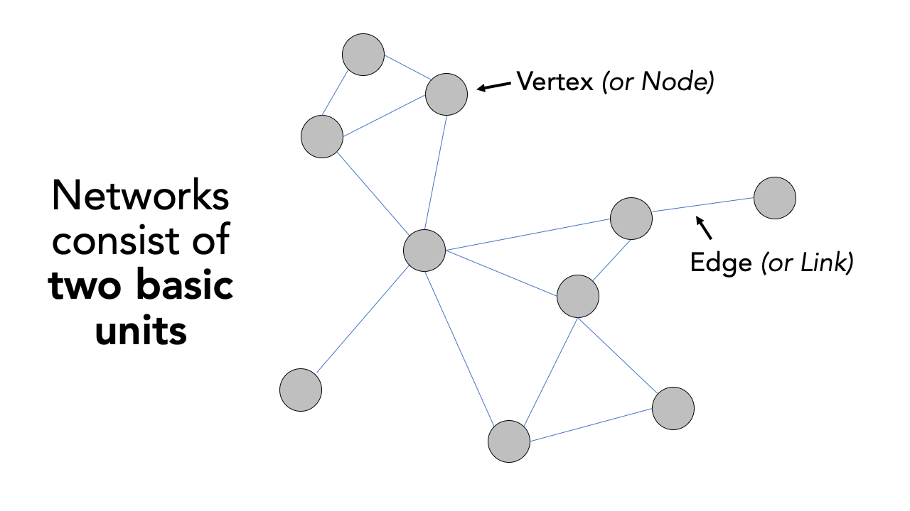

# Network Analysis & Reproducible Research

## Introduction {#introduction_w10}

In the final week of PSA, we will take a look at different types of network analysis and how they apply to different applications and can be used within spatial analysis.

For our practical component, we will first look at current possible approaches to analyse road networks in R, and utilise the `dodgr` library to calculate the distance between two points (i.e. an Origin and a Destination). These distances can then be used to calculate the number of X resource (e.g. fast-food outlets) within a certain distance of a POI, e.g. a school or population-weighted centroid. This calculation can form part of an accessibility measure, as we'll see in the practical, that, unlike the density count or euclidean buffers we've used in previous practicals, has less sensitivity to neighbourhood/boundary effects.

The second half of the practical will move this project into CodeOcean, an online platform that hosts code and data to create "reproducible runs" and "capsules" of research projects. The platform (alongside others!) enables you to create an anonymized version of your project, ready for its submission to journals as part of their increasing requirement to pass reproducibility and openness tests, e.g. the International Journal of Geographic Information Science. 

You'll use this platform to host your code for your first piece of coursework in PSA. We'll therefore create an anonymised account in the practical and re-deploy the code you'll write in the first half of the practical. In Friday's seminar, we will want to check that you are able to use the platform, so if you do run into issues, let either one of us know or utilise the help session with Alfie on Friday morning.

The live session of this week will be extended to answer any questions you may have on these assessments.

This week is structured by **3** short lecture videos, **2** assignments ( [assignment 1](#assignment_1_w10) / [assignment 2](#assignment_2_w10) ) that you need to do in preparation for Friday's seminar, and the practical material. As always, this [week's reading list](https://rl.talis.com/3/ucl/lists/3FB0C66A-F603-A402-A31C-28F2DA091AB6.html?lang=en-gb&login=1) is available on the UCL library reading list page for the course.

### Video: Overview {#overview_w10}
```{r 10-short-lecture-welcome, warnings=FALSE, message=FALSE, echo=FALSE, cache=TRUE}
library(vembedr)
embed_msstream('ef4c0e42-5dac-417d-83dc-be84e6709abb') %>% use_align('left')
```
[Watch on MS stream](https://web.microsoftstream.com/video/ef4c0e42-5dac-417d-83dc-be84e6709abb)

## Network analysis: a brief introduction

The term 'network analysis' (also known as 'network science', as introduced to you in Stephen's module) covers a wide range of analysis techniques, from complex network analysis, social network analysis, link analysis, as well as road network analysis. 

A network or network graph is constituted by a collection of vertices that are connected to one another by edges. Note, vertices may also be called nodes or points, whilst edges may be called links or lines. Within social network analysis, you may find the terms actors (the vertices) and ties or relations (the edges) also used. 

```{r 09-network-graph, echo=FALSE, cache=TRUE, fig.align='center', fig.cap='Visualising networks through vertices and edges.'}

```

Within our first lecture of the week, we provide you with an introduction to network analysis and one of the methodological tools within network analysis, community detection, is currently being used within (Spatial) Data Science to map the spatial distribution of social communities detected within large-scale network datasets.

### Video: An Introduction to Network Analysis
```{r 09-network-analysis, warnings=FALSE, message=FALSE, echo=FALSE, cache=TRUE}
library(vembedr)
embed_msstream('c2345c74-4900-4e33-abab-a735c45cbe16') %>% use_align('left')
```
[Lecture slides](https://web.microsoftstream.com/video/c2345c74-4900-4e33-abab-a735c45cbe16) [Watch on MS stream](https://web.microsoftstream.com/video/40688ce3-f162-4d3a-8a5a-9f8b0ccba3d5)

As you have heard and seen, networks are generally conceived within graphical space, but more recently, with the involvement of Spatial Data Scientists and geographers, are being analysed within geographic space.

### Using Spatial Analysis with Geographic Networks: Examples and Applications

Understanding that networks are formed through the connections of vertices and edges, we can think of many naturally and manmade occuring networks that also have a precise geography to them (i.e. their distribution can be mapped directly within geographic space), including rivers connected with tributaries and animal tracks, to electricity pylons and cables and our road and street networks that form crucial parts of our infrastructure. 

The latter, in particular, have been a substantial focus of those working within spatial analysis over the last two decades, particularly with routing applications now dominating much of our day-to-day technology, from personal route-planning and ride-share apps to large-scale logistics and infrastructure applications, including the delivery operations behind all of our holiday season online shopping and even [Scotland's Trunk Road Gritters](https://www.arcgis.com/apps/webappviewer/index.html?id=2de764a9303848ffb9a4cac0bd0b1aab)(one of my favourite uses of ArcGIS's online maps and very seasonal indeed!).

Alongside this development of routing applications, GIS analysts, geographers and public health specialists have also identified the utility of network analysis within geographic space to calcuate distance-based measurement and coverage buffers that can be used as part of accessibility studies that look to understand the provision of a specific resource (e.g. greenspaces, hospitals or even fast-food stores) to a certain area of population.

The following lecture introduces these different types of geographic spatial analyses:

### Video: Using Spatial Analysis with Geographic Networks
```{r 09-spatial-networks, warnings=FALSE, message=FALSE, cache=TRUE, echo=FALSE}
library(vembedr)
embed_msstream('e31cc91a-cd03-47a7-9c27-e33e233f1869') %>% use_align('left')
```
[Lecture slides](https://liveuclac-my.sharepoint.com/:b:/g/personal/ucfailk_ucl_ac_uk/EeuEqM5OLF5DsM1TYOJFLhkBQe4AOKjHT-1nEDy7mVK-3A?e=S0fmcB) [Watch on MS stream](https://web.microsoftstream.com/video/e31cc91a-cd03-47a7-9c27-e33e233f1869)

As you can see, there is plenty we can do with geographic networks within spatial analysis - and when looking at the growing spatial data science field of research, even more when incorporating techniques from social network analysis. These lectures have served only as a brief introduction into the possibilities of network analysis. If you are interested in looking further into social network analysis with spatial research, one new resource I can highly recommend is looking into the **Spatial Networks Lab** tutorials (in R) from Georgia Tech and Clio Andris available [here](https://github.com/friendlycities-gatech/SpatialNetworksLabs). Furthermore, many of the topics and applications we've mentioned in our first lecture will be covered in more detail within GEOG0051, although this analysis will be in Python rather than R.

## Accessibility and Network Analysis Practical

For this week's practical, we will focus on one type of geographic network analysis applciations mentioned above: calculating distance-based measurements.

As shown in the lecture, distance-based measurements are incredibly useful for calculating accessibility metrics that can be used in public health, environment and infrastructure applications, such as identifying areas with potential food deserts or with low health or greenspace provision.

Until recently, calculating these distance-based measurements in R would have been incredibly complex - and you would likely have to resort to ArcGIS (or QGIS), where these Origin-Destination calculations or Drive-Time buffers are relatively easily to implement and have served Esri particularly well as part of their own commerical business selling to logistic firms! You can even use your ArcGIS Online account from earlier on in this module to create Network Buffers from a single point dataset with just a few clicks!

Whilst (graph-based) network analysis has proven an incredibly popular data science technique and has been integrated into R through packages such as `igraph`, `ggraph` and `tidygraph`, the same can't be said for network analysis within geographic space! However, with more and more spatial data scientists invovled in R and package development, the last year or so has seen new packages emerge that contain functions that enable the spatial analysis of networks!

The three key packages/libraries to be aware of are:

-`stplanr` from Robin Lovelace and Richard Ellison. `stplanr` facilitates common transport planning tasks including: downloading and cleaning transport datasets; creating geographic ‘desire lines from origin-destination (OD) data; route assignment, via the `SpatialLinesNetwork` class and interfaces to routing services such as CycleStreets.net; calculation of route segment attributes such as bearing and aggregate flow; and `travel watershed’ analysis. You can read more about the library [here](https://cran.r-project.org/web/packages/stplanr/vignettes/stplanr-paper.html).

-`sfnetworks` from Lucas van der Meer, Lorena Abad, Andrea Gilardi and Robin Lovelace. Whilst the [package](https://luukvdmeer.github.io/sfnetworks/index.html) is still in a beta format, the aim of the package is to provide a type of spatial network that can be used with both `sf` and `tidygraph`.

-`dodgr` from Mark Padgham and Andreas Petutschnig (plus contributors). `dodgr`  is an R [package](https://atfutures.github.io/dodgr/index.html) for calculating Distances On Directed Graphs. The package may be used to calculate a matrix of distances between a given set of geographic coordinates.

As you might be able to tell from these brief descriptions, for our practical today - and our aim to calculate distance-based measurements- we will be using the `dodgr` library! 

However, in addition to the recommendation above for the Friendly Cities tutorial, there is a short tutorial available to demonstrate `stplanr` for potential routing applications within the *Geocomputation with R* book, online [here](https://geocompr.robinlovelace.net/transport.html). Whilst you might not have time to look at either this week, you might just want to make a note of these tutorials for future reference, e.g. for your thesis. 

For this practical, we'll stick with producing a metric that you may want to use within your own PSA coursework, if, for example, you are looking at the accessibility of a specific resource to a population.

#### Practical Outline

This tutorial takes you through a simple approach to measuring either distances or time between two points on a road network - for multiple points. You will construct a road network from OpenStreetMap, and utilise this network along with the `dodgr` library to calculate your chosen metrics between two coordinate datasets (otherwise known as an Origin-Destination matrix).

#### Our analysis case study

For this tutorial, we'll be using Portsmouth in the U.K. as our area of interest for our analysis (woohoo, a change from London!). The city is located on the south coast of the U.K., and is actually the only city in the U.K whose population density exceeds that of London (in 2011)! One of the reasons is that the city primarily occupies an outcrop of land on the south-coast (an island called Portsea Island), and extends only slightly into the north, past the M27. There are lots of geographical issues and challenges within the city that you could investigate, including weaknesses in Portsmouth's current road provision - there are only three main roads in and out of the island! Can you identify them in the map below?

```{r ports_map, include=FALSE, cache=TRUE}
library(sf)
library(mapview)
# Create portsmouth map
cities <- st_read("raw/w10/data/raw/admin_boundaries/Major_Towns_and_Cities__December_2015__Boundaries.shp", stringsAsFactors=FALSE)

portsmouth_city = cities[74,]
#plot(portsmouth_city)

```
<center>
```{r pmap, echo=FALSE, cache=TRUE}
mapview(portsmouth_city, alpha.regions= 0, legend= NULL, alpha=0)
```
*Portsmouth city, extending just north of the M27 into Paulsgrove, Cosham, Drayton and Farlington.* 
</center>
<br>

One prominent topic within the city is the issue of public health and childhood obesity. According to figures released in March 2020 by Public Health Engalnd, more than one in three school pupils are overweight or obese by the time they finish primary school within the city - higher than the national average of one in four. One potential contributor to the health crisis is the ease and availability of fast-food in the city. 

From the local newspaper in the city, the Portsmouth News, Healthwatch Portsmouth Chairman Roger Batterbury was quoted: *‘For people in areas of deprivation, every penny counts and when it comes to buying food, the cheapest option is important but that is rarely the healthy choice.'* See the original article [here](https://www.portsmouth.co.uk/health/one-three-portsmouth-pupils-are-overweight-or-obese-time-they-finish-primary-school-2063613).

The City Council itself has aimed to address the issue by banning new fast-food takeaways within a 400m range of schools – it started with a pilot at Arundel Court Primary Academy in Landport in September 2019. Since the pilot, no new hot food takeaways will be able to open within a 400m radius of the school.

To assess the likely impact of this policy, we will investigate the accessibility of fast-food outlets for school children - we want to know if there is a geography to accessibility that could be used within future analysis to understand whether certain socio-economic demographics are more exposed to fast-food then others. We will measure accessibility by understanding how many fast-food outlets are within specific walking distances of each school, starting at 400m, then 800m and finally a 1km walking distance. We'll then aggregate these counts at the Lower Super Output Area (LSOA) and compare across the city.

To get this data ready for our spatial and socio-economic analyses, we'll need to first calculate the distances between our schools and fast-food outlets. This involves **calculating the shortest distance a child would walk between a school and a fast-food outlet, using roads or streets**. This means we need to conduct a road network analysis between each school and fast-food outlet - just what this tutorial is designed to do!

Let's get started!

#### Practical Instructions

**1) Setting up your script - libraries and working directory**

For our network analysis, we will be using the very recent (as of August 2020!) `dodgr` library. Prior to the creation of `dodgr`, this analysis would have been incredibly complex to do. Whilst `R` has had many *network analysis* libraries, the majority of these focus on utilising networks in graphical spaces, rather than geographical. Creating measures of distance or time therefore would be more complex as you would need to transform your graph distances into geographical ones - but thanks to `dodgr` not anymore! 

We'll also be loading several other libraries to help with our analysis, including:

-`here`: to direct to our working directory

-`magrittr`: to allow us to use the pipe function (`%>%`) within our work, to enable efficient programming.

-`osmdata`: to download OSM data from the OSM API server. 

*NB: `dodgr` also has an in-built function to enable you to create a network download directly for use within their libraries (without any of the formatting you'll see us use), but this function (currently) does not provide the flexibility of determining what type of network you want to construct. In our case, we want to omit any motorways from our network to ensure our network represents where people will walk. Hence we'll use the `osmdata` library to create our pedestrian-friendly network!*

-`sf`: the Simple Features library, used to encode spatial data.

and:

-`expss`: this library provides many functions that are usually seen in Excel or SPSS. Here we use the `count_if` function in our code (you'll see why later on). This functionality probably can be replaced by base libraries in R and a few additional lines of code, but this was a simple and quick solution to what we needed to make this tutorial work!

** Make sure to install any new libraries/packages using the R console first, e.g.:
<br>
`install.packages(c('osmdata', 'dodgr', 'expss'))`
<br>

Let's first load our libraries:
```{r libraries, cache=TRUE}
# Load our libraries
library(here)
library(magrittr)
library(osmdata)
library(dodgr)
library(sf)
library(expss)
```

**2) Downloading our datasets from OpenStreetMap**

Once we've loaded our libraries and set our directory, the first step in our tutorial is to download our OpenStreetMap data to create the network dataset for our analysis.

To do this, we'll use `osmdata` library and the `add_osm_feature` function. You can find out more about this and how to construct your queries [here](https://cran.r-project.org/web/packages/osmdata/vignettes/osmdata.html).

To use the function, we need to provided it with either a *bounding box* of our area of interest (AOI) or a set of points, from which the function will create its own bounding box.

We'll use the former approach, and a very useful tool for extracting your bounding box can be found [here](https://boundingbox.klokantech.com). You simply navigate to your AOI and then use the rectangle + arrow button to access a tool that will draw you a bounding box you can then edit. 

Alternatively, you can use the pentagon button to create your own polygon. At the bottom of the webpage you'll see options to copy and paste your box. Choose *CSV*, ready to copy and paste your coordinates into the code below.

To download our road network dataset, we first define a variable to store our bounding box coordinates, `p_bbox`. 

We then use this within our osm query to extract specific types of highways within that bounding box - the results of our query are then stored in an `osmdata` object (this one is for sf). You can find out more info about the `osmdata` object in Section 3 of the `osmdata` vignette tutorial linked above.

```{r download_osm, cache=TRUE}
# Define our bbox coordinates, here our coordinates relate to Portsmouth
p_bbox <- c(-1.113197,50.775781,-1.026508,50.859941)

# Pass our bounding box coordinates into the OverPassQuery (opq) function
osmdata <- opq(bbox = p_bbox ) %>%
  # Pipe this into the add_osm_feature data query function to extract our highways
  # Note here, we specify the values we are interested in, omitting motorways
  add_osm_feature(key = 'highway', value = c('primary', 'secondary', 'tertiary', 'residential','path','footway', 'unclassified','living_street', 'pedestrian')) %>% 
  # And then pipe this into our osmdata_sf object
  osmdata_sf()
```

You should now see an `osmdata` variable appear in your environment window - as explained in the linked tutorial, the `osmdata` object contains the bounding box of your query, a time-stamp of the query, and then the spatial data as `osm_points`, `osm_lines`, `osm_multilines` and `osm_polgyons` (which are listed with their respective fields also detailed). Some of the spatial features maybe empty, depending on what you asked your query to return.

What is important to know is that **the actual spatial data contained in an** `osmdata` **object can be extracted - and will be in the** `sf` **format, when using the** `osmdata_sf()` **function (as we did) or in the** `sp` **format if you use the** `osmdata_sp()` **function instead.**

*3) Extracting our road network*

Our next step therefore is to extract our spatial data from our `osmdata` object to create our road network dataset. This is in fact incredibly easy, using the traditional `$` R approach to access these spatial features from our object. 

Deciding what to extract is probably the more complicated aspect of this - mainly as you need to understand how to represent your road network, and this will usually be determined by the library/functions you'll be using it within. 

Lucikly, I've done all the pre-reading for you and we want to pass in preference what is known as **edges** of the network, i.e. the lines that represent the roads, rather than the **nodes** of the network, i.e. the points that represent the locations at which the roads intersect. 

The latter can be used by the `dodgr` library, but edges are used in preference due to the unintended data errors than can occur if you delete nodes, versus deleting edges from a network. I won't explain this in any further detail, but in preference, choose your edges!

Despite this, here we will extract both the points/**nodes** and the lines/our road **edges** within our network - as we might want to use the former for visualisation later on in our analysis. During extraction, we'll also reduce the amount of fields the spatial data contains. 

For our points, we'll just keep the `osm_id`, just in case we need to refer to this later. 

For our lines, we'll keep a little more information that we might want to use either within our road network or analysis, including the type of highway, what the maximum speed is on the road, and whether the road is one-way or not. 

Remember, OpenStreetMap is an *open-source* of spatial data, therefore these fields may be not complete for each road, and the accuracy and currency of these fields cannot be guaranteed.

Extract the data as follows:

```{r roadnetwork, cache=TRUE}
# Extract our spatial data into variables of their own

# Extract the points, with their osm_id.
ports_roads_nodes <- osmdata$osm_points[, "osm_id"]

# Extract the lines, with their osm_id, name, type of highway, max speed and oneway attributes 
ports_roads_edges <- osmdata$osm_lines[ , c("osm_id", "name", "highway","maxspeed", "oneway")]
```

We should now have two additional variables in our Environment, snd we're ready to create our road network dataset - or in network terms, *our graph*.

To check our dataset, we can quickly plot the edges of our road network using the `plot()` function:

```{r networkplot, cache=TRUE}
plot(ports_roads_edges)
```

This looks like Portsmouth to me! And our main plot for the dataset (**osm_id**) looks pretty complete. Our other plots are also interesting to look at, including where there are one way streets in Portsmouth - as well as the predictable similarities between the *highway* type and *maxspeed* variables.

*4) Downloading and extracting our point datasets for analysis*

Before we construct our graph, we need to also create our **ORIGIN** and **DESTINATION** points, i.e. the datasets we wish to calculate the distances between. As we will use the `dodgr_dists` function to calculate these distances, according to the `dodgr` documentation, these points need to be in either a vector or matrix format, containing the two coordinates for each point for the origins and for the destintions.

For our Portsmouth scenario, we are interested in calculating the shortest distances between schools and fast-food outlets, therefore we need to download these datasets ready for our use - and we'll use OpenStreetMap to do this. (If you are using this tutorial to help guide your own analysis and already have your OD datasets ready, you can skip this step!).

Following a similar structure to our query above, we'll use our knowledge of Openstreetmap *keys* and *values* to extract the points of origins (schools) and destinations (fast-food outlets) we are interested in:

*Note, we do not need to restate the bounding box coordinates as this is still stored as a variable in our session's memory.*

```{r schools_ff_osm, cache=TRUE}
# Download our schools from OSM, store in school variable
schools <- opq(bbox = p_bbox) %>%
  add_osm_feature(key = 'amenity', value = 'school') %>% 
  osmdata_sf()

# And our fast-food outlets (could add convenience stores - separate query)
ff_outlets <- opq(bbox = p_bbox) %>%
  add_osm_feature(key = 'amenity', value = 'fast_food') %>%
  osmdata_sf()
```

We also need to follow a similar extraction of our two datasets from the `osmdata` object as we did for our road dataset:

```{r schools_ff_points, cache=TRUE}
# Extract our school points
ports_schools <- schools$osm_points[ , c("osm_id", "name")]

# Extract our fast-food outlet points
ports_ff <- ff_outlets$osm_points[ , c("osm_id", "name")]
```

We now have our road network data and our OD points - we're now ready to construct our network graph and run our network analysis!

*5) Running our network analysis and calculating distances*

With any network analysis, the main data structure is a **graph**, constructed by our nodes and edges. To create a graph for use within `dodgr`, we pass our `ports_roads_edges` into the `weight_streetnet` function. 

The `dodgr` library also contains weighting profiles, that you can customise, for use within your network analysis. These weighting profiles contain weights based on the type of highway, determined by the type of transportation the profile aims to model. Here we will use the weighting profile **foot**, as we're looking to model walking accessibility.

Let's create our graph:

```{r network_graph, cache=TRUE}
# Create network graph using are edge data, with the foot weighting profile
graph <- weight_streetnet(ports_roads_edges, wt_profile = "foot")
```

Once we have our graph, we can then use this to calculate our network distances between our OD points. Here we use the `dodgr_distances` function, which you can find out more about in the its documentation. 

In this function, we first pass our `graph`, then our Origin points (schools), in the `from` argument, and then our Destination points (fast-food outlets), in the `to` argument. There are several other arguments the function takes, which, again, you can read about in the documentation.

One thing to note is our addition of the `st_coordinates` function as we pass our two point datasets within the `from` and `to` functions. In their current format, our point data is as an `sf` data frame, which the function cannot pass - we need to instead provide it with a vector or matrix. We can achieve this simply by using the `st_coordinates` function, which retrieves the coordinates of any (spatial) data frame in matrix form.

We can now calculate our distances:

```{r distance_calc, cache=TRUE}
# Calculate distances between schools to fast-food stores
sch_to_ff_calc <- dodgr_distances(graph, from=st_coordinates(ports_schools), to= st_coordinates(ports_ff), shortest = TRUE, pairwise = FALSE, quiet=FALSE)
```

For our dataset, the query runs very quickly - a total of 876 x 294 calculations in a few seconds.

Let's check our output:

```{r data_check, cache=TRUE}
head(sch_to_ff_calc, 1)
```

Our output shows the calculations for the first school - and the distances between the school and every fast-food outlet. We do have several NAs - this is likely because our network and nodes do not connect with each other and so warrants further investigation. We would want to check the reasons for this and see how we can fix it.

We won't do this today, but it does highlight that all analysis is fallible to errors and mistakes. To investigate this further, I'd recommend looking at the OD points and the network within GIS software (or an interactive map within R), where you can zoom in to check the OD points versus the network.

*6) Calculating an accessibility measurement for each school*

The next step of processing all depends on what you're trying to assess - here we want to understand which schools have a higher exposure or accessibility to fast-food outlets compared to others, quantified by how many outlets are within walking distance of specific distances.

We will therefore look to count how many outlets are with X walking distance from each school and store this as a new column within our ports_school data frame. 

To do this, we'll use the `count_row_if` function from the `expss` library, which will count the number of observations for each row that meet a certain condition. Here we use the `lt` function, which means less than (there's also `gt`, which means greater than). We simply need to add in the distance we're looking to use - and store the output of all of this as a new variable, which will be a new column (remember this is denoted through `$`) within our data frame.

This query could be re-written using the `dplyr` library and several of its functions - you could set yourself the task of trying to write a query using `dplyr` that achieves the same output as this `count_if` function.

We can repeat this for all three distances, simply exchanging the values of our distance and renaming our variable/fieldname.

```{r count_aggregation, cache=TRUE}
# Add column to ports_schools, counting number of ff within 400m walking distance from them
ports_schools$ff_within_400m <- count_row_if(lt(401),sch_to_ff_calc)

# Add column to ports_schools, counting number of ff within 800m walking distance from them
ports_schools$ff_within_800m <- count_row_if(lt(801),sch_to_ff_calc)

# Add column to ports_schools, counting number of ff within 1000m walking distance from them
ports_schools$ff_within_1km <- count_row_if(lt(1001),sch_to_ff_calc)
```

We can then look at our outputs quickly again using the `plot` function:

```{r schools_plot, cache=TRUE}
plot(ports_schools)
```

Just from this simple plot, we can see across our distances some clear geographical patterns in accessibility. 

Areas with greater access/exposure to fast-food outlets (denoted by the yellow/pink colours) appear to be within the city centre and in the south, whereas those schools in the north have less exposure. If we head back to the interactive map at the start of this practical, you will be able to see that these two areas correlate quite well with the more commercial areas within Portsmouth, the high street and an area known as Gunwharf Quays.

#### Assignment 1: Analysing accessibility of fast-food outlets from schools in Portsmouth {#assignment_1_w10}

For this week's first assignment, we'd like you to think of a way to aggregate and visualise accessibility at the LSOA scale. 

By aggregating these distance calculations at the LSOA scale, you'd be able to then compare accessibility to other variables, such as the [2015 Index of Multiple Deprivation](https://data.gov.uk/dataset/8f601edb-6974-417e-9c9d-85832dd2bbf2/english-indices-of-deprivation-2015-lsoa-level), another variable you may have calculated or even a geodemographic classification, such as that provided by the [CDRC](https://data.cdrc.ac.uk/dataset/output-area-classification-2011). 

To get started, you'll first need to download and extract the LSOA boundaries for Portsmouth. 

You the need to decide on a measurement that you'd want to aggregate. For example, you could look at:

1) The average number of fast-food restaurants within X distance of a school within each LSOA
2) The average distance a fast-food restaurant is from a school within each LSOA
3) The (average) shortest distance a fast-food restaurant is from a school within each LSOA

Essentially, the possibilities are endless and there is no real right or wrong answer - it just depends on how you want to answer our original question. I'd recommend briefly reading through the methodologies (and their chosen variables) of the papers cited in the second lecture (which can be found on your reading list).

For the seminar on Friday, we'd like you to be able to *post a map of your chosen variable**. This assignment is again software-agnostic - your calculations and map do not need to be made in R, but we do recommend it, particularly if you'd like to use this approach within your own research. 
<br>
<br>

## Reproducible Research & Data/Code Repositories

From early on in the module, we have talked about the key aspects of spatial data science that set it apart from typical GIS: scalability, repeatability, reproducibility and collaboration.

Whilst all four of the aspects are important for you as a Spatial Data Scientist moving forward, particularly into your next term within the MSc, understanding how to make sure your work is **reproducible** will hold you in good stead when it comes to your MSc thesis and further on, when you may be submitting your research for publication.

Full reproducibility involves enabling someone else to be able to repeat your research from scratch in order to obtain the same results. Where this replication is not possible or impractical (e.g. data pribacy concerns), dummy or sample data, alongside your code, can be made available as a means to reproduce the same results. 

Reproducibility of scientific results offers a significant stepping stone towards accountability and verification of your research - and helps prevent the falsification of results, as well as offers a "helping hand" to those looking to use your research or data in their own study.

Reproducibility is a significant part of the "Open Science" movement, which emphasizes transparency in methods, analysis and outputs and the importance of being able to replicate findings, alongside the use of Free and Open Source Software (FOSS), such as R and Python, and, preferably, open and publicly available datasets.

There are many ways to ensure reproducibility of your research - starting with utilising organised folder/file structures and employing good coding principles, such as commenting on your code as well as thinking through variable names to ensure they are clear and are not part of the "reserved" variable names used by your programming language (e.g. file, item).

A further way to ensure reproducibility is to host your data and code in a repository that can be publicly accessed - and even run, through a 'capsule' approach, in order to produce the same results. In fact, many journals, that you may end up submitting research to, are encouraging the use of these repositories and the creation of 'capsules', which detail the data, code and development environment (i.e. metadata on their software or programming tools, including the version as well as packages and package versions) behind the publication in review. Some journals, in fact, are making their use mandatory. *This capsule approach could also be compared to the 'Compendium' approach promoted in the video below, which was part of your Week 4 CASA0005 content**:

### Video: A guide to modern reproducible data science within R {#rresearch_w10}
```{r 10-reproducible-research, warnings=FALSE, message=FALSE, echo=FALSE, cache=TRUE}
library(vembedr)
embed_youtube('f39_oW4RKfI') %>% use_align('left')
```
[Watch original video](https://rstudio.com/resources/rstudioconf-2019/a-guide-to-modern-reproducible-data-science-with-r-karthik-ram/)

Your CASA0005 module also introduced you to the concept of Reproducible Research in Week 4, whilst showing you how to use git and GitHub. If you're not using GitHub to track your work in the entire of the MSc modules, particularly the computational modules (which is 7/8s of the course!), we'd recommend spending some time over the break to set up your GitHub to do so. 

GitHub is just one such program for creating a repository - however it only enables you to host your data and code and as yet does not enable "reproducible runs" of your code.

Now, it was our intention for you to experiment with one of these capsule building repositories, namely *CodeOcean**. 

Within the application, you can create a capsule in which to host your original data and code, and then "run" your scripts to produce the outputs that, for example, you may end up including in your research report. It also "publishes" your work and records each version that you publish afterwards.

However after significant testing, there are some current issues with the running R and specifcally the `sf` library within the 'Reproducible Runs' that we couldn't fix in time for the start of Week 10.

We will hopefully get this to work in time for the seminar, so for now, we would like you to set up an account, ready to move your code over come Friday if we manage to find a solution.

We would like you to use this account to submit your code for your PSA coursework - therefore, when creating your account, **do not use your name** at any point within the sign-up. Instead, when signing up, **use you UCL email and your UCL Student Number** that you would put on your coursework front page in order to keep yourself anonymised. 

When submitting work to an academic journal, you would need to submit your work anonymously, therefore this will get you in good practice of keeping your name out of your work!

This also applies to your code that you may include in your repository - make sure all path names do not involve your own name (using the `here` library should help avoid this) and you do not add your name via comments in your code.

If we are still unable to get CodeOcean to work for us (and R!), we will add an additional link for you to submit either a zipfile of your code and original datasets **or** a binder link within Moodle - but we'll update you with this on Friday.
<br>
<br>

#### Assignment 2: Setting up a CodeOcean account {#assignment_2_w10}

1. Head to CodeOcean's website: [https://codeocean.com](https://codeocean.com)

2. Sign up for an account - use your UCL email for your email address and your UCL student code as your **name**.

3. Activate your account through the verification email.

4. Create a new capsule, called **PSA_Week_10_analysis** ready to move your code from this week over during our seminar on Friday.

And that's it, you're done with your Assignments and work for PSA this week!

## Attributions {#attributions_w10}
This week's content and practical are original to GEOG0114.

## Feedback {#feedback_w10}
Please take a moment to give us some [feedback on this week's content](https://forms.gle/BYbZySVSHeoUEkJh9).

Additional course surveys will also be run by the Department over the next few weeks.
