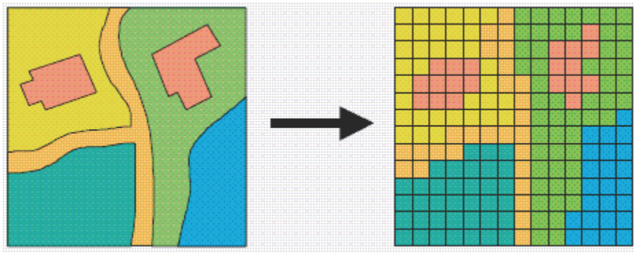
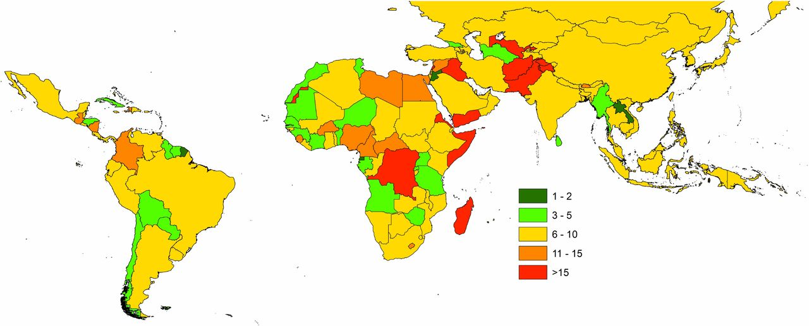

--- 
title: "GEOG0114: Principles of Spatial Analysis"
author: Justin van Dijk^[Department of Geography, https://www.mappingdutchman.com/] and Joanna Wilkin^[Department of Geography, https://www.geog.ucl.ac.uk/people/academic-staff/joanna-wilkin]
date: "`r Sys.Date()`"
site: bookdown::bookdown_site
output: bookdown::gitbook
documentclass: book
link-citations: yes
github-repo: "jtvandijk/GEOG0114"
description: "GEOG114: Principles of Spatial Analysis handbook."
url: 'https\://jtvandijk.github.io/GEOG0114/'
---

# Welcome {-}

```{r echo=FALSE, out.width = "100%", fig.align='center', cache=TRUE,}
 
```
<br />

Welcome to **Principles of Spatial Analysis**, one of the four core modules for the MSc in Geographic and Social Data Science here at [UCL Geography](https://www.geog.ucl.ac.uk/).

This module provides an introduction into the theory, methods and tools of spatial analysis essential for your career as a Data Scientist.
This module has been designed in conjunction with your module on [Geographic Information Systems (GIS) and Science (GIScience)](https://www.ucl.ac.uk/module-catalogue/modules/geographic-information-systems-and-science-CASA0005) from CASA to provide you with an extensive introduction into GIScience, spatial analysis and their associated tools. It has a specific focus on the principles, properties and parameters that are part of spatial analysis and how to understand and apply these effectively within geographic and data science-oriented research.

The first half of the module provides detailed introductions into spatial concepts such as scale and geography, 
spatial dependency and autocorrelation, and spatial heterogeneity and spatial regression models. The second half then focuses 
on the applications of spatial analysis within current data science research, including cluster analysis and Bayesian modelling.

## Get in touch {-}
Dr Jo Wilkin will be taking **Week 1-4**, **8**, and **10** of the module. You can contact her at <nobr>**j.wilkin [at] ucl.ac.uk**</nobr> or, for online office hours, you can book a half hour slot with Jo [using MS Bookings](https://outlook.office365.com/owa/calendar/JoWilkinBookableOfficeHours@ucl.ac.uk/bookings/).

Dr Justin van Dijk will be taking **Week 5-7** and **9** of the module. You can contact him at <nobr>**j.t.vandijk [at] ucl.ac.uk**</nobr> or, for online office hours, you can book a half hour slot with Justin [using MS Bookings](https://outlook.office365.com/owa/calendar/JustinvanDijkBookableOfficeHours@ucl.ac.uk/bookings/s/z5HqD80lWU-RMPggKx0acQ2).

The module is further supported by two Postgraduate Teaching Assistants: Alfie Long and Jakub Wyszomierski.

## Noticed a mistake in this resource? {-}
Please let us know through the GitHub issues tab, send us a message over MS Teams, or contact us by e-mail.


<!--chapter:end:index.Rmd-->

# Course information {-}

## Module structure {-}
This module consists of ten self-led workshops, ten interactive seminar discussions and ten help sessions. Each week, we'll provide an online workshop, provided as a worksheet with videos and instructions to complete the practical component of the workshop. All online classes will be held on the Principles of Spatial Analysis 'team'.

In addition, each week will have its own reading list or additional 'recommended' (optional, not required!) online tutorials we know of that you might want to also complete.

## Weekly topics {-}
| Week          | Date          | Topic |
| :------ |:-----|:--------------|
| 1             | 05/10/2020    | Spatial analysis for data science |
| 2             | 12/10/2020    | Representation, scale and geography in spatial analysis |
| 3             | 19/10/2020    | Spatial properties, relationships and operations |
| 4             | 26/10/2020    | Spatial dependence, spatial autocorrelation and defining neighbours |
| 5             | 02/11/2020    | Exploratory Spatial Data Analysis |
| *reading week*  | *reading week*  | *reading week* |
| 6             | 16/11/2020    | Point pattern analysis |
| 7             | 23/11/2020    | Raster data and geostatistics |
| 8             | 30/11/2020    | Spatial analysis for urban (mapping) applications |
| 9             | 07/12/2020    | Geodemographics |
| 10            | 14/12/2020    | Reproducible research |

## Learning objectives {-}
By the end of the module, you should:

- have a good understanding of the principles underlying the analysis of spatial data in general and spatial statistics in particular;
-	be able to use GIS software and tools for generating and visualising summary statistics;
-	be able to examine, analyse and simulate a range of spatial patterns and processes;
-	be able to use geostatistical tools to analyze and interpolate spatial patterns;
-	appreciate the many different sources of uncertainty in spatial data and spatial processing and how to address such issues in analysis and research;
-	be able to master the key concepts in network analysis with a focus on social and spatial networks (now in Intro to Data Science and Advanced Data Science modules);
-	be able to explain several novel applications of spatial analysis techniques within geographic and social data science applications.

## Reading list {-}
We link to books and resources throughout each practical. The [full reading list for the course](https://rl.talis.com/3/ucl/lists/3FB0C66A-F603-A402-A31C-28F2DA091AB6.html?lang=en-gb&login=1) is provided on the UCL library reading list page for the course. Alternatively, you can always easily find the link to the Reading List in the top right of any Moodle page for our module, under "Library Resources". 

This Reading List will be updated on a weekly basis, in preparation for the week to come, so you may see some weeks without reading for now. But please check back at the **start of each week** as the lecture, seminar and/or workshop material is released for that week to check for new readings. All reading for that week will be provided by the time your learning materials are released - so you will not need to check the reading list for updates as the week progresses.

## Module assessment details {-}

The assessment for Principles of Spatial Analysis is set across two pieces of separate coursework, weighted at 50% each. 

1) The first piece of coursework will involve the completion of a spatial analysis project, based on the theory, concepts and application learnt during the module. A 1,500 word report will be submitted, alongside the code used within the project, which describes the analysis undertaken and the results of the analysis. Further guidance is available on Moodle.

2) The second piece of coursework will be a written (1,500 word) review on a current data science application that uses spatial analysis as its core methodology. The application can be drawn from the lecture material, particularly during Weeks 8 and 9, or one of your own choice. Further guidance us available on Moodle.

## Useful additional resources {-}
Besides the mandatory and recommended reading for this course, there are some additional resources that are worth checking out:

1. MIT's introduction course on mastering the command line: [The Missing Semester of Your CS Education](https://missing.csail.mit.edu/) 

2. A useful tool to unpack command line instructions: [explainshell.com](https://www.explainshell.com/)

3. Online resource to develop and check your regular expressions: [regexr.com](https://regexr.com/5d21d)

4. Selecting colour palettes for your map making and data visualisation: [colorbrewer 2.0](https://colorbrewer2.org)

<!--chapter:end:00-course-info.Rmd-->

# Spatial analysis for data science

The first week of PSA will introduce how geography and Geographical Information Science (GIScience) fits within the wider data science discipline and why there is a need to specialise in spatial and social analysis for data science. 

To provide this understanding, you will first work your way through a short document written specifically for this week to provide an extensive overview to why a geographical understanding to data science is critical to accurate and valid data analysis. 
Next, through a recorded lecture, you'll be given a short introduction to Geographical Information Systems (GIS) tools for spatial data science and an explanation to how these tools have changed over the last decade, including a shift from traditional GIS software towards programming-based analysis in research applications. 

We’ll then show you examples of different types of GIS software through a recorded tutorial. To gain a practical basic understanding of the differences across these software, including their ease of use, the recorded tutorial will show you the steps and processing to create a simple choropleth map of population and population density in London. This week plays a formative role in providing everyone with baseline from which to not only pursue this module, but the other technical modules on the MSc. 

<center>**This week's content is [available on Moodle](https://moodle.ucl.ac.uk/).**</center>

<!--chapter:end:01-week01.Rmd-->

# Geographical representation

The first part of this week will look at spatial representation data models, i.e. how we transform geographic features and phenomena into geographic data for use within GIS. We will then explore the role of scale and geography within spatial analysis and provide you with a critical understanding of how both can impact and effect the analysis of data, particularly when looking at ‘event’ type data, i.e. the occurrence of a specific phenomenon over space. 

We will then introduce you to the role and usage of administrative geographies and discuss how they are subject to the Modifiable Area Unit Problem as well as its the consequences, including ecological fallacies. We will then discuss methods to account for these issues, including population standardization, as well as highlight alternative methods for representing data beyond traditional choropleth maps. The interactive lecture will also introduce the role of projections and what considerations you should make when choosing the projection for your analysis; projections are further discussed in Week 3 of CASA0005. 

The practical component of the week puts these issues into practice with an analysis of crime data from the UK and its various administrative geographies, as well as voting patterns in the USA. The practical component also introduces the two types of data joining primarily used in spatial analysis: attribute and spatial joins.

<center>**This week's content is [available on Moodle](https://moodle.ucl.ac.uk/).**</center>


<!--chapter:end:02-week02.Rmd-->

# Spatial properties and relationships

Understanding spatial properties, relationships and how they are used within spatial operations are the building blocks to spatial data processing and analysis. This week, we look to provide you with a thorough introduction into using spatial operations (and the properties and relationships associated with them) through an introductory lecture, a research-based analysis (with demo and practical) and then a research task which we will look at during this week's seminar.

Within the lecture, we will highlight the different ways of conceptualizing key spatial properties, such as distance, and the impact this may have on measurement.  We then focus on their application within spatial operations, and how they can be used for the selection, subset and validation of data. We then look at the core terminology used to define spatial relationships and how they can be used to process datasets, using the operations previously mentioned. 

The practical utilises these concepts to investigate the accessibility of greenspace for schools across London. Recent research (Bijnens et al, 2020) has shown that children brought up in proximity to greenspace have a higher IQ and fewer behavioral problems, irrespective of socio-economic background. Here we will look to understand whether there are geographical patterns to schools that have high versus low access of greenspace and where a lack of greenspace needs to be addressed.

For the practical, we provide an introduction to the research problem and outline how we devise a research methodology to be able to investigate our research questions. We then look at the required processing steps to create the final dataset that can be used in our analysis. This is followed by a short demo in which Jo will demonstrate the analysis visually in QGIS. We then ask you to recreate the analysis by creating a script in R-Studio (code provided) - this will allow you to replicate the analysis for other cities within the U.K, or even further afield if you can extract the same data. Finally, in preparation for this week's seminar, we ask you to watch a five minute video from a local news channel in Jo's hometown - ready to discuss as a possible research task in Friday's seminar.

<center>**This week's content is [available on Moodle](https://moodle.ucl.ac.uk/).**</center>


<!--chapter:end:03-week03.Rmd-->

# Spatial autocorrelation

```{r 04-spatial-distribution-qual-data, echo=FALSE, fig.align='center', out.width='80%', fig.cap='Spatial distribution of qualitative data taken from the [Colorbrewer 2.0 website](https://colorbrewer2.org/#type=qualitative&scheme=Set2&n=3).'}
knitr::include_graphics('images/week04/04_a_spatial_auto_correlation_map.png')
```

This week, we focus on the first of two key properties of spatial data: spatial dependence. Spatial dependence is the idea, as introduced in the first week via Tobler’s Law (1970), that the observed value of a variable in one location is often dependent (to some degree) on the observed value of the same value in a nearby location. For spatial analysis, this dependence can be assessed and measured statistically by considering the level of spatial autocorrelation between values of a specific variable, observed in either different locations or between pairs of variables observed at the same location. Spatial autocorrelation occurs when these values are not independent of one another and instead cluster together across geographic space. A critical first step of spatial autocorrelation is to define the criteria under which a spatial unit (e.g. an areal or point unit) can be understood as a "neighbor" to another unit. As highlighted in the previous week, spatial properties can often take on several meanings, and as a result, have an impact on the validity and accuracy of spatial analysis. This multiplicity also can be applied to the concept of spatial neighbours which can be defined through adjacency, contiguity or distance-based measures. As the specification of these criteria can impact the results, the definition followed therefore need to be grounded in particular theory that aims to represent the process and variable investigated. 

This week looks at spatial dependence and autocorrelation in detail, focusing on the different methods of assessment. As part of this, we look at the multiple methods to defining spatial neighbours and their suitability of use across different spatial phenomena – and how this approach is used to generate spatial weights for use within these spatial autocorrelation methods as well as their potential to generate spatially-explicit variables. 

We put these learnings into practice through an analysis of spatial dependence of our areal crime data from Week 2, experimenting with the deployment of different neighbours and the impact of their analyses. For this practical we will look at the distribution of thefts from persons in the borough of Camden, home of the main UCL Campus, and birthplace of [Alfie Long](https://github.com/aclong) (statue forthcoming).

## Neighbours
If we want to come up with quantifiable descriptions of variables and how they vary over space, then we need to find ways of quantifying the distance from point to point. When you attach values to the polygons of wards in London, and visualise them, different patterns appear, and the different shapes and sizes of the polygons effect what these patterns look like. There can appear to be clusters, or the distribution can be random. If you want to explain and discuss variables, the underlying causes, and the possible solutions to issues, it becomes useful to quantify how clustered, or at the opposite end, how random these distributions are. This issue is known as spatial autocorrelation.

> "Things are more like things that are closer to them."
 - Tobler(ish)

In raster data, variables are measured at regular spatial intervals (or interpolated to be represented as such). Each measurement is regularly spaced from its neighbours, like the pixels on the screen you are reading this from.

With vector data, the distance of measurement to measurement, and the size and shape of the "pixel" of measurement becomes part of the captured information. Whilst this can allow for more nuanced representations of spatial phenomena, it also means that the quantity and type of distance between measurements needs to be acknowledged. Quantify the relationship of "neighbour" allows this to be done systematically. 

If you want to calculate the relative spatial relation of distributions, knowledge of what counts as a "neighbour" becomes useful. Neighbours can be neighbours due to euclidean distance (distance in space), or they can be due to shares relationships, like a shared boundary, or they can simply be the nearest neighbour, if there aren't many other vectors around. Depending on the variable you are measuring the appropriateness of neighbourhood calculation techniques can change.

### Setting up the environment

To begin let's load the libraries needed for this practical.

``` {r 04-a-loading-in-libraries, warning=FALSE}

# for spatial objects and operations
library(sf)

# for finding nearest neighbours in sf objects
library(nngeo)

# for reading and quantifying data
library(data.table)

# for visualising spatial data
library(tmap)

```

Download the data and put it in a folder we can find. We will use the same structure as the data directory from the previous week. If you are using the same directory for this weeks work then you can put these files in the same directories. If not make new ones with names that work. Alternatively you can make your own structure and use that. 

To follow along with the code as it is and not edit the file paths there should be a folder called "raw/" in your project working directory, if not best to make one. Inside this create a folder called "crime". You can download the crime data we will be working with from [here](https://julie.geog.ucl.ac.uk/~aclong/psa-course-data/raw/crime/2019_camden_theft_from_person.csv) and put it in the crime folder. 

Inside the "raw" directory there should be a directory called "administrative_boundaries". In here make a folder called "camden_oas_2011/". You can download the shape data we will be using from [here](https://julie.geog.ucl.ac.uk/~aclong/psa-course-data/raw/administrative_boundaries/camden_oas_2011/).

To check that you have all the files you need have a look at what's in these directories. We can create variables that hold a text version of the filepath, you can edit these to contain the filepath of your own copy of the data.

``` {r 04-aa-listing-files}

# make the filepath objects
shapefile_dir_path <- "raw/boundaries/camden_oas_2011/"
crime_data_dir_path <- "raw/crime/"

# we can use list.files() with the direcotry names to find their contents
# check for the files within these folders
list.files(shapefile_dir_path)
list.files(crime_data_dir_path)

# then we can assign the filenames to variables as well
shapefile_name <- "OAs_camden_2011.shp"
crimedata_filename <- "2019_camden_theft_from_person.csv"

# you can use paste0() to add these together as complete filepaths
paste0(shapefile_dir_path, shapefile_name)
paste0(crime_data_dir_path, crimedata_filename)

```

Now we know the data is there we can load and plot the shape data.

Plot the output areas of the borough Camden.

``` {r 04-b-plotting-camden-OAs, cache=TRUE}

# first read in the data
camden_oas <- st_read(paste0(shapefile_dir_path, shapefile_name), 
                      # the filename of the shapefile
                      crs=27700
                      # the projection information of the shape
                      # as we know it is in British National Grid
                      )

# plot it to have a look
plot(st_geometry(camden_oas))

```

You can see how one of these output areas could have many more neighbours than others, they vary a great deal in size and shape. The dimensions of these objects change over space, as a result the measurements within them must change too.

Output areas are designed to convey and contain census information, so they are created in a way that maintains a similar number of residents in each one. The more sparsely populated an OA the larger it is. Output Areas are designed to cover the entirety of the land of England and Wales so they stretch over places where there are no people. In the north of Camden the largest Ouput Areas span over Hampstead Heath, a large park.

Let's explore how to find different kinds of neighbours using the example of one randomly selected output area.

``` {r 04-c-highlighting-one-oa, cache=TRUE}

# we have randomly selected one OA "E00004174", the OA containing the UCL main campus 
# and coincidentally also the birthplace of Alfie Long (statue forthcoming)

# highlight it in a map using tmap
tm_shape(camden_oas) +
  tm_borders(col="black") +
  tm_shape(camden_oas[camden_oas$OA11CD=="E00004174",]) +
  tm_fill(col = "red")

```

### Euclidean neighbours

The first way we are going to call something a neighbour is by using Euclidean distance. As our OA shapefile is projected in BNG (British National Grid), the coordinates are planar, going up 1 is the same distance as going sideways 1. Even better the coordinates are in metric measurements so it's easy to make up heuristic distances. 

Let's call every output area with a centroid 500m or less away from the centroid of our chosen OA a neighbour.

``` {r 04-d-euclidean-distance-neighbour, warning=FALSE, cache=TRUE}

# make a variable for our chosen output area so that we could change 
# it and all the other code could remain the same
chosen_oa <- "E00004174"

# find only nearest neighbours to our chosen output area centroid, find all within 500 meters
# select only the the centroid of our chosen output area and all other areas (with st_centroid)
# we set the maximum number of neighbours we want to find to "50" (with parameter k)
# we set the maximum distance of calling an OA centroid a neigbour to "500" (with parameter maxdist)
# we return a sparse matrix that tells us whether each OA is a neighbour or not (with parameter sparse)
chosen_oa_neighbours <- st_nn(st_geometry(st_centroid(camden_oas[camden_oas$OA11CD==chosen_oa,])), 
                              st_geometry(st_centroid(camden_oas)),
                              sparse = TRUE,
                              k = 50,
                              maxdist = 500) 

# see the output
class(chosen_oa_neighbours)

# this is a list object that contains the row number of all the found numbers
# you can access the pure vector of these numbers by using [[1]] notation
# this can then be used to subset the OA output areas object

# get the names (codes) of these neighbours
neighbour_names <- camden_oas[chosen_oa_neighbours[[1]],]
neighbour_names <- neighbour_names$OA11CD

# plot the borough OA outlines in black with 
# the chosen oa filled in red and 
# the neighbours in green

tm_shape(camden_oas) + 
  tm_borders() +
  # highlight only the neighbours
  tm_shape(camden_oas[camden_oas$OA11CD %in% neighbour_names,]) + 
  tm_fill(col = "green") +
  # highlight only the chosen OA
  tm_shape(camden_oas[camden_oas$OA11CD==chosen_oa,]) + 
  tm_fill(col = "red") +
  tm_shape(camden_oas) + 
  # overlay the borders
  tm_borders(col="black")


```

### Shared boundary neighbours

The next way of calculating neighbours takes into account the actual shape and location of the polygons in our shapefile.

This has only recently been added to the world of `sf()`, previously we would have reverted to using the `sp()` package and others that depend on it such as `spdep()`.

I've actually taken this bit of code from an issue raised in the Git repository of the sf package. You can look at it [here](https://github.com/r-spatial/sf/issues/234#issuecomment-299013710).

We create functions that check whether any polygons share boundaries or overlap one another, and then also check by how much. These new functions are based on the `st_relate()` function.

The different cases of these are known as queen, and rook. These describe the relations in a similar way to the possible chess board movements of these pieces. 

``` {r 04-e-shared-boundary-neighbour-function-creation, cache=TRUE}

# for rook case
st_rook = function(a, b = a) st_relate(a, b, pattern = "F***1****")

# for queen case
st_queen <- function(a, b = a) st_relate(a, b, pattern = "F***T****")

# these methods are now in the documetation for st_relate()
# have a look in the examples at the bottom of the documentation

```

Now that we've created the functions lets try them out.

``` {r 04-f-shared-boundary-neighbour-example, cache=TRUE}

# let's use the same example oa as previously
# you can check that it exists and if not assign the variable again
if(exists("chosen_oa")==TRUE)
  {
  
  print(paste0("You have already selected ",chosen_oa))

  }else{
  chosen_oa <- "E00004174"
  
  print("You have not yet assigned the variable chosen_oa in this session. You have now been assigned E00004174, home of the main UCL campus and birthplace of Alfie Long (statue forthcoming).")
  
  }

# the neighbourhood assigning works in a very similar way to the way st_nn() works
# this way we will return a sparse list for the row numbers that are neighbours 
# and use that to subset the oa shapefile
chosen_oa_neighbours <- st_rook(st_geometry(camden_oas[camden_oas$OA11CD==chosen_oa,]), 
                                st_geometry(camden_oas))

# get the names of neighbours
# get the names (codes) of these neighbours
neighbour_names <- camden_oas[chosen_oa_neighbours[[1]],]
neighbour_names <- neighbour_names$OA11CD

# plot the borough OA outlines in black with 
# the chosen oa filled in red and 
# the neighbours in green

tm_shape(camden_oas) + 
  tm_borders() +
  # highlight only the neighbours
  tm_shape(camden_oas[camden_oas$OA11CD %in% neighbour_names,]) + 
  tm_fill(col = "green") +
  tm_shape(camden_oas[camden_oas$OA11CD==chosen_oa,]) + 
  # highlight only the chosen OA
  tm_fill(col = "red") +
  tm_shape(camden_oas) + 
  # overlay the borders
  tm_borders(col="black")

```

Because the tolerance of the shared boundaries in the st_rook pattern and the st_queen pattern in the example I have chosen they both assign the same neighbours. This is true for many non-square polygons as the difference is often given as whether two shapes share one or more points. Therefore the difference can have more to do with the resolution and alignment of your polygons than the actual spatial properties they represent.

They can and do find different neighbours in other situations. Follow the grid example in the `st_relate()` documentation if you want to see it working.

## Quantifying difference over space

Now that we have found the different ways of finding neighbours we can consider how they relate to one another.

There are two ways of looking at spatial autocorrelation:
 
 - **Local:** This is the difference between an area and its neighbours. You would expect neighbours to be similar, but you can find exceptional places and results by seeing if places are quantifiably mor like or dislike their neighbours than the average other place. 
  
 - **Global:** This is a way of creating a metric of how regularly or irregularly clustered the variables are over the entire area studied.

But before we start that let's get into the data we are going to use!

### Our property is theft.

We'll be using personal theft data from around camden. Our neighbourhood analysis of spatial autocorrelation should allow us to quantify the pattern of distribution of reported theft from persons in Camden in 2019.

``` {r 04-g-loading-in-crime-data, cache=TRUE}

# read in the data
camden_theft <- fread("raw/crime/2019_camden_theft_from_person.csv")

# this is a csv, and the coordinates are in columns called "X" and "Y"
# you can convert this into an sf object quite easily
camden_theft <- st_as_sf(camden_theft, coords = c("X", "Y"),
                         crs = 27700)

# have a look at these points
plot(camden_theft)

```

This is point data, but we are interested in the polygons and how this data relates to the administrative boundaries it is within.

Let's count the number of thefts in each OA. This is a spatial operation that is often called "point in polygon". As we are just counting the number of occurences in each polygon it is quite easy. In the future you may often want to aggregate over points for an area, or in reverse assign values from the polygon to the points.

``` {r 04-h-point-in-polygon, cache=TRUE}

# this code counts the lengths (number) of points that intersect each polygon
# let's add a new column to our OA sf object called n_thefts to store this
camden_oas$n_thefts <- lengths(st_intersects(camden_oas, camden_theft))

# plot a quick map of it
tm_shape(camden_oas) +
  tm_fill(col="n_thefts")

# you can see our map is massively skewed by central london
# meaning that the results in central london (the south of camden) 
# are so much larger than those in the north that it makes it harder
# to see the smaller differences between other areas
# try taking the square root of the number of thefts
# (there are 0s in data so log would return some negatives)
camden_oas$sqrt_n_thefts <- sqrt(camden_oas$n_thefts)

# plot a quick map of it
tm_shape(camden_oas) +
  tm_fill(col="sqrt_n_thefts")

# there: a much more nuanced picture

```

### Global Moran's I

With a global Moran's I we can test how "random" the spatial distribution of these values is. Global Moran's I is a metric between -1 and 1. -1 is a completely even spatial distribution of values, 0 is a "random" distribution, and 1 is a "non-random" distribution of clearly defined clusters.

To calculate the global Moran's I you need an adjacency matrix that contains the information of whether or not an OA is next to another, for an even more nuanced view you can include distance, or a distance weighting in the matrix rather than just the TRUE or FALSE, to take into account the strength of the nieghbourhoodness.

I will revisit the neighbourhood calculation used earlier then develop it from a one to all to an all to all computation. 

``` {r 04-i-global-autocorrelation-single-comparison, warning=FALSE, cache=TRUE}
# here is the previous way of calculating neighbourhoodness for our chosen OA
# but now we will add an extra argument that states we want a non-sparse adjacency matrix returned

# find only nearest neighbours to our chosen output area centroid, find all within 500 meters
# select only the the centroid of our chosen output area and all other areas (with st_centroid)
# we set the maximum number of neighbours we want to find to "50" (with parameter k)
# we set the maximum distance of calling an OA centroid a neigbour to "500" (with parameter maxdist)
# we return a non-sparse matrix that tells us whether each OA is a neighbour or not (with parameter sparse)
chosen_oa_neighbours <- st_nn(st_geometry(st_centroid(camden_oas[camden_oas$OA11CD==chosen_oa,])), 
                              st_geometry(st_centroid(camden_oas)),
                              sparse = FALSE,
                              k=50,
                              maxdist = 500) 

# check the object type
class(chosen_oa_neighbours)

# this single row matrix contains a true or false for each OA in the OA sf object indicating whether it is true or false
# if you sum() it it counts the number of TRUEs in it
sum(chosen_oa_neighbours)

```

Because of the way Moran's I functions in R it is necessary to use `sp()` and `spdep()`.

So load them in.


``` {r 04-j-load-sp-spdep, warning=FALSE, cache=TRUE}

# for doing spatial operations (now mostly superseded by sf)
library(sp)

# for our neighbourhood and Moran's I analysis
library(spdep)

```

As you will see these methods and functions have quite esoteric and complicated syntax.

Some of the operations they will do will be similar to the examples shown earlier, but the way they assign and store variables makes it much quicker to run complex spatial operations.

``` {r 04-k-converting-to-sp, cache=TRUE}

# check the current class
class(camden_oas)

# convert it to sp
camden_oas_sp <- as_Spatial(camden_oas, IDs=camden_oas$OA11CD)

# check the class of the new object
class(camden_oas_sp)

```

Now we can make the esoteric and timesaving "nb" object!

``` {r 04-l-nb-time, cache=TRUE}

# make the nb
camden_oas_nb <- poly2nb(camden_oas_sp, row.names=camden_oas_sp$OA11CD)

# what kind of object is it?
class(camden_oas_nb)

# have a look inside
str(camden_oas_nb,list.len=10)

```

It's basically the same as the sparse list of neighbours that we created before using `st_nn()` and `st_rook()`. Now, however it will work with the `spdep()` ecosystem of functions.

If you look at the output you can see that it automatically uses "queen" case.

``` {r 04-m-nb-to-matrix, cache=TRUE}

# further into the sp rabbit hole we can now create a matrix from this (like the non-sparse output of the st_nn/st_rook processes)
camden_oas_nb_mat <- nb2mat(camden_oas_nb, style='B')

# check the sum of one columnd
sum(camden_oas_nb_mat[1,])

# where nb2mat() extends this is in allowing weighting
camden_oas_nb_mat <- nb2mat(camden_oas_nb, style='W')

# check the sum of one column
sum(camden_oas_nb_mat[1,])

```

Now the sum of one row instead of being the total number of neighbours for that OA instead adds up to 1. This is important for the calculation of Moran's I, as the metric is designed to return a values between -1 and 1. If the neghbour relations are not limited to add up to one the value for Moran's I can exceed -1 and 1, and it loses meaning when compared against other cases.

Now we need to calculate a separate weights list object to use for the Moran's I calculation.

``` {r 04-n-list-weights-object, cache=TRUE}

# create the list weights object
nb_weights_list <- nb2listw(camden_oas_nb, style='B')

# have a look at the class
class(nb_weights_list)
# so it's nb AND weights

# now use that to create a quick Moran's I
moran(camden_oas_sp$n_thefts, 
      nb_weights_list, 
      n=length(nb_weights_list$neighbours), 
      S0=Szero(nb_weights_list))

```

On the scale of -1 to 1 where does it sit?

This is just a quick way to check the score. To do so properly you need to check between a randomly distributed version of the variables, and the variables as they are.

To do so you need to use the MonteCarlo method where you actually carry this out. You can specify how many times it does this to increase precision.

``` {r 04-o-monte-carlo-moran, cache=TRUE}

# run it 599 times
mc_model <- moran.mc(camden_oas_sp$n_thefts, nb_weights_list, nsim=599)

# what do we get?
mc_model

```

This model shows that our distribution of thefts differs significantly from a random distribution.

### Local Moran's I

With a measurement of local spatial autocorrelation we could find hotspots of theft that are surrounded by areas of much lower theft. According to the previous global statistic these are not randomly distributed pockets but would be outliers against the general trend of clusteredness!

These could be areas that contain very specific locations, where interventions could be made that drastically reduce the rate of crime rather than other areas where there is a high level of ambient crime.

``` {r 04-p-local-spatial-autocorrelation, cache=TRUE}

# you need the nb object and the nb and weights list
# make the nb
camden_oas_nb <- poly2nb(camden_oas_sp, row.names=camden_oas_sp$OA11CD)

# create the list weights object
# but importantly with the row stadardisation this time
nb_weights_list <- nb2listw(camden_oas_nb, style='W')

# use the localmoran() function
local_moran_camden_oa_theft <- localmoran(camden_oas_sp$n_thefts, nb_weights_list)

```

To properly utilise these local statistics and make in intuitively useful map we need to combine them with our crime count variable.

Because of the way the new variable will be calculated we need to rescale our variable so that the mean is 0. this means that the lowest values will be -ve and the highest +ve. The distribution and the relationship between the will be preserved though.

``` {r 04-q-rescale, cache=TRUE}

# rescale that variable!
camden_oas_sp$scale_n_thefts <- scale(camden_oas_sp$n_thefts)

```

To compare against its neighbours we need to create a new column that carries information about the neighbours.

This is called a spatial lag function! What fun!

The "lag" just refers to the fact you are comparing one observation against another, this can be used between timed observations. In this case, the "lag" we are looking at is between neighbours.

``` {r 04-r-spatial-lag, cache=TRUE}

# create a spatial lag variable and save it to a new column
camden_oas_sp$lag_scale_n_thefts <- lag.listw(nb_weights_list, camden_oas_sp$scale_n_thefts)

```

Now we have used sp for all it is worth it's time to head back to the safety of `sf()`!

``` {r 04-s-back-to-sf, cache=TRUE}

# convert to sf
camden_oas_moran_stats <- st_as_sf(camden_oas_sp)

```

To make a human readable version of the map we will generate some labels for our findings from the Local Moran's I stats.

This process calculates what the value of each polygon is compared to its neighbours and works out if they are similar or dissimilar and in which way, then gives them a text label to describe the relationship.

I the text label, the first term describes the area being focused on and the second represents that areas neighbours.

``` {r 04-t-conditional-labelling, cache=TRUE}

# run all of these through to assign variables

# for the statistical significance version assign a level 
# of statistical significance for the p value, column 5 of the local moran model
sig_level <- 0.1

# version with significance value
camden_oas_moran_stats$quad_sig <- ifelse(camden_oas_moran_stats$scale_n_thefts > 0 & 
                                          camden_oas_moran_stats$lag_scale_n_thefts > 0 & 
                                          local_moran_camden_oa_theft[,5] <= sig_level, 
                                          "high-high", 
                                   ifelse(camden_oas_moran_stats$scale_n_thefts <= 0 & 
                                          camden_oas_moran_stats$lag_scale_n_thefts <= 0 & 
                                          local_moran_camden_oa_theft[,5] <= sig_level, 
                                          "low-low", 
                                   ifelse(camden_oas_moran_stats$scale_n_thefts > 0 & 
                                          camden_oas_moran_stats$lag_scale_n_thefts <= 0 & 
                                          local_moran_camden_oa_theft[,5] <= sig_level, 
                                          "high-low", 
                                   ifelse(camden_oas_moran_stats$scale_n_thefts <= 0 & 
                                          camden_oas_moran_stats$lag_scale_n_thefts > 0 & 
                                          local_moran_camden_oa_theft[,5] <= sig_level, 
                                          "low-high",
                                   ifelse(local_moran_camden_oa_theft[,5] > sig_level, 
                                          "not-significant", 
                                          "not-significant")))))

# version without significance check
camden_oas_moran_stats$quad_non_sig <- ifelse(camden_oas_moran_stats$scale_n_thefts > 0 & 
                                              camden_oas_moran_stats$lag_scale_n_thefts > 0, 
                                              "high-high", 
                                       ifelse(camden_oas_moran_stats$scale_n_thefts <= 0 & 
                                              camden_oas_moran_stats$lag_scale_n_thefts <= 0, 
                                              "low-low", 
                                       ifelse(camden_oas_moran_stats$scale_n_thefts > 0 & 
                                              camden_oas_moran_stats$lag_scale_n_thefts <= 0, 
                                              "high-low", 
                                       ifelse(camden_oas_moran_stats$scale_n_thefts <= 0 & 
                                              camden_oas_moran_stats$lag_scale_n_thefts > 0,
                                              "low-high",NA))))

```

Now that the horrible looking conditional is finished we can see what we did.

To understand how this is working we can look at the data non-spatially. As we recentred the data, our axes should split the data neatly into their different area vs spatial lag relationship categories.

To do this plot we will need to use the plotting package `ggplot2`.

``` {r 04-t-ggplot-loading}

library(ggplot2)

```

Let's make the scatterplot using the scaled number of thefts for the areas in the x axis and their spatially lagged results in the y axis.

``` {r 04-v-plotting-quadrants-scatter, cache=TRUE}

# plot the results without the satistical significance
ggplot(camden_oas_moran_stats, aes(x = scale_n_thefts, 
                                   y = lag_scale_n_thefts, 
                                   color = quad_non_sig)) +
  geom_vline(xintercept = 0) + # plot vertical line
  geom_hline(yintercept = 0) + # plot horizontal line
  xlab("Scaled Thefts (n)") +
  ylab("Lagged Scaled Thefts (n)") +
  labs(colour="Relative to neighbours") +
  geom_point()

# plot the results nnw with the satistical significance
ggplot(camden_oas_moran_stats, aes(x = scale_n_thefts, 
                                   y = lag_scale_n_thefts, 
                                   color = quad_sig)) +
  geom_vline(xintercept = 0) + # plot vertical line
  geom_hline(yintercept = 0) + # plot horizontal line
  xlab("Scaled Thefts (n)") +
  ylab("Lagged Scaled Thefts (n)") +
  labs(colour="Relative to neighbours") +
  geom_point()

```

Now let's see how they are arranged spatially.

``` {r 04-s-mapping-local-moran, cache=TRUE}

# map all of the results here
tm_shape(camden_oas_moran_stats) +
  tm_fill(col = "quad_non_sig")

# map only the statistically significant results here
tm_shape(camden_oas_moran_stats) +
  tm_fill(col = "quad_sig")


```

As our data are so spatially clustered we can't see any outlier places (once we have ignored the non-significant results. This suggests that the pattern of theft from persons is not highly concentrated in very small areas or particular Output Areas, and instead is spread on a larger scale than we have used here.

To go further than we have today it would be possible to run the exact same code but using a larger scale, perhaps LSOA, or Ward, and compare how this changes the Moran's I statistics globally and locally.

Or, to gain statistical significance in looking at the difference between areas getting more data perhaps over a longer timescale, where there are less areas with 0 thefts.


<!--chapter:end:04-week04.Rmd-->

# Exploratory spatial data analysis

## Introduction {#introduction_w05}
This week, we focus on the second of the two key properties of spatial data: spatial heterogeneity. With the underlying process (or processes) that govern a spatial variable likely to vary across space, a single global relationship for an entire region of study may not adequately model the process that governs outcomes in any given location of the study region. As a result, multiple methods have been developed to incorporate ‘space’ into traditional regression models, including spatial lag models, spatial error models, and Geographical Weighted Regression. 

This week provides the building blocks to conducting a statistical and spatial investigation into the relationships between spatial variables, looking at the concept of **Exploratory Spatial Data Analysis (ESDA)**. We then look at the two of the three types of spatial regression models in turn to understand their methodology and potential advantages and limitations in accounting for space when modelling relationships. However, before we move on to ESDA, we will look into some aspects of data preparation, data cleaning, and creating a **tidy dataset**.

In the first part of this week's session we will start by creating a **tidy dataset** using some data from the [UK 2011 Census of Population](https://www.ons.gov.uk/census/2011census). In the second part of this week's session we will explore potential factors that may contribute to bicycle theft in London. We conduct an ESDA of these variables, followed by statistical and spatial regression analysis to determine whether our variables contribute to bicycle theft in our area of study. 

This week is structured by **three** short lecture videos, **two** [assignments](#assignment_w05) that you need to do in preparation for Friday's seminar, and the practical material. As always, this [week's reading list](https://rl.talis.com/3/ucl/lists/3FB0C66A-F603-A402-A31C-28F2DA091AB6.html?lang=en-gb&login=1) is available on the UCL library reading list page for the course.

<div class="warning">
Please be aware that you will need to [submit the result](#map-submission) of the second assignment **before Friday morning 09h00** UK time (GMT+0).
</div>

### Video: Overview {#overview_w05}
```{r 05-short-lecture-welcome, warnings=FALSE, message=FALSE, echo=FALSE}
library(vembedr)
embed_msstream('9ba75497-60e1-40c2-99c4-ac6057acbd27') %>% use_align('left')
```
[Lecture slides] [[Watch on MS stream]](https://web.microsoftstream.com/video/9ba75497-60e1-40c2-99c4-ac6057acbd27?list=studio)

## Tidy data
Over the past weeks a lot of information has come your way, diving deep into the world of Spatial Data Science. However, whilst you are slowly becoming proficient in using R and Python to solve complex (spatial) problems, it is now a good moment to start thinking about data themselves and how they are organised. This is crucial for when you are moving on to working on your own projects where you have to source data yourselves: the vast majority of the data you will find in the public domain (or private domain for that matter) will be **dirty data**. With dirty data we mean data that needs some form of pre-processing, cleaning, and linkage before you can use it for your analysis. Exploratory Spatial Data Analysis very much starts with your data preparation .

In the following, you will learn a consistent way to structure your data in R: **tidy data**. Tidy data, as formalised by [R Wizard Hadley Wickham](http://hadley.nz/) in his contribution to the [Journal of Statistical Software](http://www.jstatsoft.org/v59/i10/paper) is not only very much at the core of the `tidyverse` R package, but also of general importance when organising your data. In the words, of [the Wizard](https://r4ds.had.co.nz/tidy-data.html):

> Once you have tidy data and the tidy tools provided by packages in the tidyverse, you will spend much less time munging data from one representation to another, allowing you to spend more time on the analytic questions at hand.

### Video: Tidy data
```{r 05-short-lecture-tidy-data, warnings=FALSE, message=FALSE, echo=FALSE}
library(vembedr)
embed_msstream('ae00eeb4-4558-4f95-8e26-9a16d970bbd1') %>% use_align('left')
```
[[Lecture slides]](https://github.com/jtvandijk/GEOG0114/tree/master/slides/w05/w05_01_tidy_data.pdf) [[Watch on MS stream]](https://web.microsoftstream.com/video/ae00eeb4-4558-4f95-8e26-9a16d970bbd1?list=studio)

### What do tidy data look like?
You can represent the same underlying data in multiple ways. The example below, taken from the the `tidyverse` package and described in the [R for Data Science](https://r4ds.had.co.nz/tidy-data.html) book, shows that the same data can organised in four different ways. 

```{r 05-loading-tidyverse, warnings=FALSE, message=FALSE}
# load the tidyverse 
library(tidyverse)
```

Table **1**:
```{r 05-tidyverse-table1, warnings=FALSE, message=FALSE}
table1
```

Table **2**:
```{r 05-tidyverse-table2, warnings=FALSE, message=FALSE}
table2
```

Table **3**:
```{r 05-tidyverse-table3, warnings=FALSE, message=FALSE}
table3
```

Table **4a**:
```{r 05-tidyverse-table4a, warnings=FALSE, message=FALSE}
table4a
```

Table **4b**:
```{r 05-tidyverse-table4b, warnings=FALSE, message=FALSE}
table4b
```

None of these representations are wrong per se, however, not are equally easy to use. Only Table **1** can be considered as tidy data because it is the only table that adheres to the three rules that make a dataset tidy:

1. Each variable must have its own column.
2. Each observation must have its own row.
3. Each value must have its own cell.

```{r 05-figure-hadley-wickham, echo=FALSE, fig.align='center', fig.cap='A visual representation of tidy data by [Hadley Wickham](https://r4ds.had.co.nz/tidy-data.html).'}
knitr::include_graphics('images/week05/05_a_tidy_data.png')
```

Fortunately, there are some functions in the `tidyr` and `dplyr` packages, both part of the `tidyverse` that will help us cleaning and preparing our datasets to create a **tidy dataset**. The most important and useful functions are:

| Package   | Function          | Use to |
| :------   | :------           | :------ |
| dplyr	    | select            | select columns |
| dplyr	    | filter            | select rows |
| dplyr	    | mutate            | transform or recode variables |
| dplyr	    | summarise         | summarise data |
| dplyr	    | group by          | group data into subgropus for further processing |
| tidyr	    | pivot_longer      | convert data from wide format to long format |
| tidyr	    | pivot_wider       | convert long format dataset to wide format |

<div class="note">
Remember that when you encounter a function in a piece of R code that you have not seen before and you are wondering what it does that you can get access the documentation through `?name_of_function`, e.g. `?pivot_longer`. For almost any R package, the documentation contains a list of arguments that the function takes, in which format the functions expects these arguments, as well as a set of usage examples.
</div>

### Example: Creating tidy data
Now we know what constitute **tidy data**, we can put this into practice with an example using some data from the [Office for National Statistics](https://www.ons.gov.uk/). Let's say we are asked by our bosses to analyse some data on the ethnic background of the UK population, for instance, because we want to get some insights into the relationship between [COVID-19 and ethnic background](https://www.theguardian.com/world/2020/oct/09/bame-groups-hit-hard-again-covid-second-wave-grips-uk-nations). Our assignment is to calculate the relative proportions of each ethnic group within the administrative geography of the [Middle layer Super Output Area (MSOA)](https://www.ons.gov.uk/peoplepopulationandcommunity/populationandmigration/populationestimates/datasets/middlesuperoutputareamidyearpopulationestimates). In order to do this, we have been given a file that contains data on ethnicity by age group at the MSOA-level of every person in the 2011 UK Census who is 16 year or older. Download the file to your own computer and [set up your data directory](spatial-autocorrelation.html#setting-up-the-environment) in the same fashion as you did last week. You can also decide on setting up your own folder structure, no problem, just make sure that you update the file paths in the practical to match the file paths on your own computer. 

<div class="note">
Make sure that after downloading you first unzip the data, for instance, using [7-Zip](https://www.7-zip.org/) on Windows or using [The Unarchiver](https://theunarchiver.com/) on Mac OS.
</div>

#### File download {-}
| File                                                 | Type           | Link |
| :------                                              | :------        | :------ |
| Etnicity by age group 2011 Census of Population      | `csv`          | [Download](https://github.com/jtvandijk/GEOG0114/tree/master/raw/zip/msoa_eth2011_ew_16plus.zip) |

We start by making sure our `tidyverse` is loaded into R and using the `read_csv()` function to read our `csv` file.

```{r 05-reading-data, warnings=FALSE, message=FALSE}
# load the tidyverse 
library(tidyverse)

# read data into dataframe
df <- read_csv('raw/population/msoa_eth2011_ew_16plus.csv')
  
# inspect the dataframe: number of columns
ncol(df)

# inspect the dataframe: number of rows
nrow(df)

# inspect the dataframe: sneak peak
print(df, n_extra=2)
```

Because the data are split out over multiple columns, it is clear that the data are not directly suitable to establish the proportion of each ethnic group within the population of each MSOA. Let's inspect the names of the columns to get a better idea of the structure of our data set.

```{r 05-setting-max-print, warnings=FALSE, message=FALSE, echo=FALSE}
# settings
options(max.print = 30)
```

```{r 05-inspecting-column-names, warnings=FALSE, message=FALSE}
# inspect the dataframe: column names
names(df)
```

The column names are all awfully long and it looks like the data have been split out into age groups. Further to this, the data contain within group total counts: *all categories*, *white total*, *mixed/multiple ethnic group total*, and so on. 

<div class="note">
You can also try using `View(df)` or use any other form of spreadsheet software (e.g. Microsoft Excel) to **browse** through the dataset to get a better idea of what is happening and get a better idea of the structure of the data. You first will need to understand the structure of your dataset before you can start reorganising your dataset.
</div>

Although the data is messy and we will need to reorganise our data set, it does look there is some form of structure present that we can exploit: the various columns with population counts for each ethnic group are repeated for each of the different age groups. This means that we can go through the data frame in steps of equal size to select the data we want: starting from column 2 (column 1 only contains the reference to the adminsitrative geography) we want to select all 24 columns of data for that particular age group. We can create a `for` loop that does exactly that:

```{r 05-creating-loop, warnings=FALSE, message=FALSE, cache=TRUE}
# loop through the columns of our data set
for (column in seq(2,ncol(df),24)) {
    
  # index number of start column of age group
  start <- column
  
  # index number of end column of age group
  stop <- column + 23 
  
  # print results
  print(c(start,stop))
}
```
For each age group in our data, the printed values should **(!)** correspond with the index number of the start column of the age group and the index number of the end column of the age group, respectively. Let's do a sanity check.

```{r 05-sanity-check-columns, warnings=FALSE, message=FALSE}
# sanity check: age group 16-17 (start column)
df[,2]

# sanity check: age group 16-17 (end column)
df[,25]

# sanity check: age group 18-19 (start column)
df[,26]

# sanity check: age group 18-19 (end column)
df[,49]
```

All seems to be correct and we have successfully identified our columns. This is great, however, we still cannot work with our data as everything is spread out over different columns. Let's fix this by manipulating the shape of our data by turning columns into rows.

```{r 05-columns-to-rows-function, warnings=FALSE, message=FALSE}
# create function
columns_to_rows <- function(df, start, stop) {
  
  # columns we are interested in
  col_sub <- c(1,start:stop)
  
  # subset the dataframe 
  df_sub <- select(df,col_sub)
  
  # pivot the columns in the dataframe, exclude the MSOA code column 
  df_piv <- pivot_longer(df_sub,-msoa11cd)
  
  # rename columns
  names(df_piv) <- c('msoa11cd','age_group','count')
  return(df_piv)
}

# test
columns_to_rows(df,2,25)
```

This looks much better. Now let's combine our loop with our newly created function to apply this to all of our data.

```{r 05-reformat-dataframe, warnings=FALSE, message=FALSE, cache=TRUE}
# create an empty list to store our result from the loop
df_lst <- list()

# loop through the columns of our data set
for (column in seq(2,ncol(df),24)) {
    
  # index number of start column of age group
  start <- column
  
  # index number of end column of age group
  stop <- column + 23 
  
  # call our function and assign it to the list
  df_lst[[length(df_lst)+1]] <- columns_to_rows(df,start=start,stop=stop)
}

# paste all elements from the list underneath one another
# do.call executes the function 'rbind' for all elements in our list
df_reformatted <- as_tibble(do.call(rbind,df_lst))

# and the result
df_reformatted
```

Now the data is in a much more manageable format, we can move on with preparing the data further. We will start by filtering out the columns (now rows!) that contain *all categories* and the *within group totals*. We will do this by cleverly filtering our data set on only a part of the text string that is contained in the *age_group* column of our dataframe using a [regular expression](https://en.wikipedia.org/wiki/Regular_expression). We further truncate the information that is contained in the *age_group* column to make all a little more readable.

```{r 05-further-clean-dataframe, warnings=FALSE, message=FALSE, cache=TRUE}
# filter rows
# this can be a little slow because of the regular expression!
df_reformatted <- filter(df_reformatted,!grepl('*All categories*',age_group))
df_reformatted <- filter(df_reformatted,!grepl('*Total*',age_group))

# create variable that flags the 85 and over category
# this can be a little slow because of the regular expression!
df_reformatted$g <- ifelse(grepl('85',as.character(df_reformatted$age_group)),1,0)

# select information from character 41 (85 and over category) or from character 38
df_reformatted <- mutate(df_reformatted,group = ifelse(g==0,substr(as.character(age_group),38,500),
                                                            substr(as.character(age_group),41,500))) 

# remove unnecessary columns
df_reformatted <- select(df_reformatted, -age_group, -g)
```

We are now really getting somewhere, although in order for our data to be tidy each variable must have its own column. We also want, within each ethnic group, to aggregate the individual values within each age group.

```{r 05-pivot-table-aggregate, warnings=FALSE, message=FALSE, cache=TRUE}
# pivot table and aggregate values
df_clean <- pivot_wider(df_reformatted,names_from=group,values_from=count,values_fn=sum)

# rename columns
# names are assigned based on index values, so make sure that the current columnnames match the
# order of the new columnames otherwise our whole analysis will be wrong!
names(df_clean) <- c('msoa11cd','white_british','white_irish','white_traveller','white_other','mixed_white_black_caribbean',
                     'mixed_white_black_african','mixed_white_asian','mixed_other','asian_indian','asian_pakistani',
                     'asian_bangladeshi','asian_chinese','asian_other','black_african','black_caribbean','black_other',
                     'other_arab','other_other')

# tidy data
df_clean
```

Finally. We now have a **tidy dataset** that we can work with!

### Assignments {#assignment_w05}

#### Assignment 1 {-}
Since we went through all the trouble of cleaning and creating this file, the first task for Friday's seminar is to finalise the analysis: use the cleaned data set to create a table that, for each MSOA, contains the proportions of the population belonging to each of the ethnic groups in the UK 2011 Census of Population. It could look something like this:

| msoa11cd          | white_british          | white_irish       | etc.        |
| :------           | :------:               | :------:          | :------:    |
| E02002562         | 0.74                   | 0.03              | ...         |
| E02002560         | 0.32                   | 0.32              | ...         |

#### Tips {-} 
1. First think what you what steps you would need to take in order to get the group proportions. Write them down on a piece of paper if you like. Once you have identified the steps, then start coding.
2. Conduct sanity checks. Every time you have written a line of code, check the results to see if the code did indeed give the result that you expected to get.
3. Google is your friend. Do not be afraid to search for specific solutions and suggestions, chances are that there have been other people who have faces similar problems and posted their questions on [stackoverflow](https://stackoverflow.com/).

#### Assignment 2 {-}
Further to calculating the proportions of the population belonging to each of the ethnic groups in the UK 2011 Census of Population, we also want to make a choropleth map at district level of the UK population that is older than 60 as a proportion of the total population. For this analysis we have available one dataset with the administrative boundaries of the UK 2020 Local Authorithy Districts administrative geography and we have a `csv` file that holds population estimates for the UK in 2019. Use everything you have learned over the past weeks to produces this map. Some tips:

#### Tips {-}
1. Inspect both the shapefile and the `csv` file to get an idea of how your data look like. Use any tool you like to do this inspection (ArcGIS, R, QGIS, Microsoft Excel, etc.).
2. The `csv` file does contain a mix of administrative geographies, and you will need to do some data cleaning by filtering out *Country*, *County*, *Metropolitan County*, and *Region* before you link the data to the shapefile.
3. You are in charge of deciding what software you want to use to visualise the data (ArcGIS, R, QGIS, etc.).
4. You now have to make your own decisions on how to go about this problem. Although this practical has so far covered some of the functions and strategies you might need, the data cleaning and data preparation process is not the same.

#### Map submission {-}
E-mail your final map as a `PDF` or `JPG` to <nobr>**j.t.vandijk [at] ucl.ac.uk**</nobr> before Friday morning **09h00** UK time (GMT+0). Also, 'bring' your final map with you to Friday's seminar.

#### File download {-}
| File                                        | Type         | Link |
| :------                                     | :------      | :------ |
| Local Authorithy District boundaries 2020   | `shp`        | [Download](https://github.com/jtvandijk/GEOG0114/tree/master/raw/zip/LADs_uk_2020.zip) |
| Mid-Year Population Estimates 2019          | `csv`        | [Download](https://github.com/jtvandijk/GEOG0114/tree/master/raw/zip/mye_pop_2019.zip) |

## Exploratory spatial data analysis in R
Exploratory Data Analysis got introduced in the the late 1970s by the American mathematician [John Tukey](https://en.wikipedia.org/wiki/John_Tukey). Tukey thought that in much data analysis there was much emphasis on statistical hypothesis testing and very little development of new hypotheses. He therefore made a distinction between **confirmatory data analysis** and **exploratory data analysis (EDA)**. EDA is a collection of descriptive techniques used to detect patterns, identify outliers, and form hypotheses from the data. An EDA typically involves descriptive statistics and data visualisation. Exploratory techniques generally stay 'close' to the original data. **Exploratory spatial data analysis (ESDA)** is the extension of exploratory data analysis (EDA) to the spatial realm.

### Video: Exploratory spatial data analysis
```{r short-lecture-esda, echo=FALSE}
library(vembedr)
embed_msstream('1a534d23-24e2-4f4a-aa38-f85a029ba19b') %>% use_align('left')
```
[[Lecture slides]](https://github.com/jtvandijk/GEOG0114/tree/master/slides/w05/w05_02_esda.pdf) [[Watch on MS stream]](https://web.microsoftstream.com/video/1a534d23-24e2-4f4a-aa38-f85a029ba19b?list=studio)

### Example: Exploring our dataset
After successfully creating the maps that we were requested to make, our bosses got so happy that they directly gave us a new assignment. This time they want us to look at bicycle theft in London, specifically they want to know which factors contribute to bicycle theft in London's central boroughs of Southwark, Lambeth, Camden, Westminster, Tower Hamlets, City of London, and Hackney. For this assignment, we have access to two **open** datasets. The first one contains the English [Index of Multiple Deprivation (IMD)](https://www.gov.uk/government/statistics/english-indices-of-deprivation-2019) for 2019. The English indices of deprivation measure relative deprivation in small areas in England called Lower-layer Super Output Areas (LSOAs) The index of multiple deprivation is the most widely used of these indices. The second dataset contains some of the input data that have been used to create the [Access to Healthy Assets and Hazards (AHAH)](https://data.cdrc.ac.uk/dataset/access-healthy-assets-hazards-ahah). AHAH is a multi-dimensional index developed by the [Consumer Data Research Centre (CDRC)](https://www.cdrc.ac.uk/) for Great Britain measuring how ‘healthy’ neighbourhoods are. We also have access to the LSOAs for London. Further to these two open datasets, we have a shapefile with all of London's LSOAs as well as a `csv` file that contains the coordinates of all tube stations.

#### File download {-}
| File                                        | Type         | Link |
| :------                                     | :------      | :------ |
| Selected Lower-layer Super Output Areas London 2011  | `shp`        | [Download](https://github.com/jtvandijk/GEOG0114/tree/master/raw/zip/lsoa_london_2011_sel.zip) |
| Bicycle theft data London 2019| `csv`        | [Download](https://github.com/jtvandijk/GEOG0114/tree/master/raw/zip/2019_london_bicycle_theft.zip) |
| Index of Multiple Deprivation London 2019   | `csv`        | [Download](https://github.com/jtvandijk/GEOG0114/tree/master/raw/zip/imd_ew_2019.zip) |
| Access to Healthy Assets and Hazards (AHAH) London | `csv` | [Download](https://github.com/jtvandijk/GEOG0114/tree/master/raw/zip/ahah_input_gb_2016.zip) |
| Locations of tube stations in London        | `csv`        | [Download](https://github.com/jtvandijk/GEOG0114/tree/master/raw/zip/london_underground_stations.zip) |

Download the individual files to your own computer and again make sure [your data directory](spatial-autocorrelation.html#setting-up-the-environment) is set up correctly and the data are unzipped. Then load the libraries and the data into R.

```{r 05-load-libraries, warnings=FALSE, message=FALSE}
# load libraries
library(tidyverse)
library(sf)
library(tmap)
library(Rfast)

# load spatial data
lsoa <- st_read('raw/boundaries/london_lsoa_2011/lsoa_london_2011_sel.shp')
names(lsoa) <- c('lsoa11cd','geometry')

# load data
crime <- read_csv('raw/crime/2019_london_bicycle_theft.csv')
imd <- read_csv('raw/index/imd_ew_2019.csv')
ahah <- read_csv('raw/index/ahah_input_gb_2016.csv')
tube <- read_csv('raw/locations/london_underground_stations.csv')

# inspect crime data
head(crime)

# inspect imd data
head(imd)

# inspect ahah data
head(ahah)

# inspect tube location data
head(tube)
```

Looking at the data you will notice that both the bike theft data and the tube location data exist of longitudes and latitudes. The IMD dataset has an *lsoa11cd* column, an IMD rank column, and an IMD decile column. The AHAH dataset has an *lsoa11cd* column, a distance to the nearest gambling outlet column, a distance to the nearest pub column, and a distance to the nearest off license column. The [technical report of the AHAH index](https://figshare.com/articles/Access_to_Healthy_Assets_and_Hazards_AHAH_-_Updated_version_2017/8295842/1) suggests these distances represent the mean distance (kilometres) by car of all postcodes within each LSOA to the nearest outlet. Good to know!

Let's start by linking the IMD dataset and the AHAH dataset to the spatial dataset. Since we are using `sf` for our spatial data, we can very easily join them together using the common variable in these datasets: *lsoa11cd*.

```{r 05-join-data-to-shape, warnings=FALSE, message=FALSE}
# join imd data
lsoa_join <- left_join(lsoa,imd,by=c('lsoa11cd'))

# join ahah data
lsoa_join <- left_join(lsoa_join,ahah,by=c('lsoa11cd'))

# inspect the result
head(lsoa_join)
```

This is all looking fine. Let's now turn our turn our bike theft location dataset into a spatial dataset using the longitude and latitude values and get total bike theft counts within each of our available LSOAs.

```{r 05-points-to-lsoa, warnings=FALSE, message=FALSE, cache=TRUE}
# filter out points without a longitude and/or latitude value
crime <- filter(crime,!is.na(long) | !is.na(lat))
crime_points <- st_as_sf(crime, coords=c('long','lat'),crs=4326)

# project into british national grid (epsg 27700)
crime_points <- st_transform(crime_points,27700)

# count the number of points intersecting within each of London's LSOAs
lsoa_join$n_crime <- lengths(st_intersects(lsoa_join,crime_points))

# inspect the result
tm_shape(lsoa_join) +
  tm_fill(col='n_crime')
```

This all looks good. We can see, however, that the the number of times bike theft was reported are highly skewed by Central London. It is now a good idea to explore the bike theft data a bit further to see how the data are distributed non-spatially by plotting them.

```{r 05-inspect-the-crime-data, warnings=FALSE, message=FALSE, cache=TRUE}
# summary
summary(lsoa_join$n_crime)

# histogram
ggplot(lsoa_join, aes(x=n_crime)) +
    geom_histogram(binwidth=.5, colour='black', fill='white')

# boxplot
ggplot(lsoa_join, aes(x=n_crime))+
 geom_boxplot()

# as the data is very skewed, let's cube transform the bike theft data 
# and inspect the transformed data again
lsoa_join$n_crime_cube <- abs(lsoa_join$n_crime)^(1/3)

# summary
summary(lsoa_join$n_crime_cube)

# histogram
ggplot(lsoa_join, aes(x=n_crime_cube)) +
    geom_histogram(binwidth=.5, colour='black', fill='white')

# boxplot
ggplot(lsoa_join, aes(x=n_crime_cube))+
 geom_boxplot()

# inspect the result
tm_shape(lsoa_join) +
  tm_fill(col='n_crime_cube')
```

This does look much better, although there are clearly several outliers in our data set with some areas that have a higher number of cases of bike theft. Let's now also inspect our input data before we start to see whether there is a relationship between our independent variables and our dependent variable (i.e. the number of cases of bike theft).

```{r 05-inspect-the-input-data, warnings=FALSE, message=FALSE, cache=TRUE}
# summary imd deciles
summary(lsoa_join[,4])

# boxplot imd deciles
ggplot(lsoa_join, aes(x=imd_dec))+
 geom_boxplot()

# summary ahah
summary(lsoa_join[,5:7])

# boplot ahah pub distance
ggplot(lsoa_join, aes(x=gamb_dist))+
 geom_boxplot()

# boplot ahah off license distance
ggplot(lsoa_join, aes(x=off_dist))+
 geom_boxplot()

# gambling distance vs bike theft 
ggplot(lsoa_join,aes(x=gamb_dist, y=n_crime_cube)) +
  geom_point()
```

The input data look good. There are no real strange and unexpected outliers or missing values. At the same time there is enough [heterogeneity](https://en.wikipedia.org/wiki/Homogeneity_and_heterogeneity) in our data. This is important because if the input data have very similar values for al LSOAs they would not be very useful in trying to explain the differences in bike theft. However, we have not touched our tube locations dataset just yet. Perhaps bicycle theft happens more around tube stations? Let's do some quick spatial analysis and add for each LSOA the distance to the nearest tube station to our dataset.

<div class="warning">
The following operation requires some computing power as for all of our selected LSOAs in London we are going to calculate the euclidean distance from its centroid to all tube stations and create a **distance matrix**. In case the calculation takes too much time on your computer, you can download the [distance matrix](https://github.com/jtvandijk/GEOG0114/tree/master/raw/zip/dist_matrix.zip) instead and use `dist_matrix <- data.matrix(read_csv('path_to_file'))` to continue with the practical.
</div>

```{r 05-add-those-tube-locactions, warnings=FALSE, message=FALSE, cache=TRUE}
# create a point dataset from the tube csv file
tube_points <- st_as_sf(tube, coords=c('long','lat'),crs=4326)

# project into british national grid (epsg 27700)
tube_points <- st_transform(tube_points,27700)

# create a distance matrix
dist_matrix <- st_distance(st_centroid(lsoa_join),tube_points)

# assign the distance of the closes tube station 
lsoa_join$tube_dist <- rowMins(dist_matrix,value=TRUE)
```

Great. So, now we can continue. Let's start by seeing if there is any visual relationship between our input (independent) variables and our output (dependent) variable by plotting them against each other.

```{r 05-lets-scatterplot, warnings=FALSE, message=FALSE, cache=TRUE}
# imd decile vs bike theft 
ggplot(lsoa_join,aes(x=imd_dec, y=n_crime_cube)) +
  geom_point()

# pub distance vs bike theft 
ggplot(lsoa_join,aes(x=pubs_dist, y=n_crime_cube)) +
  geom_point()

# gambling outlets distance vs bike theft 
ggplot(lsoa_join,aes(x=gamb_dist, y=n_crime_cube)) +
  geom_point()

# off license distance vs bike theft 
ggplot(lsoa_join,aes(x=off_dist, y=n_crime_cube)) +
  geom_point()

# tube station distance vs bike theft 
ggplot(lsoa_join,aes(x=tube_dist, y=n_crime_cube)) +
  geom_point()
```

The IMD deciles, which are in fact categorical data, do not show any obvious pattern, however, the distance to the various outlets do show some pattern. Let's correlate.

```{r 05-lets-correlate, warnings=FALSE, message=FALSE}
# imd decile vs bike theft
cor(lsoa_join$imd_dec,lsoa_join$n_crime_cube)

# gambling outlet distance vs bike theft
cor(lsoa_join$gamb_dist,lsoa_join$n_crime_cube)

# pub distance vs bike theft
cor(lsoa_join$pubs_dist,lsoa_join$n_crime_cube)

# off license distance vs bike theft
cor(lsoa_join$off_dist,lsoa_join$n_crime_cube)

# tube location distance vs bike theft
cor(lsoa_join$off_dist,lsoa_join$n_crime_cube)
```

So, looking at these correlations there seems to be some relationship between our explanatory (independent) variables and our dependent variables. It is time to form a hypothesis: LSOAs that are in a less deprived IMD decile, LSOAs with a lower mean distance to one of our outlets of interest, and LSOAs that are closer to a tube station, experience more bike theft. The null hypothesis then becomes: this relationship **does not** exist.

Let's see if we can test this hypothesis using an Ordinary Least Squares (OLS) regression model. In R, models are typically fitted by calling a model-fitting function, in our case `lm()` (linear model). The `lm()` function returns a fitted model which we can inspect by calling `summary()` on the object. 

```{r 05-we-are-regressing, warnings=FALSE, message=FALSE}
# linear model
crime_model <- lm(n_crime_cube ~ imd_dec + gamb_dist + pubs_dist + off_dist + tube_dist, data=lsoa_join)

# get the results
summary(crime_model)
```

In running a regression model, we are effectively trying to test our null hypothesis. If our null hypothesis is true then we  expect our coefficients to equal to 0. Right now our null hypothesis is that there is no relationship between bike theft and our input variables. Without going in much further detail, as this will be in-depth covered in your [CASA005 module](https://andrewmaclachlan.github.io/CASA0005repo/gwr-and-spatially-lagged-regression.html), we can see that the null hypothesis is disproven and, in fact, there seems to be a negative relationship between our distance-related input variables and our dependent variable. Four out of our five variables are significant at a 0.05 level of significance. The R-squared, which is a measure of the goodness-of-fit of the model, suggest that **19.95** per cent of the variation in our dependent variable can be explained by our independent variables. This means that a relationship is present, but it is not very strong! Nonetheless, the model suggest that LSOAs with a higher IMD score, a higher accessibility to pubs, a higher accessibility to gambling outlets, and a higher accessibility to a tube location, experience more bike theft. Consider that when parking your bike somewhere overnight.

#### Important {-}
Normally, you would also check the underlying assumptions of the linear model (linearity, homoscedasticity, independence, and normality), however, this will be covered more in-depth in your [CASA005 module](https://andrewmaclachlan.github.io/CASA0005repo/gwr-and-spatially-lagged-regression.html) and for our current purposes we are going to be a little naughty and accept the results as is and assume that all our underlying assumptions are satisfied (even though we are actually violating some of these underlying assumptions!). 

If you do want to get into some more detail on regression analysis right here and now, the following video explains the process of fitting a line to your data very clearly. While you at it, do have a look at some of the other videos on the [StatsQuestwith Josh Stammer](https://www.youtube.com/channel/UCtYLUTtgS3k1Fg4y5tAhLbw) Youtube Channel.

```{r 05-statquest-ols,echo=FALSE}
library(vembedr)
embed_youtube('nk2CQITm_eo',frameborder=1) %>% use_align('left')
```

## Spatial heterogeneity
We now have established a relationship between IMD deciles, access to gambling outlets, access to pubs, access to off licenses, access to the nearest tube stations, and the occurrence of bike theft. However, our data are very spatial and we did not incorporate this spatial distribution into our model. So if we want to develop a regression model for bike theft in London we may have to recognise this spatial component. On top of this, a regression model assumes independence of observations: what happens in LSOA001 is not related to what happens in LSOA002 or any other LSOA. However, we know from last weeks content that this is not always the case because of spatial autocorrelation.

### Video: Spatial heterogeneity
```{r 05-short-lecture-spatial-heterogeneity,echo=FALSE}
library(vembedr)
embed_msstream('454ff23d-4d5c-4ae4-9f3c-323a71c42b67') %>% use_align('left')
```
[[Lecture slides]](https://github.com/jtvandijk/GEOG0114/tree/master/slides/w05/w05_03_spatial_models.pdf) [[Watch on MS stream]](https://web.microsoftstream.com/video/454ff23d-4d5c-4ae4-9f3c-323a71c42b67?list=studio)

### Example: Accounting for spatial heterogeneity
Let's start by exploring wether autocorrelation is an issue in our current analysis. Make sure the following libraries are loaded:

```{r 05-load-libraries-again, warnings=FALSE, message=FALSE}
# load libraries
library(sf)
library(tmap)
library(sp)
library(spdep)
library(spatialreg)
```

Now we are ready to go again, we are going to start by having a closer look at the residuals of our model. In other words, the residuals represent the distance between the observed values of the dependent variable and the predicted values of our dependent variables in our linear model. Residuals should be randomly distributed over space, otherwise we may be dealing with spatial autocorrelation. Strange words coming from a geographer, but right now we do **not** want to see any spatial patterning.

```{r 05-get-those-residuals, warnings=FALSE, message=FALSE}
# extract the residuals from the model and assign to our spatial dataset
lsoa_join$residuals <- residuals(crime_model)

# extract the predicted values from the model and assign to our spatial dataset
lsoa_join$predicted <- fitted(crime_model)

# example observed, residual, predicted of first LSOA in our data
lsoa_join[1,c(1,9,11,12)]
```

Now we have our residuals assigned to their spatial units, we can plot the residuals in number of standard deviations from the mean.

```{r 05-standardise-and-plot-yeah, warnings=FALSE, message=FALSE}
# standardise
lsoa_join$sd_mean <- (lsoa_join$predicted - mean(lsoa_join$predicted)) / sd(lsoa_join$predicted)

# inspect the result
breaks <- c(-14,-3,-2,-1,1,2,3,14)
tm_shape(lsoa_join) + 
  tm_fill('sd_mean', style='fixed', breaks=breaks, palette='-RdBu') +
  tm_borders(alpha = 0.1) 
```

You can see the spatial patterning of areas of over-prediction in the centre of Greater London with areas of under-prediction concentrating on the edges of the study area. We could be dealing with some spatial autocorrelation, so we need to test for it again. We will be using a Global Moran's I for this. Remember with a global Moran’s I we can test how 'random' the spatial distribution of these values is. Global Moran’s I is a metric between -1 and 1. -1 is a completely even spatial distribution of values, 0 is a 'random' distribution, and 1 is a 'non-random' distribution of clearly defined clusters.

```{r 05-moran-preparation, message=FALSE, warnings=FALSE, cache=TRUE}
# force sf to sp
lsoa_join_sp <- as_Spatial(lsoa_join, IDs=lsoa_join$lsoa11cd)

# create a list of neighbours using the 'queen' criteria
lsoa_nb <- poly2nb(lsoa_join_sp, row.names=lsoa_join_sp$lsoa11cd, queen=TRUE)

# check neighbours
summary(lsoa_nb)

# generate the row standardised spatial weight matrix
wm <- nb2mat(lsoa_nb, style='B')
rwm <- nb2listw(lsoa_nb, style='W')
```

Now we can execute a Moran's test **for the regression residuals**. We use `lm.morantest()` for this. This is important because this function takes into account that the input data are residuals, something which the 'normal' Moran's I test does not do.

```{r 05-moran-execution, warnings=FALSE, message=FALSE, cache=TRUE}
# Moran's I
lm.morantest(crime_model, rwm, alternative='two.sided')
```


Not surprisingly, the test is significant: we are indeed dealing with spatial autocorrelation. This means that our OLS regression may not be the best way to represent our data as currently our regression line will per definition under-predict or over-predict in areas that are close to one another. There are two ways of taking this spatial dependence into account: by means of a **spatial error** model or by means of a **spatially lagged** model. These methods are quite different as they treat spatial autocorrelation in different ways. In the first case, the observed spatial dependence *is not* considered as an actual spatial process but is an effect of spatial clustering. In the second case, spatial dependence *is* considered as an actual spatial process and 'space' should be incorporated as an explanation in the model.

How do we now decide which model to use? Well, first, as with any model, the relationship between independent and dependent variables must make sense. So, for instance, if you think that the spatial dependence is just an artefact of the data distribution rather than a truly spatial process, you should go with a spatial error model. Vice versa, if you think that the spatial dependence is the result of a spatial process, you should consider the spatially lagged model. In less clear cut cases, we can also get a little help by making use of the **Lagrange Multiplier test statistics**. We can these run these tests as follows:

```{r 05-lagrange-multiplier, warnings=FALSE, message=FALSE, cache=TRUE}
# lagrange mulitplier
lm.LMtests(crime_model, rwm, test = c('LMerr','LMlag','RLMerr','RLMlag'))
```

How dow we use this information? The output of the test is split into two groups: the standard tests (**LMerr** and **LMlag**) and the robust versions of these tests (**RLMerr** and **RMlag**). 

The robust version should be used only if both of the standard tests are significant (i.e. below the .05 level). If only one of the standard tests comes back significant, but the other one is not, then it becomes very easy to decide between the spatial error and the spatially lagged model: choose the one that is significant! In case both the standard tests are significant we would need to look at the outcomes of the robust tests and make a decision. In such a situation, the best suggestion is to compare the *p-values* of both tests and select the model that is 'more significant' than the other. In our case the situation is very clear and we should go with a spatially lagged model rather than a spatial error model. Let's do that using the `lagsarlm()` function. Also, let's remove the distance to the neareast off license as that variable was not significant to begin with.

```{r 05-spatially-lagged-model, warnings=FALSE, message=FALSE, cache=TRUE}
# execute the spatially lagged model
# this can take a little bit of time, be patient!
crime_model_lag <- lagsarlm(n_crime_cube ~ imd_dec + pubs_dist + gamb_dist + tube_dist, data=lsoa_join, listw=rwm)

# let's inspet the results
summary(crime_model_lag)
```

To interpret these results, we have to look at the Akaike Information Criterion (AIC). The AIC of our spatially lagged model is 2212.6, whereas the model without taking spatial dependence into account has an AIC of 2455.5 This means that the spatially lagged model is a better fit to the data then the standard OLS model. We also have a new term **Rho**, which is the spatial autoregressive parameter. In our case it is both positive and statistically significant, suggesting that when bike theft in the neighbours of area **X***i* increase, bike theft will also be higher in area **X***i*. At the same time, the IMD decile, the distance to the nearest pub, and the distance to the nearest tube stations are all still significant. Next time you know where not to park your bike.

<div class="note">
Be careful **not** to compare the regression coefficients of the spatially lagged model to the regression coefficients of the original OLS model because their meaning now has changed. Whilst in the OLS model the coefficient of any of the independent variables measures the overall impact of these variables, this is not the case in the spatially lagged model: by including the spatial lag, the effect that X has on Y depends also (indirectly) on the effect that X has on Y in its neighbours.
</div>

Although we probably should not, let's also run a spatial error model. Just for the sake of running it and see how it looks.

```{r 05-spatial-error-model, warnings=FALSE, message=FALSE, cache=TRUE}
# execute the spatially lagged model
# this can take a little bit of time, be patient!
crime_model_err <- errorsarlm(n_crime_cube ~ imd_dec + pubs_dist + gamb_dist + tube_dist, data=lsoa_join, listw=rwm)

# let's inspect the results
summary(crime_model_err)
```

If we have good reasons to believe that we need to run a spatial error model rather than an OLS regression model, we actually notice that the model fit improves: the AIC of the spatial error model is 2215.5, whilst the AIC of the OLS model is still 2455.5 Keep in mind: whereas the spatially lagged model takes spatial dependence into account, the spatial error model simply tries to remove the influence of space and we in fact estimate a model that relaxes one of the standard regression model assumptions that the errors need to be independent.

<div class="note">
This time you could actually compare the regression coefficients from the spatial error model with those from the OLS model!
</div>

### Geographically Weighted Regression
As mentioned in the short lecture video, another option to take 'space' into account is by executing a Geographically Weighted Regression (GWR). However, as this week's content is already getting very long as well as that GWR will be covered in your [CASA005 module](https://andrewmaclachlan.github.io/CASA0005repo/gwr-and-spatially-lagged-regression.html), we will not cover this now. Do have a look at the article by [Shabrian et al. 2020](https://onlinelibrary.wiley.com/doi/10.1111/gean.12259) that is part of this week's essential reading to see GWR in action.

## Take home message
Exploratory (Spatial) Data Analysis is at the core of any analysis. After you cleaned and prepared your data, you first want to inspect your data through simple and visual methods to get acquainted with the data. Then you can start looking for relationships, and, if any relationships are found you are going to want to ask the question to what extent these relationships are real or to what extent other (spatial) processes, such as spatial dependence, play a role in shaping these relationships. That is it for this week! Next week we will move to point pattern analysis, but that is next week so for now we can [celebrate the successful completion](https://www.youtube.com/watch?v=d8Fmu3RLEOY) of this week's material.

## Attributions {#attributions_w05}
This week's content and practical uses content and inspiration from:

- Wickham, H., Grolemund, G. 2017. R for Data Science. https://r4ds.had.co.nz/index.html 
- Medina, J, Solymosi, R. 2019. Crime Mapping in R. https://maczokni.github.io/crimemapping_textbook_bookdown/

## Feedback {#feedback_w05}
Please take a moment to give us some [feedback on this week's content](https://forms.gle/BYbZySVSHeoUEkJh9).

<!--chapter:end:05-week05.Rmd-->

# Point pattern analysis

## Introduction {#introduction_w06}
In our previous practicals, we have aggregated our point data into areal units, primarily using administrative geographies, to enable its easy comparison with other datasets provided at the same spatial scale, such as the census data used in the previous week, as well as to conduct spatial autocorrelation tests. However, when locations are precisely known, spatial point data can be used with a variety of spatial analytic techniques that go beyond the methods typically applied to areal data. The set of methods unique to point data are often referred to as point pattern analysis and geostatistics. 

This week, we focus on point pattern analysis, whilst next week we will look at geostatistics. Within point pattern analysis, we look to detect patterns across a set of locations, including measuring density, dispersion and homogeneity in our point structures. We will look at both distance-based methods, by employing Ripley's K function, as well as density-based methods, particularly Kernel Density Estimation.

This week is structured by **two** short lecture videos, **two** [assignments](#assignment_w06) that you need to do in preparation for Friday's seminar, and the practical material. As always, this [week's reading list](https://rl.talis.com/3/ucl/lists/3FB0C66A-F603-A402-A31C-28F2DA091AB6.html?lang=en-gb&login=1) is available on the UCL library reading list page for the course.

### Video: Overview {#overview_w06}
```{r 06-short-lecture-welcome, warnings=FALSE, message=FALSE, echo=FALSE}
library(vembedr)
embed_msstream('0c605bb0-59f2-44ec-aaa1-d09c2d22bc2e') %>% use_align('left')
```
[Lecture slides] [[Watch on MS stream]](https://web.microsoftstream.com/video/0c605bb0-59f2-44ec-aaa1-d09c2d22bc2e?list=studio)

## Point pattern analysis
In the previous weeks, we have aggregated our event data into areal units. In R we could do this very easily by identifying all points that fall within a polygon using the `st_intersects()` function from the `sf` package. We used this method to 
[aggregate 'theft from persons' in Camden in 2019](spatial-autocorrelation.html#our-property-is-theft.) as well as to [aggregate 'bicycle theft' in four of London's boroughs](exploratory-spatial-data-analysis.html#exploratory-spatial-data-analysis-in-r). However, depending on your research problem and aim, points do not necessarily have to be aggregated and there are many applications in which you want to work with the point locations directly. In fact, the R package `spatstat` for spatial statistics is predominantly designed for analysing spatial point patterns. The mere fact that the [`spatstat` documentation](https://cran.r-project.org/web/packages/spatstat/spatstat.pdf) has almost 1,800 pages should give you a good idea about the general importance of point pattern analysis within the domain of Social and Geographic Data Science.

### Video: Point pattern analysis
```{r 06-point-pattern-analysis, warnings=FALSE, message=FALSE, echo=FALSE}
library(vembedr)
embed_msstream('c2e8d774-2506-454a-9a92-d5c18d0c6064') %>% use_align('left')
```
[[Lecture slides]](https://github.com/jtvandijk/GEOG0114/tree/master/slides/w06/w06_01_point_pattern_analysis.pdf) [[Watch on MS stream]](https://web.microsoftstream.com/video/c2e8d774-2506-454a-9a92-d5c18d0c6064?list=studio)

### Example: Point pattern analysis
After last week's success in analysing spatial autocorrelation and running two spatial models, we got a follow-up assignment to look further into bicycle theft. This time our assignment is to analyse the pattern of bicycle theft for the whole of [Greater London](https://en.wikipedia.org/wiki/Greater_London) in November 2019. We also have access to the boundaries of the 33 [London boroughs](https://en.wikipedia.org/wiki/London_boroughs).

#### File download {-}
| File                                        | Type         | Link |
| :------                                     | :------      | :------ |
| Local Authority Districts London 2020      | `shp`        | [Download](https://github.com/jtvandijk/GEOG0114/tree/master/raw/zip/london_lad_2020.zip) |
| Bicycle theft data London 2019              | `csv`        | [Download](https://github.com/jtvandijk/GEOG0114/tree/master/raw/zip/2019_london_bicycle_theft.zip) |

Download the individual files to your own computer and as usual make sure [your data directory](spatial-autocorrelation.html#setting-up-the-environment) is set up correctly and the data are unzipped. 

```{r 06-settings-and-options, warnings=FALSE, message=FALSE, echo=FALSE}
# settings
options(max.print = 30)
```
```{r 06-load-libraries-and data, warnings=FALSE, message=FALSE}
# load libraries
library(tidyverse)
library(spatstat)
library(tmap)
library(sf)
library(maptools)

# load spatial data
lad <- st_read('raw/boundaries/london_lad_2020/london_lad_2020.shp')

# load data
crime <- read_csv('raw/crime/2019_london_bicycle_theft.csv')

# inspect
head(crime)

# filter crime data, create point layer, and project into british national grid (epsg 27700)
crime_dec <- crime[crime$month=='2019-11' & !is.na(crime$long) & !is.na(crime$lat),]
crime_points <- st_as_sf(crime_dec, coords=c('long','lat'),crs=4326)
crime_points <- st_transform(crime_points,27700)

# ensure all points are within the boundaries of Greater London
crime_london <- st_intersects(lad, crime_points)
crime_points <- crime_points[unlist(crime_london),]

# inspect
tm_shape(lad) +
  tm_fill() +
  tm_shape(crime_points) +
  tm_dots()
```

Where we are now somehow familiar with the `sf` and `sp` packages, the `spatstat` package expects point data to be in yet another format: `ppp`. An object of the class `ppp` represents a two-dimensional point dataset within a pre-defined area, the window of observation. Because `spatstat` predates `sf` we do need to take several steps to transform our simple features object to a `ppp` object.

<div class="note">
As we are looking at a *point pattern*, a `ppp` object does not necessarily have to have attributes associated with the **events** (as point data are called within `spatstat`). Within the `spatstat` environment, attributes are referred to as **marks**. Be aware that some functions do require these marks to be present.
</div>

```{r 06-make-some-ppp-objects, warnings=FALSE, message=FALSE}
# transform sf to sp
lad_sp <- as(lad,'Spatial')

# get the window of observation using maptools package
window <- as.owin.SpatialPolygons(lad_sp)

# inspect
window

# get coordinates from sf object
crime_points_coords <- matrix(unlist(crime_points$geometry),ncol=2,byrow=T)

# inspect
crime_points_coords

# create ppp object
crime_ppp <- ppp(x=crime_points_coords[,1],y=crime_points_coords[,2],window=window,check=T)

# inspect
plot(crime_ppp)
```

Note the messages **data contain duplicated points**. This is an issue in spatial point pattern analysis as one of the assumptions underlying many analytical methods is that all events are unique; some statistical procedures actually may return very wrong results if duplicate points are found within the data. Long story short: we will need to deal with duplicates points. Although the way you do this is not always straightforward, you basically have two options:

1. Remove the duplicates and pretend they are not there. However, only do this when you are sure that your research problem allows for this and you are happy to 'ignore' some of the data. For some functions (such as Kernel Density Estimation) it is also possible to assign weights to points so that, for instance, instead of having point **event A** and point **event B** at the same location you create a point **event C** with a **mark** (attribute) that specifies that this event should be weighted double.
2. Force all points to be unique. For instance, if you know that the locations are not 'actual' event locations but rather the centroids of an administrative geography, we can slightly adjust all coordinates (jitter) so that the event locations do not exactly coincide anymore. This way we effectively deduplicate our point data without having to get rid off data points.

```{r 06-lets-check-for-duplicates, warnings=FALSE, message=FALSE}
# check for duplicates
any(duplicated(crime_ppp))

# count the number of duplicated points
sum(multiplicity(crime_ppp) > 1)
```

This means we have 291 duplicated points. This seems a lot to simply remove. As these are crime data the exact locations are not revealed for privacy and safety reasons, meaning that all crimes get ['snapped' to a predefined point location](https://data.police.uk/about/#anonymisation)! Let's shift all our coordinates slighlty to 'remove' our duplicates and enforce all points to be unique.

<div class="note">
Remember that when you encounter a function in a piece of R code that you have not seen before and you are wondering what it does that you can get access the documentation through `?name_of_function`, e.g. `?multiplicity` or `rjitter`. For almost any R package, the documentation contains a list of arguments that the function takes, what these arguments mean / do, in which format the functions expects these arguments, as well as a set of usage examples. 
</div>

```{r 06-jitter-jitter-jitter, warnings=FALSE, message=FALSE}
# add some jitter to our points
crime_ppp_jitter <- rjitter(crime_ppp,retry=TRUE,nsim=1,drop=TRUE)

# count the number of duplicated points
any(duplicated(crime_ppp_jitter))

# inspect
plot(crime_ppp_jitter)
```

#### Distance-based methods
One way of looking at a point pattern is by describing the overall distribution of the pattern using distance-based methods. With an average nearest neighbour (ANN) analysis, for instance, we can measure the average distance from each point in the study area to its nearest point. If we then plot ANN values for different order neighbours, we will get an insight into the spatial ordering of all our points relative to one another. Let's try it.

```{r 06-average-nearest-neighbours, warnings=FALSE, message=FALSE}
# get the average distance to the first nearest neighbour
mean(nndist(crime_ppp_jitter, k=1))

# get the average distance to the second nearest neighbour
mean(nndist(crime_ppp_jitter, k=2))

# get the average distance to the third nearest neighbour
mean(nndist(crime_ppp_jitter, k=3))

# get the average distance to the first, second, ..., the hundredth, nearest neighbour
crime_ann <- apply(nndist(crime_ppp_jitter, k=1:100),2,FUN=mean)

# plot the results
plot(crime_ann ~ seq(1:100))
```

For point patterns that are highly clusters one would expect the average distances between points to be very short. However, this is based on the important assumption that the point pattern is **stationary** throughout the study area. Further to this, the size and shape of the study area also have a very strong effect on this metric. In our case, the plot does not reveal anything interesting in particular except that higher order points seem to be slightly closer than lower order points.

Rather than to look at the average distances of different orders neighbours, we can also look at the distance between a point and 'all distances' to other points and compare this to a point pattern that is generated in a random manner; i.e. compare our point distribution to a theoretical distribution that has been generated in a spatial random manner. This can be done with **Ripley's K** function. Ripley's K- function essentially summarises the distance between points for all distances using radial distance bands. The calculation is relatively straightforward:

1. For point **event A**, count the number of points inside a buffer (radius) of a certain size. Then count the number of points inside a slightly larger buffer (radius). 
2. Repeat this for every point event in the dataset.
3. Compute the average number of points in each buffer (radius) and divide this to the overall point density.
4. Repeat this using points drawn from a Poisson random model for the same set of buffers.
5. Compare the observed distribution with the distribution with the Poisson distribution.

We can conduct a Ripley’s K test on our data very simply with the spatstat package using the `Kest()` function. 

<div class="warning">
Be careful with running Ripley's K on large datasets as the function is essentially a series of nested loops, meaning that calculation time will increase exponentially with an increasing number of points.
</div>

```{r 06-ripley-and-his-k, warnings=FALSE, message=FALSE}
# calculate Ripley's K for our bicycle theft locations, maximum radius of 4 kilometres
plot(Kest(crime_ppp_jitter,correction='border',rmax=4000))
```

The *Kpois(r)* line shows the theoretical value of K for each distance radius (r) under a Poisson assumption of Complete Spatial Randomness. K values greater than the expected K, indicate clustering of points at a given distance band. In our example, bicycle theft seems to be more clustered than expected at distance below 1500 metres. In the same fashion as the Average Nearest Neighbour Analysis, Ripley's K assumes a stationary underlying point process.

The maximum radius of four kilometres is, in this case, simply to zoom the plot as the line with the K values does not go beyond this distance. This is due to the *border* correction that we apply, which is necessary otherwise our Ripley's K function will run for a very long time! This border correction is also for a theorethical reason important: when analysing spatial point patterns we do not have any informatin abou the points that are situated close to the boundaries of our observation window. This means that the neighbours (which we do not know about!) of these points cannot be taken into account in the metric. This can lead to significant bias in the estimates. One way of dealing with this border effect is by using the 'border method' ([Diggle 1979](https://doi.org/10.2307/2529938), [Ripley 1988](https://ucl-new-primo.hosted.exlibrisgroup.com/permalink/f/1klfcc3/TN_cdi_cambridge_cbo_10_1017_CBO9780511624131
)), which takes out all points that are closer to the border of the observation window than they are to their nearest neighbour.

#### Density-based methods
Although distance-based methods can give us an idea of the distribution of the underlying point pattern and suggest that some of the data are clustered, it does not tell us **where** the clustering is happening. Density-based methods can help us out here.
We will start with a simple quadrat count by dividing the observation window into section and counting the number of bicycle thefts within each quadrant.

```{r 06-quadrat-count, warnings=FALSE, message=FALSE, cache=TRUE}
# quadratcount in a 15 x 15 grid across the observational window
crime_quadrat <- quadratcount(crime_ppp_jitter,nx=15,ny=15)

# inspect
plot(crime_quadrat)
```

As we want to know whether or not there is any kind of spatial pattern present in our bicycle theft data, we need to look at our data and ask again whether the pattern is generated in a random manner; i.e. whether the distribution of points in our study area differs from **complete spatial randomness** (CSR) or whether there are some clusters present. Looking at our quadrat analysis, and with the results of our Ripley's K in the back of our minds, it is aready quite clear that some quadrats have higher counts than others, however, we can once again generate a point dataset that adheres to the principles of complete spatial randomness and compare it to our dataset. We can do that again using a *Poisson point process*.

```{r 06-random-points-poisson, warnings=FALSE, message=FALSE}
# create and plot a completely spatially random point pattern of the same size as our bicycle theft data
plot(rpoispp(1254))
```

The first thing you will see is that the points are not uniformly distributed. Furthermore, every time you run the function the outcome will be slightly different than the previous time because the points are sampled from a Poisson distribution. To check whether our bicycle theft points differ from complete spatial randomness (i.e. there is no clustering or dispersal of points) we can run a [Chi-Squared test] with the null hypotheses that our point data have been generated under complete spatial randomness.

```{r 06-chi-square-it, warnings=FALSE, message=FALSE, cache=TRUE}
# chi-square between observed pattern and Poisson sampled points
quadrat.test(crime_ppp_jitter,nx=15,ny=15)
```

The p value is well below 0.05 (or 0.01 for that matter), and we can reject the null hypothesis: our point pattern was not generated in a random matter. Not very suprising. 

Instead of looking at the distribution of our bicycle theft with the boundaries of our quadrats (or any other tessellation we could pick), we can also analyse our points using a **Kernel Density Estimation** (KDE). As was explained in the short lecture video, a KDE is a statistical technique to generate a smooth continuous surface representing the density of the underlying pattern. The resulting surface is created by placing a search window (kernel) over each point and attributing the sum of kernel values to a grid.

```{r 06-kernel-density-estimation, warnings=FALSE, message=FALSE, cache=TRUE}
# kernel density estimation with a 100 metre bandwidth
plot(density.ppp(crime_ppp_jitter,sigma=100))

# kernel density estimation with a 500 metre bandwidth
plot(density.ppp(crime_ppp_jitter,sigma=500))

# kernel density estimation with a 1000 metre bandwidth
plot(density.ppp(crime_ppp_jitter,sigma=1000))
```

Notice the importance of the bandwidth that is selected. Larger bandwidths lead to a smoother surface, but there is a danger of oversmoothing your data! Smaller bandwidths lead to a more irregular shaped surface, but there is then the danger of undersmoothing. There are automated functions (e.g. based on [maximum-likelihood estimations](https://www.youtube.com/watch?v=XepXtl9YKwc)) that can help you with selecting an appropriate bandwidth, but in the end you will have to make a decision. 

Although bandwidth typically has a more pronounced effect upon the density estimation than the type of kernel used, kernel types can affect the result too. Also here applies: the selection of the kernel depends on how much you want to weigh near points relative to far points (even though this is **also** influenced by the bandwidth!).

```{r 06-kernel-density-estimation-kernels, warnings=FALSE, message=FALSE, cache=TRUE}
# kernel density estimation with a Gaussian Kernel
plot(density.ppp(crime_ppp_jitter,sigma=500,kernel='gaussian'))

# kernel density estimation with a Quartic Kernel
plot(density.ppp(crime_ppp_jitter,sigma=500,kernel='quartic'))

# kernel density estimation with an Epanechnikov Kernel
plot(density.ppp(crime_ppp_jitter,sigma=500,kernel='epanechnikov'))
```

Bandwidth typically has a more marked effect upon the density estimation than kernel type and is defined as the extent of the area around each grid cell from which the occurrences, and their respective kernels, are drawn. Do have a look at the article by [Shi 2008](https://www.tandfonline.com/doi/full/10.1080/13658810902950625) that is part of this week’s essential reading for some further considerations and deliberations when selection bandwidths. 

For now, however, no matter which kernel or which bandwidth (within reason, of course) we use, we can be quite confident in stating that bicycle theft in London in November 2019 is **not** a spatially random process and we can clearly see the areas where bicycle theft is most concentrated.

## Point pattern analysis in practice
Now we have an understanding on what constitutes point pattern analysis and which methods one can employ, we will move to some more practical examples of point pattern analysis as point data come in many shapes and forms.

### Video: Point pattern analysis in practice
```{r 06-point-pattern-analysis-in-practice, warnings=FALSE, message=FALSE, echo=FALSE}
library(vembedr)
embed_msstream('b78d3d72-6a6f-4f9b-b019-d81836d31d9a') %>% use_align('left')
```
[[Lecture slides]](https://github.com/jtvandijk/GEOG0114/tree/master/slides/w06/w06_02_point_pattern_analysis_in_practice.pdf) [[Watch on MS stream]](https://web.microsoftstream.com/video/b78d3d72-6a6f-4f9b-b019-d81836d31d9a?list=studio)

### Example: Point Pattern Analysis in practice
The short lecture video showed several examples of point pattern analysis, with a particular focus on movement (spatiotemporal) data. Spatiotemporal data bring additional challenges for their analysis because there is a temporal element involved: points are part of a trajectory. Nonetheless, there are some strategies related to 'stationary' point pattern analysis that can be employed. 
A great example of a company having to deal with massive spatial point datasets is [Uber](https://www.uber.com/gb/en/). In fact, in order to analyse, visualise and explore their spatial point data, Uber developed a grid-based system called **H3** (is it already reminding you of our quadrat count somehow?!). Watch the YouTube video to see how Uber leverages hierachically nested hexagons for geospatial indexing and why this is so important in their use case.

```{r 05-uber-h3-index,echo=FALSE}
library(vembedr)
embed_youtube('ay2uwtRO3QE',frameborder=1) %>% use_align('left')
```

Another example of point pattern analysis in practice, is Consumer Data Research Centre [GBNames](https://apps.cdrc.ac.uk/gbnames/) website. By using the residential locations of the bearers of surnames for different time periods, GBNames  explores the generational and inter-generational residential movements of family groups across Great Britain. One way to analyse and compare individual surname distributions over time without being hindered by changing administrative areas is, in fact, by point pattern analysis. This is done by assign every individual found in the historic census data to the centroid of the parish with which they are associated. Similarly, all individuals found in the contemporary [Consumer Registers](https://rss.onlinelibrary.wiley.com/doi/abs/10.1111/rssa.12476) are geocoded directly through the coordinates associated with each postcode. 

Try to execute some surname searches and see if you can find any interesting patterns or differences between surnames. Also, try to understand what the additional Consumer Statistics mean - these are already a small bridge to the material of W09 which will involve a closer look at geodemographics!

### Assignments {#assignment_w06}

#### Assignment 1 {-}
Now you have seen the GBNames website and you know how to execute a Kernel Density Estimation, it is time you try it yourself. Below are three datasets with the locations of the bearers of three different surnames (Longley, Wilkins, Van Dijk). Each dataset contains a surname, a x-coordinate and a y-coordinate (both already projected in [EPSG 27700](https://epsg.io/27700)). Your task for Friday is to analyse these three surname distributions using Kernel Density Estimation. 

<div class="warning">
**For privacy reasons the surname data you will be using are not actual data but are made to closely represent the actual data!**
</div>

This will involve you having to make some decisions: Which **kernel** to use? Which **bandwidth** to use? Why? Do you differ the bandwidth *between* different surname searches or do you keep them the same? 

<div class ="note">
Whilst we have been using `spatstat` for creating our KDE, there are also other packages available (such as `sparr`). If you are up for a challenge, feel free to see if you can create your KDE maps using a different package! 
</div>

We will discuss your choices and results in **Friday's seminar**, so make sure to 'bring' your maps along.

#### File download {-}
| File                                                 | Type           | Link |
| :------                                              | :------        | :------ |
| Surname bearer files (Longley, Wilkins, Van Dijk)    | `csv`          | [Download](https://github.com/jtvandijk/GEOG0114/tree/master/raw/zip/surname_bearers.zip) |
| Simplified boundaries of Great Britain               | `shp`          | [Download](https://github.com/jtvandijk/GEOG0114/tree/master/raw/zip/gb_outline.zip) |

#### Assignment 2 {-}
During Friday's seminar we will be having a guest talk by [Nombuyiselo Murage](https://nombumurage.github.io/). Nombuyiselo just finished her Master's at the University of Liverpool and her work involved dealing with a massive point dataset. In preparation for her talk, read [the abstract of her Master's Dissertation](https://www.cdrc.ac.uk/wp-content/uploads/sites/72/2020/11/7.-Nombuyiselo-Murage.pdf) carefully and formulate at least **two** questions that you can ask her during the seminar. 

Use this opportunity to also ask questions about her experience with the [CDRC Master's Dissertation Programme](https://www.cdrc.ac.uk/education-and-training/masters-dissertation-scheme/) in which she participated, what issues she encountered during her research, what tools she would advise you to get comfortable with quickly, etc. 

<div class="warning">
**Keep in mind that in several months time you will be writing a Master's Dissertation yourself and this is an excellent opportunity to gain some invaluable insights from someone who has seen it through!**
</div>

## Take home message
Point pattern analysis comes in many shapes and forms. You now have been introduced to some of the most well-known techniques such as **Ripley's K** and **Kernel Density Estimation** to analyse point patterns as well as a variety of implementations. Keep in mind that there is not really 'one method', which methods are suitable for your research problem depend on the questions you want answered as much as they depend on the underlying point distribution. That is it for this week! Next week we will be moving on with our [exploration of space](https://www.youtube.com/watch?v=NE2AvbROl5k) by looking at geostatistics.

## Attributions {#attributions_w06}
This week's content and practical uses content and inspiration from:

- Gimond, M. 2020. Geodesic geometry. https://mgimond.github.io/Spatial/index.html
- Medina, J, Solymosi, R. 2019. Crime Mapping in R. https://maczokni.github.io/crimemapping_textbook_bookdown/

## Feedback {#feedback_w06}
Please take a moment to give us some [feedback on this week's content](https://forms.gle/BYbZySVSHeoUEkJh9).

<!--chapter:end:06-week06.Rmd-->

# Raster data and geostatistics

## Introduction {#introduction_w07}
During this week, we will continue to work with point data by providing you with a more in-depth and detailed explanation behind the geostatistics methods of interpolation of point data, looking at various deterministic and geostatistical techniques. Because some of these techniques yield a raster dataset as an output, we will start by focusing on raster data and its applications.

This week is structured around **two** short lecture videos, **one** [assignments](#assignment_w07) that you need to do in preparation for Friday's seminar, and the practical material. As always, this [week's reading list](https://rl.talis.com/3/ucl/lists/3FB0C66A-F603-A402-A31C-28F2DA091AB6.html?lang=en-gb&login=1) is available on the UCL library reading list page for the course.

### Video: Overview {#overview_w07}
```{r 07-short-lecture-welcome, warnings=FALSE, message=FALSE, echo=FALSE}
library(vembedr)
embed_msstream('64e6a9e8-4a05-42ad-bfc2-a67008dd9c5f') %>% use_align('left')
```
[Lecture slides] [[Watch on MS stream]](https://web.microsoftstream.com/video/64e6a9e8-4a05-42ad-bfc2-a67008dd9c5f?list=studio)

## Raster data and map algebra
In the previous weeks, we have predominantly worked with **vector data**. However, depending on the nature of your research problem, you may also encounter **raster data**. Each of these GIS models has its own advantages and disadvantages. 

```{r 07-raster-as-text, echo=FALSE, fig.align='center', fig.cap='A hypothetical raster and a vector model of landuse ([ESRI 2019](https://desktop.arcgis.com/en/arcmap/10.3/manage-data/geodatabases/raster-basics.htm)).'}

```

The main difference between vector and raster model is that raster datasets are composed of pixels (or grid cells), while vector dataset are composed of geometric points and lines (paths). This means that a raster dataset represent a geographic phenomemon by dividing the world into discrete rectangular cells laid out in a grid. Each cell holds one value that represents some characteristic of that gric cell's location. Probably one of the most common or well-known types of raster data is land cover derived from satellite imagery, however, there are many situations in which raster datasets are used. 

Within R, we can use the functions from the `raster` package for reading, writing, manipulating, analysing, and modelling raster data; however, before we do that let's first dive a little deeper into raster data and **map algebra**.

### Video: Raster data and map algebra
```{r 07-raster-data-and-map-algebra, warnings=FALSE, message=FALSE, echo=FALSE}
library(vembedr)
embed_msstream('7854a8dc-f24f-4a3d-908c-9a10adb4b085') %>% use_align('left')
```
[[Lecture slides]](https://github.com/jtvandijk/GEOG0114/tree/master/slides/w07/w07_01_raster_data.pdf) [[Watch on MS stream]](https://web.microsoftstream.com/video/7854a8dc-f24f-4a3d-908c-9a10adb4b085?list=studio)

### Example: Raster data and map algebra
For the first part of this week's practical material we will be using raster datasets from the [Population Change and Geographic Inequalities in the UK, 1971-2011 (PopChange)](https://www.liverpool.ac.uk/geography-and-planning/research/popchange/introduction/) project. In this [ESRC-funded project](https://esrc.ukri.org/research/our-research/secondary-data-analysis-initiative/), researchers from the University of Liverpool created raster population surfaces from publicly available Census data (1971, 1981, 1991, 2001, 2011). Population surfaces are estimates of counts of people for regular grids, for example, population in a certain subgroup over 1km by 1km grid cells. In the example below, we will be using the 2001 and 2011 Age 30-44 years population surfaces but feel free to choose and download two different datasets through to https://popchange-data.liverpool.ac.uk/.

#### Questions {-}
1. Small-area counts of people in a variety of population subgroups are publicly released for each Census, so why was it necessary to create these raster population surfaces?

#### File download {-}
| File                                        | Type         | Link |
| :------                                     | :------      | :------ |
| Population surface GB 2001 - Age 30-44      | `asc`        | [Download](https://github.com/jtvandijk/GEOG0114/tree/master/raw/zip/5a_ascii_grid2001_Age_Age30_44.zip) |
| Population surface GB 2011 - Age 30-44      | `asc`        | [Download](https://github.com/jtvandijk/GEOG0114/tree/master/raw/zip/5a_ascii_grid2011_Age_Age30_44.zip) |
| Local Authority Districts London 2020      | `shp`        | [Download](https://github.com/jtvandijk/GEOG0114/tree/master/raw/zip/london_lad_2020.zip) |

If you did not download two dataset directly from the [PopChange](https://www.liverpool.ac.uk/geography-and-planning/research/popchange/introduction/) data resource, download the individual files above to your own computer and as usual make sure [your data directory](spatial-autocorrelation.html#setting-up-the-environment) is set up correctly and the data are unzipped where necessary. 

Before we open up the data in R, try to have a 'non-spatial sneak peak' at the `.asc` file by opening it in a normal texteditor, for instance, *TextEdit* on Mac OS or *NotePad* on Windows. What you will notice is that the `asc` file, which is an exchange format, is in very fact a flat plain text file!

```{r 07-raster-vector, echo=FALSE, fig.align='center', fig.cap='Raster or plain text?'}
knitr::include_graphics('images/week07/07_raster_as_text.png')
```
#### Questions {-}
1. Any idea on what the first few lines of the `asc` file, when opened with a texteditor, mean?

```{r 07-settings-and-options, warnings=FALSE, message=FALSE, echo=FALSE}
# settings
options(max.print = 30)
```
```{r 07-load-libraries-and data, warnings=FALSE, message=FALSE}
# load libraries
library(raster)
library(RColorBrewer)
library(rgdal)
library(tmap)

# load data
pop01_3044 <- raster('raw/raster/5a_ascii_grid2001_Age_Age30_44.asc')
pop11_3044 <- raster('raw/raster/5a_ascii_grid2011_Age_Age30_44.asc')

# inspect 2001 // this can be a little slow, especially for large raster
plot(pop01_3044)

# plot 2011 // this can be a little slow, especially for large rasters
plot(pop11_3044)

# plot pretty 2001 // this can be a little slow, especially for large rasters
plot(pop01_3044,col=brewer.pal(6,'Blues'),main='Population surface age 30 - 44 in 2011',axes=FALSE)

# plot pretty 2011 // this can be a little slow, especially for large rasters
plot(pop11_3044,col=brewer.pal(6,'Blues'),main='Population surface age 30 - 44 in 2011',axes=FALSE)
```

#### Questions {-}
1. The `plot()` function automatically adds a legend to our raster dataset. What do these numbers represent?

Now all data are loaded, we have been able to quickly make a halfway decent map, we are ready to look a bit better at our raster dataset. In a way a raster dataset (or any raster image for that matter), can be thought of as a big matrix of *n_rows* by *n_columns*. Every cell in the matrix holds a value - because of this many standard descriptive techniques can be applied onto raster data. In very fact, we can do some algebra with these datasets! 

**Map algebra** is a set-based algebra for manipulating geographic data, coined by [Dana Tomlin](https://en.wikipedia.org/wiki/Dana_Tomlin) in the early 1980s. Map algebra operations and functions are typically broken down into four groups: local, focal, zonal and global. We will explore them briefly in the remainder of this section. Let's start, however, by confining our area to Greater London rather than using the whole of Great Britain.

```{r 07-confine-that-area-yall, warnings=FALSE, message=FALSE, cache=TRUE}
# load data
lad <- readOGR(dsn='raw/boundaries/london_lad_2020/london_lad_2020.shp')

# clip raster to extent greater london
lon01_3044 <- crop(pop01_3044,extent(lad))
lon11_3044 <- crop(pop11_3044,extent(lad))

# inspect
lon01_3044

# inspect
lon11_3044

# transfer values raster values to shape of greater london
lon01_3044 <- rasterize(lad, lon01_3044, mask=TRUE)
lon11_3044 <- rasterize(lad, lon11_3044, mask=TRUE)

# plot
plot(lon01_3044)

# plot 
plot(lon11_3044)
```

**Local** operations and functions are applied to each individual cell. In case of one raster this could be a reclassification of values. In case of multiple rasters the operations applied to each individual cell only involve the cells that share the same location. You can use mathematical operators to execute addition, substraction, division, etc., but you can also use boolean (or logical) operators such as **AND**, **OR**, or **NOT**. Boolean operators are particularly useful when combining multiple input rasters and you are trying to get an output raster that is conditioned on the input rasters.

**Focal** operations and functions assign the output of some neighbourhood function to each individual cell. For instance, the cell in the output raster could be the average of all 9 neighbouring cells. Focal operations require a **kernel**, that is a search window, to define the neighbourhood. 

**Zonal** operations and functions aggregate the cells of an input raster based on some zonal definition, for instance, an administrative unit. In a way these operations and functions are similar to the **focal** operations, but the zonal definition comes from 'outside' the input raster.

**Global** operations and functions use some or all input cells to create an output raster. An example is the calculation of the shortest distance between a source point and every other cell in the input raster. The input raster here provides the resistance of the surface. A good example would be a raster dataset containing slope data where one would want to calculate what the path of least resistance ([a least-cost path](https://pro.arcgis.com/en/pro-app/tool-reference/spatial-analyst/creating-the-least-cost-path.htm#:~:text=The%20least%2Dcost%20path%20travels,into%20the%20weighted%2Ddistance%20tool.)) is when moving from point A to point B.

Since we have two population surfaces, the **local**, **focal**, and **zonal** methods make most sense to use. Let's calculate population change, smooth this population change, and lastly aggregate our population of 30-44 year to an administrative geography. If you wonder what some of the parameters in the functions do or mean, check the documentation for these functions! E.g. `?focal` or `?zonal`.

```{r 07-local-is-lekker, warnings=FALSE, message=FALSE}
# example of local statistics: population change
lon_change <- lon11_3044 - lon01_3044

# inspect
plot(lon_change)
```

```{r 07-focus-on-the-hood, warnings=FALSE, message=FALSE}
# example of focal statistics: mean of 9 neighbours
lon_smooth <- focal(lon_change,w=matrix(1,3,3),fun=mean)

# inspect
plot(lon_smooth)
```

```{r 07-I-am-in-the-zone, warnings=FALSE, message=FALSE}
# example of zonal statistics: aggregate by raster cells
lon_agg1 <- aggregate(lon_change,fact=2, fun=mean)

# inspect
plot(lon_agg1)

# example of zonal statistics: aggregate to administrative geography
# please note: the output is a vector that is forced to a SpatialPolygons object
lon_agg2 <- raster::extract(lon_change, lad, fun=mean, sp=TRUE)

# inspect
tm_shape(lon_agg2) +
  tm_polygons(col='layer')
```

<div class="note">
Many packages share the same function names. This can be a problem when these packages are loaded in a same R session. For instance `extract` is not only the name of a function in the `raster` package, but also the name of functions in the `magrittr` and `tidyr` packages. To ensure you are using the function that you think you are using, you can specify the package: `tidyr::extract` or `raster::extract`.
</div>

### Assignment {#assignment_w07}
So far we have worked with raster data and made use of local, focal, and zonal statistics - but we have not yet looked at global statistics and functions. In this assignment you will work with global statistics and functions by executing a least-cost path analysis.

Below you will find a raster datasets containing (fake!) elevation data which will act as your [cost surface](https://pro.arcgis.com/en/pro-app/tool-reference/spatial-analyst/creating-a-cost-surface-raster.htm). Your task is to **calculate and map** the [least-cost path](https://pro.arcgis.com/en/pro-app/tool-reference/spatial-analyst/creating-the-least-cost-path.htm) between a given start and end point using the elevation data as your cost surface.

#### Coordinates {-}
- coordinates of the start point (XY): **515000, 160000**
- coordinates of the end point (XY): **540000, 190000**

No further instructions are provided and you will have to figure out on your own how to do this! We will discuss your choices and results in **Friday's seminar**, so make sure to 'bring' your results along.

#### Tips {-}
- Google is your friend. 
- You are in charge of deciding what software you want to use.
- For the pupose of this assignment, you can use the elevation data directly as your cost surface.
- If you need to specify a coordinate system use the British National Grid.

#### File download {-}
| File                                                 | Type           | Link |
| :------                                              | :------        | :------ |
| Elevation cost surface                               | `asc`          | [Download](https://github.com/jtvandijk/GEOG0114/tree/master/raw/zip/elevation_cost_surface.zip) |

## Interpolation and geostatistics
Now we know how to work with raster data, we can move on to point data interpolation and geostatistics. There are many reasons why we may wish to interpolate point data across a map. It could be because we are trying to predict a variable across space, including in areas where there are little to no data. We might also want to smooth the data across space so that we cannot interpret the results of individuals, but still identify the general trends from the data. This is particularly useful when the data corresponds to individual persons and disclosing their locations is unethical. 

### Video: Interpolation and geostatistics
```{r 07-interpolation-and-geostatistics, warnings=FALSE, message=FALSE, echo=FALSE}
library(vembedr)
embed_msstream('14b64e5f-e633-4cf0-b0eb-c25498516f3b') %>% use_align('left')
```
[[Lecture slides]](https://github.com/jtvandijk/GEOG0114/tree/master/slides/w07/w07_02_interpolation_geostatistics.pdf) [[Watch on MS stream]](https://web.microsoftstream.com/video/14b64e5f-e633-4cf0-b0eb-c25498516f3b?list=studio)

### Example: Interpolation and geostatistics
Spatial interpolation is the prediction of a given phenomenon in unmeasured locations. For that, we need a set of procedures to calculate predicted values of the variable of interest, given calibration data. We will explore several methods by looking at air pollution in London by getting data from the [Londonair](https://www.londonair.org.uk/LondonAir/General/about.aspx) website. Londonair is the website of the London Air Quality Network (LAQN), and shows air pollution in London and south east England that is provided by the [Environmental Research Group](https://www.imperial.ac.uk/school-public-health/environmental-research-group/) of Imperial College London. The data are captured by hundreds of sensors at various continuous monitoring sites in London and the south east of England. The best of it all? The data are publicly available for download!

```{r 07-monitoring-in-london, echo=FALSE, fig.align='center', fig.cap='Continuous monitoring sites in London ([Londonair 2020](https://www.londonair.org.uk/london/asp/publicdetails.asp)).'}
knitr::include_graphics('images/week07/07_london_air.png')
```

#### Questions {-}
1. Although we will use the air pollution data captured at the continuous monitoring sites in London, why may using air pollution not be the perfect type of data to use here?

We could manually download `csv` files from the Londonair website for all the monitoring sites we are interested in, however, there is also a [R package](https://davidcarslaw.github.io/openair/) that makes things much easier. Have a look at the [documentation of the openair package](https://cloud.r-project.org/web/packages/openair/openair.pdf) so that you get an idea why we use the `importMeta()` and `importKCL()` functions below!

<div class="note">
Because `openair` contains **C++** code, a compiler is needed. For Windows, for example, [Rtools](https://cran.r-project.org/bin/windows/Rtools/) is needed. Depending on your system and configuration this can sometimes be a hassle. Fortunately, even though packed with functionality, we will only use `openair` to download all the air pollution data we are interested in: in case you cannot get `openair` to work on your computer you can download a copy of the dataset instead.
</div>

#### File download {-}
| File                                        | Type         | Link |
| :------                                     | :------      | :------ |
| Air pollution London 2019 (NO~2~)           | `csv`        | [Download](https://github.com/jtvandijk/GEOG0114/tree/master/raw/zip/no2_london_2019.zip) |

In what follows, we will be looking at Nitrogen Dioxide (NO~2~) in London for 2019. Let's get started by importing our data using the functionality provided by `openair` or, alternatively, reading in the data you downloaded above.

```{r 07-get-data-from-london-air, warnings=FALSE, message=FALSE, eval=FALSE}
# option 1: using openair package

# libraries
library(openair)
library(tidyverse)

# import all monitoring sites
sites <- importMeta(source='kcl',all=FALSE)

# import pollution data for 2019 for all monitoring sites // this will take a few minutes
pollution <- importKCL(site=c(sites$code),year=2019,pollutant='no2',meta=TRUE)

# you can ignore the 'XXX_2019 does not exist' messages: 
# we just forcing a download for all possible sites
# irrespective of whether the monitoring site was active in 2019

# filter NA values for nitrogen dioxide
pollution <- filter(pollution,!is.na(no2))
```

```{r 07-get-data-from-zip, warnings=FALSE, message=FALSE}
# option 2: using downloaded csv file

# libraries
library(tidyverse)

# read in downloaded data // the file is quite large so we read directly from zip
pollution <- read_csv('raw/zip/no2_london_2019.zip')
```

```{r 07-inspect-inspect, warnings=FALSE, message=FALSE}
# inspect
head(pollution)
```

Oof. That is quite a large data set. Let's quickly make it more useable by aggregating the data and get the average NO~2~ value for each monitoring site. Let's also make sure that we retain the latitude and longitude of our monitoring sites.

```{r 07-that-is-mean, warnings=FALSE, message=FALSE}
# aggregate data to unique latitude and longitude combinations, remove monitoring sites without coordinates
avg_pol <- pollution %>% group_by(latitude,longitude) %>% 
                         summarise(no2=mean(no2)) %>% 
                         filter(!is.na(latitude | longitude))

# inspect
avg_pol
```

Spatial interpolation models of point data can be roughly divided into two categories: **deterministic models** and **geostatistical models**. We will start by trying two deterministic models: Thiessen Polygons and Inverse Distance Weighting (IDW). Before we can continue, however, there is still a little bit of work to do to get our data right: we need to make sure that we only have monitoring sites in Greater London. We can do this in the same way as we did last week for our [crime location data](point-pattern-analysis.html#example-point-pattern-analysis).

``` {r 07-prepare-air-pol-data-further, warnings=FALSE, message=FALSE, cache=TRUE}
# load libraries
library(sf)

# load lad as sf
lad <- st_read('raw/boundaries/london_lad_2020/london_lad_2020.shp')

# create point layer and project into british national grid (epsg 27700)
pol_points <- st_as_sf(avg_pol,coords=c('longitude','latitude'),crs=4326)[,1]
pol_points <- st_transform(pol_points,27700)

# ensure all points are within the boundaries of Greater London
lon_points <- st_intersects(lad, pol_points)
pol_points <- pol_points[unlist(lon_points),]

# inspect
tm_shape(lad) +
  tm_fill() +
  tm_shape(pol_points) +
  tm_dots()
```

### Thiessen Polygons
The first step we can take to interpolate the data across space is to create Thiessen polygons. Thiessen polygons are formed to assign boundaries of the areas closest to each unique point. Therefore, for every point in a dataset, it has a corresponding Thiessen polygon. The `spatstat` package provides the functionality to produce Thiessen polygons via its dirichlet tesselation of spatial point patterns function (`dirichlet()`). As we are using `spatstat` again, we also need to first convert the data to a `ppp` object. [Let's tesselate](https://www.youtube.com/watch?v=Qg6BwvDcANg).

```{r 07-thiessen-pols, warnings=FALSE, message=FALSE, cache=TRUE}
# load libraries
library(spatstat)  
library(maptools) 

# to sp
pol_points <- as(pol_points,'Spatial')
lad <- as(lad,'Spatial')

# update bounding box so that points on boundaries do not get excluded
pol_points@bbox <- lad@bbox

# let's tesselate
lon_th <- as(dirichlet(as.ppp(pol_points)), 'SpatialPolygons')

# set projection
proj4string(lon_th) <- CRS('+init=epsg:27700')
proj4string(pol_points) <- CRS('+init=epsg:27700')

# the tesselation does not keep the attribute information from the point data
# so we will need to add this manually using a spatial join
lon_th.z <- over(lon_th, pol_points,fn=mean)
lon_th.spdf <- SpatialPolygonsDataFrame(lon_th, lon_th.z)

# clip to Greater London boundaries
lon_th.clp <- crop(lon_th.spdf,lad)

# inspect
tm_shape(lon_th.clp) + 
  tm_fill(col='no2')
```

That's it. Every borough in Greater London now got assigned the average value of Nitrogen Dioxide (in $\mu$g/m^3^) for 2019 provided by the closest monitoring site.

### Inverse Distance Weighting
<div class="warning">
It has come to light that in some cases the below code does not work when you are running a more recent version of `rgdal` which migrated to using `gdal 3` and `proj 6`. It looks like the `gstat` package has not yet accommodated this change. If you run into errors, just read through the assignments and results. In case you want to use **IDW** at some point in the future, other packages, such as the `spatstat` package, also offers IDW functionality!
</div>

A second deterministic method to interpolate point data is **Inverse Distance Weighting** (IDW). An IDW is a means of converting point data of numerical values into a continuous surface to visualise how the data may be distributed across space. The technique interpolates point data by using a weighted average of a variable from nearby points to predict the value of that variable for each location. The weighting of the points is determined by their inverse distances drawing on [Tobler’s first law of geography](https://en.wikipedia.org/wiki/Tobler%27s_first_law_of_geography#:~:text=The%20First%20Law%20of%20Geography,specifically%20for%20the%20inverse%20distance) that "everything is related to everything else, but near things are more related than distant thing". The distance weighting is done by a power function: the larger the power coefficient, the stronger the weight of nearby point. The output is most commonly represented as a raster surface.

```{r 07-inverse-distance-weights, warnings=FALSE, message=FALSE, cache=TRUE}
# load libraries
library(gstat)  
library(xts) 

# create empty raster grid over which to interpolate the pollution values  
grid <-spsample(pol_points, type ='regular', n=100000)

# runs the idw for the no2 variable with a power value of 2
idw <- idw(pol_points$no2 ~ 1, pol_points, newdata= grid, idp=2)

# specify spatial data as being gridded
gridded(idw) <- TRUE

# coerce to raster
raster_idw <- raster(idw)

# inspect
plot(raster_idw)

# plot prettyish
tm_shape(mask(raster_idw,lad)) + 
  tm_raster('var1.pred', style='quantile', n=100, palette='Reds', legend.show=FALSE) +
  tm_shape(pol_points) +
  tm_dots() +
  tm_shape(lad) +
  tm_borders()
```

#### Questions {-}
1. Do you got any idea where the *var1.pred* variable in the `tm_raster()` function is coming from that we use to plot the results of the IDW?

The main parameter in the IDW is the power function. How do you know whether you interpolation results are accurate? You can choose the power function based on literature, but you can also perform a *leave one out cross validation* (LOOCV). The idea is simple: you remove one data point from the dataset and then try to interpolate (predict) the value of this point using all other points in the dataset. Then you remove another data point from the dataset and then try to interpolate (predict) the value of this point using all other points in the dataset. And so on for all points in the dataset. You then can compare the interpolated point values with the actual values from the omitted points. The performance of the interpolation can be summarised using the [root-mean-square error](https://en.wikipedia.org/wiki/Root-mean-square_deviation) (RMSE) which you in effect try to minimise!

```{r 07-leave-one-out-idw-validation, warnings=FALSE, message=FALSE, results=FALSE, cache=TRUE}
# create an empty vector of the same length as our pollution monitoring sites
idw.pred <- vector(length = length(pol_points))

# loop through all points every time leaving one of our pollution monitoring sites out
# assign the predicted result to the empty vector we created
for (i in 1:length(pol_points)) {
  idw.pred[i] <- idw(no2 ~ 1, pol_points[-i,], pol_points[i,], idp=2)$var1.pred
}
```

```{r 07-leave-one-out-idw-validation-with-tha-plots, warnings=FALSE, message=FALSE, cache=TRUE}
# inspect
idw.pred

# combine predicted values with observed values
idw.com <- as.data.frame(cbind('predicted'=idw.pred,'observed'=pol_points$no2))

# plot the predicted values against the observed values
# black line: if all points are on this line the predicted values are identical to the observed values
# blue line: shows the basic linear model of the scatter plot 
ggplot(idw.com) +
  geom_abline() +
  geom_smooth(method='lm',aes(x=observed,y=predicted),se=FALSE) +
  geom_point(aes(x=observed,y=predicted),colour=rgb(0,0,0,0.5)) +
  xlim(c(0,80)) +
  ylim(c(0,80))

# calculate the RMSE
sqrt(sum((idw.pred - pol_points$no2)^2) / length(pol_points))
```

#### Questions {-}
1. What happens to the RMSE when you repeat the LOOCV procedure by changing the power function to a value of **1.5**? 
2. What happens to the RMSE when you repeat the LOOCV procedure by changing the power function to a value of **3**?
3. What happens when you re-do the IDW map but this time using a power function with a value of **15**? Why does your map look like this?
4. Do you think it is possible to reduce the RMSE value to 0 in this example? Why (not)?

### Kriging
<div class="warning">
It has come to light that in some cases the below code does not work when you are running a more recent version of `rgdal` which migrated to using `gdal 3` and `proj 6`. It looks like the `gstat` package has not yet accommodated this change. If you run into errors, just read through the assignments and results. In case you want to use **kriging** at some point in the future, other packages, such as the `kriging` package, also offers this functionality!
</div>

An IDW is not the only means of interpolating point data across space. A range of geostatistical techniques have also been devised. One of the most commonly used is kriging. Whilst an IDW is created by looking at just known values and their linear distances, a kriging also considers spatial autocorrelation. The approach is therefore more appropriate is there is a known spatial or directional bias in the data. Kriging is a statistical model which uses variograms to calculate the autocorrelation between points and distance. Like an IDW the the values across space are estimated from weighted averages formed by the nearest points and considers the influence of distance.

<div class="note">
There are various different ways of running a kriging, some are quite complex given that the method requires an experimental variogram of the data in order to run. If you want to know more, there is some excellent material [available here](https://mgimond.github.io/Spatial/spatial-interpolation.html) but it is out of the scope of this course to go into much further detail.
</div>

```{r 07-lets-krig-it, warnings=FALSE, message=FALSE, cache=TRUE}
# create a variogram
var.pol <- variogram(no2 ~ 1, pol_points, cloud=FALSE, width=1000)

# compute the variogram model
var.mod <- fit.variogram(var.pol, vgm(psill=100, model='Exp',nugget=160))

# inspect
plot(var.pol, var.mod)

# create empty raster grid over which to interpolate the pollution values  
grid <- as.data.frame(spsample(pol_points, type ='regular', n=100000))
names(grid) <- c('x','y')
coordinates(grid) <- c('x','y')
gridded(grid) <- TRUE
fullgrid(grid) <- TRUE
proj4string(grid) <- proj4string(pol_points)

# execute the kriging interpolation on a regular grid using the variogram as input
dat.krg <- krige(no2 ~ 1, pol_points, grid, var.mod)

# convert to raster and mask
rst.krg <- raster(dat.krg)

# inspect
plot(rst.krg)

# plot prettyish
tm_shape(mask(rst.krg,lad)) + 
  tm_raster('var1.pred', style='quantile', n=50, palette='Reds', legend.show=FALSE) +
  tm_shape(pol_points) +
  tm_dots() +
  tm_shape(lad) +
  tm_borders()
```

```{r 07-leave-one-out-krg-validation, warnings=FALSE, message=FALSE, results=FALSE, cache=TRUE}
# create an empty vector of the same length as our pollution monitoring sites
krg.pred <- vector(length = length(pol_points))

# loop through all points every time leaving one of our pollution monitoring sites out
# assign the predicted result to the empty vector we created
for (i in 1:length(pol_points)) {
  krg.pred[i] <- krige(no2 ~ 1, pol_points[-i,], pol_points[i,], var.mod)$var1.pred
}
```

```{r 07-leave-one-out-krg-validation-with-tha-plots, warnings=FALSE, message=FALSE, cache=TRUE}
# inspect
krg.pred

# combine predicted values with observed values
krg.com <- as.data.frame(cbind('predicted'=krg.pred,'observed'=pol_points$no2))

# plot the predicted values against the observed values
# black line: if all points are on this line the predicted values are identical to the observed values
# blue line: shows the basic linear model of the scatter plot 
ggplot(krg.com) +
  geom_abline() +
  geom_smooth(method='lm',aes(x=observed,y=predicted),se=FALSE) +
  geom_point(aes(x=observed,y=predicted),colour=rgb(0,0,0,0.5)) +
  xlim(c(0,80)) +
  ylim(c(0,80))

# calculate the RMSE
sqrt(sum((krg.pred - pol_points$no2)^2) / length(pol_points))
```

#### Questions {-}
1. Which method gives a better performance: IDW or our quick attempt to kriging? Why do you say so?

That's it. Using ordinary kriging we predicted the average value of Nitrogen Dioxide (in $\mu$g/m^3^) in 2019 for every location in Greater London.

## Take home message
Although in many instances you will be working with vector data, especially where government statistics and administrative boundaries are involved, there are also plenty of use cases in which you will be working with raster data. You now know the basics of working with raster datasets as well as that you can create your own raster datasets by using interpolation and geostatistical methods such as kriging to predict a given phenomenon in unmeasured locations. [That is it for this week](https://www.youtube.com/watch?v=C7dPqrmDWxs)!

## Attributions {#attributions_w07}
This week's content and practical uses content and inspiration from:

- Gimond, M. 2020. Geodesic geometry. https://mgimond.github.io/Spatial/index.html
- Lansley, G., Cheshire, J. 2020. An Introduction to Spatial Data Analysis and Visualisation in R. https://data.cdrc.ac.uk/dataset/introduction-spatial-data-analysis-and-visualisation-r

## Feedback {#feedback_w07}
Please take a moment to give us some [feedback on this week's content](https://forms.gle/BYbZySVSHeoUEkJh9).

<!--chapter:end:07-week07.Rmd-->

# Spatial analysis for urban (mapping) applications      

## Introduction {#introduction_w08}
For the next few weeks, we'll be looking at how you can use spatial analysis for different types of applications within geographic and social data science-oriented research, from urban mapping, to marketing and transport planning.

This week, we will focus on how spatial analysis is being used within urban mapping applications, particularly to help create new spatial mapping data.

To understand the context behind these applications and how they have emerged as an area of research, we actually need to look first at the wider sector of 'Data For Good'(also known as 'Data For Development'). 

The first part of this week's content therefore introduces you to the 'Data For Good' sector and how different types of spatial analysis are being used within the sector to create new datasets that can be utilised within sustainable developement and humanitarian applications. We will look at the different datasets concerned with population distribution and demographics, mobility and movement and social connectivity, and look at the spatial analysis techniques used to create them.

We then focus on the use of cluster analysis and a specific Point Pattern Analysis tecnhique (/algorithm) known as **DB-Scan** and look at how it is being used for innovative research within urban mapping applications. We will then deploy DB-Scan on a building data subset from the Tanzanian building dataset created by Microsoft in an attempt to detect and delineate our own settlement outlines within the dataset. 

Our seminar will discuss the advantages of spatial analysis for the 'Data For Good' sector, reflecting on the lecture and practical content. 

This week is structured by **4** short lecture videos, **2** assignments ( [assignment 1](#assignment_1_w08) / [assignment 2](#assignment_2_w08) ) that you need to do in preparation for Friday's seminar, and the practical material. As always, this [week's reading list](https://rl.talis.com/3/ucl/lists/3FB0C66A-F603-A402-A31C-28F2DA091AB6.html?lang=en-gb&login=1) is available on the UCL library reading list page for the course.

### Video: Overview {#overview_w08}
```{r 08-short-lecture-welcome, warnings=FALSE, message=FALSE, echo=FALSE}
library(vembedr)
embed_msstream('e2c33395-e3ca-44ee-b39e-69c3c74c77a5') %>% use_align('left')
```
[Lecture slides] [[Watch on MS stream](https://web.microsoftstream.com/video/e2c33395-e3ca-44ee-b39e-69c3c74c77a5)]

## Data for good: the need for data within sustainable development and humanitarian applications
Both the sustainable development and the humanitarian sectors lack comprehensive, globally applicable and up-to-date data. For example, five years after their launch, only 28% of the global data needed to monitor the SDGs is currently available ([UN Women, 2019](https://twitter.com/UN_Women/status/1186138804446470146)). This lack of data is primarily caused by the financial and logistical challenges faced with collecting data at large scales that can capture individual level socio-economic demographics. These types of data are usually collected on the ground, through censuses and household surveys, however these methods are often expensive or highly time-consuming to conduct and as a result are either scarce (either non-existent or difficult to obtain) or sparse (limited in their temporal or spatial coverage).

In some cases, the data does exist but are collected or held privately by commercial data collection agencies, governments, businesses or non-governmental organisations (NGOs). Whilst some of these datasets can be accessed at a price, it can also simply be the case that the data have ended up existing in what is known as a ‘data silo’, i.e., in a location where it is inaccessible to others, such as stored on a single computer hard drive. Finally, in some countries, even the most basic demographic and geographic data can be missing key groups or areas, inaccurate, incomplete or obsolete (outdated). Many countries have not had a recent census (see image below), whilst long delays between their enumeration and data release question their accuracy. 

```{r 08-figure-wardrop-data, echo=FALSE, fig.align='center', fig.cap='At the beginning of 2017, the number of years since the last national census in countries across Latin America, Africa, and Asia. [Wardrop et al, 2018](https://www.pnas.org/content/115/14/3529).'}

```

With poor quality data affecting high profile development efforts, those working within sustainable development are looking towards the analysis of novel datasets as well as the use of innovative methodologies to address this data scarcity and sparsity. 

In terms of data, imagery from satellites and Unmanned Aerial Vehicles (UAVs), as well as the metadata derived from the use of everyday digital technologies (e.g., mobile phones, credit cards, travel passes) and online social network data (e.g., Twitter, Facebook) have been identified as potential sources of data and information on human characteristics and behaviour that could be used to provide a better understanding of global sustainable development and new insights into variations in the vulnerability of societies. 

Their use is part of what the UN identifies as a ‘data revolution’, which aims to ensure everybody is accounted for, and uses data that reduces the invisibility of those most vulnerable as well as reduce the inequalities that are generated by having unequal data access and coverage ([UN Data Revolution Group, 2014](https://www.undatarevolution.org/wp-content/uploads/2014/12/A-World-That-Counts2.pdf)).

This optimism in the use of these novel datasets is enabled by the majority having a spatial component to them; the data can be mapped and spatially analysed as well as integrated with other datasets to derive further insights. Many of the datasets are also recent, frequently updated and in some cases openly accessible (e.g., certain types of satellite imagery and Twitter data); they are also available over significant spatial scales, as well as at fine spatial resolutions (e.g., individual level generated data, high resolution aerial imagery). These datasets therefore have significant advantages for use within many sustainable development relevant applications, including but not limited to: estimating poverty levels; studying the migration patterns resulting from climate stresses, predicting food insecurity, and determining the greatest influencers in the spread of disease.

Alternatively, there are many researchers and practitioners with the sectors that are focusing on innovative methodologies, from machine learning and intensive computational statistical methods (such as Bayesian modelling), alongside crowd-sourcing and citizen science approaches to create new datasets that can be used as part of this revolution.

One example of the latter is the use of OpenStreetMap by the Humanitarian OpenStreetMap Team (HOT) and The Missing Maps Project (TMMP) to create spatial data, such as buildings, roads and Points Of Interest (POIs) in areas and countries where this data does not exist in response to a shock or disaster (HOT) or pre-emptively for those areas considered most vulnerable or in need (TMMP). Spatial or 'mapping' data can tell us much about an area, such as its likely population as well as urban development and 'socio-economic profile' (and corresponding issues such as overcrowding) as well as provide the most basic of geographical information: where is X resource or how to get to somewhere from another place.

Whether creating data about human characteristics and behaviour or the geographical features within a country or region, the processes behind the creation of these new datasets often rely on the principles and techniques of spatial analysis, as we will see in today's lectures and practical. 

### Video: What are the Sustainable Development Goals and why are they important to us as Spatial Data Scientists?
The first lecture this week provides an introduction to the Sustainable Development Goals (SDGs). It outlines the 17 goals and their targets, as well as why data is essential for their achievement and success.

```{r 08-short-lecture-good-data, warnings=FALSE, message=FALSE, echo=FALSE}
library(vembedr)
embed_msstream('e3e47127-726b-448e-80e4-f13f3ca5bbaf') %>% use_align('left')
```
[[Lecture slides](https://liveuclac-my.sharepoint.com/:b:/g/personal/ucfailk_ucl_ac_uk/EZ3yaPmBE3dHrIOj3rhne0MB9jtr0RB7trQ6RKUQJL_reQ?e=DRD5mL)] [[Watch on MS stream]('e3e47127-726b-448e-80e4-f13f3ca5bbaf')]

### Data For Good sector and resulting datasets
Addressing data scarcity and sparsity across our world is therefore essential to help with the implementation,  monitoring and tracking of the SDGs. As part of this drive for data for the SDGs and the UN's 'data revolution', the Data for Good sector has emerged as an area of research, development and application for many different types of stakeholders and contributors to solve these challenges.

As explained in the following lecture, at the core of this sector are many of the datasets and capacities that we, as Spatial Data Scientists, use and possess - and thus present us with sigficant opportunity to be part of the Data for Good community:

### Video: What is the Data for Good sector?
```{r 08-short-lecture-data-good-sector, warnings=FALSE, message=FALSE, echo=FALSE}
library(vembedr)
embed_msstream('44073536-4026-423b-b3bb-26a060a2efed') %>% use_align('left')
```
[[Lecture slides](https://liveuclac-my.sharepoint.com/:b:/g/personal/ucfailk_ucl_ac_uk/EQTD6gfo3LhIqYfksk6XjHYBKPgwv_DOG0PINzFogrcVjg?e=vRbujA)] [[Watch on MS stream]('https://web.microsoftstream.com/video/44073536-4026-423b-b3bb-26a060a2efed')]

As you can see from the last slide of the lecture, the Data For Good (or 'Data For Development') sector has garnered a significant amount of interest from a range of stakeholders and contributors. From the UN and its respective agencies, such as the UN's Global Pulse and World Food Programme (WFP), to academic research projects, such as the University of Southampton's WorldPop and MIT's Solve, to privately funded organisations such as the Clinton Health Access Initiative and the Gates Foundation, as well as technology companies, such as Facebook and Microsoft and collaborative initiatives such as the Data-Pop Alliance, there are many actors involved in working towards creating these datasets to enable more efficient and effective programming. *(These are just a few we've come across and can write down here, but if you're looking for a career in DFG, there are plenty more than this short list!)*

Across these stakeholders and the Data For Good sector, the main types of spatial datasets that are primarily pursued for creation include:

* Overall population distribution
* Demographic distribution across populations (e.g. age, gender)
* Socio-economic characteristics(e.g. poverty, income, education, literacy rate)
* Building, settlement and road information
* Point of Interest information (e.g. location of hospitals, schools, etc,)
* Land Use

These datasets can be used by the various development and humanitarian agencies and organisations within the sector to plan and implement their respective programming as well as be used within more general indicators to track the progress of the SDGs over fine spatial resolutions and across multiple time periods. The aim is to update these datasets on an annual basis in order to provide relevant and updated population information, such as the percentage of the population considered to be in poverty.

In addition to these relatively static datasets, in response to a stress (a long-term impactful event, such as increasing political unrest or food insecurity) or a shock (a short-term impactful event, such as a natural hazard or spread of disease), there is also a need to create temporally changing or more dynamic datasets. For example, in the case of a hazard or a disease, (near) real-time movement and mobility data generated from mobile phones and other similar sensors can be used to plan interventions or aid delivery. 

In comparision, an agency may be concerned with the mid- or long-term tracking of certain behavours or characteristics; a key goal by the World Food Programme, for example, is to find a way to predict areas that are likely to face food insecurity, whether by remotely tracking food prices through citizen science or by correlating this with a reduction in expenditures on mobile phone usage, e.g. tracking changing top-up behaviours in areas still using the 'Pay-As-You-Go' or credit-based mobile phone model. 

These dynamic data and datasets are often used in both real-time monitoring (reactive) as well as predictive modelling (pre-emptive), in conjunction with the more static datasets, to gain a greater understanding of the ongoing (operational) scenario. An example of this is the work of Flowminder in the 2015 Nepal earthquake, which you can read about more [here](http://currents.plos.org/disasters/index.html%3Fp=27109.html).

These different types of datasets - and those creating them - are explained in more detail in the second of this week's lectures.

### Video: Exploring and explaining different 'Data For Good' datasets
```{r 08-short-lecture-data-initiatives, warnings=FALSE, message=FALSE, echo=FALSE}
library(vembedr)
embed_msstream('69d2a3d6-1ca7-4228-b43d-2713b9b8befc') %>% use_align('left')
```
[[Lecture slides](https://liveuclac-my.sharepoint.com/:b:/g/personal/ucfailk_ucl_ac_uk/EeohzAOn2UdHnKanoR98RfIBRuDRiBZnqCW-Qr-yRcXfhg?e=CDwDT2)] [[Watch on MS stream](https://web.microsoftstream.com/video/69d2a3d6-1ca7-4228-b43d-2713b9b8befc)]

We'll be using one of these datasets in our practical today: building footprints derived from the automated digitisation of satellite imagery by Microsoft.

As briefly outlined in the short lecture, these datasets are created through the unsupervised classification of satellite imagery. If you'd like to learn a little more about how these footprints are derived, you can read through Microsoft's blog posts [here](https://blogs.bing.com/maps/2018-06/microsoft-releases-125-million-building-footprints-in-the-us-as-open-data) and visualise the US building footprints in your ArcGIS Online account [here](https://www.arcgis.com/home/item.html?id=f40326b0dea54330ae39584012807126). In addition, Esri provides a short tutorial on how it has developed its own Deep Learning Model to extract building footprints using machine learning and unsupervised classification. Whilst we do not cover this type of geospatial processing in our module, it may be of interest to those of you who are keen to work with satellite imagery!

### Video: Extracting Building Footprints using Esri's Deep Learning Model
```{r 08-short-lecture-building-footprints, warnings=FALSE, message=FALSE, echo=FALSE}
library(vembedr)
embed_youtube('_9URFV0Zf1M') %>% use_align('left')
```
[[Original Video](https://www.youtube.com/watch?v=_9URFV0Zf1M&feature=youtu.be)]

### Where can I find these datasets?
With all these new datasets being created, the next question is to know where you can access and download the data - and prevent the data silos mentionned above! Whilst some of the organisations maintain their own databases - such as Microsoft's Building Footprints GitHub, which we'll see shortly - 2014 saw the launch of the [**Humanitarian Data Exchange**](https://data.humdata.org) by OCHA and its partners. 

The Humanitarian Data Exchange (HDX) is an open platform for sharing data across crises and organisations. Launched in July 2014, the goal of HDX is to make humanitarian data easy to find and use for analysis. It has a growing collection of datasets that has been accessed by users in over 200 countries and territories: at the time of writing, this was approximately 18,200 datasets across 253 locations. 

On the site, you'll find data from many of the organisations mentioned above (Facebook, Flowminder, OpenStreetMap, WorldPop) as well as many other data contributors, including survey datasets from national and local governments and NGOs. 

In addition to knowing about HDX, one other key site that you should be (or become) familar with is GADM ([Global Administrative Data & Maps](https://gadm.org)), the main database for Administrative Boundaries for every country in the world. These data can be used for academic and non-commercial research/publication.

### Using spatial analysis in Data For Good
Behind many of these datasets, you'll find that spatial analysis is a prominent tool. In just the datasets mentioned above, you could come across a variety of techniques including:

- Kernel density estimation
- Interpolation
- Thiessen polygons
- Bayesian modelling 
- Network analysis

As well as a combination of them together. This was the case for Jo's second analysis in her PhD, which will be presented in the second half of our seminar this week.

Understanding how you can use spatial analysis with, or for the creation of, these datasets takes time - it relies on you learning about the different spatial analysis techniques (as you have done in the last few weeks) as well as reading up on related literature - and as well as applying some creativity (and confidence!) to determining what you think is a suitable methodology. 

We'd like you to give this a try in your first assignment this week, as we ask you to come up with a simple methodology for tracking likely food insecurity using mobile phone data.

#### Assignment 1 {#assignment_1_w08}
For the first of this week's assignment, we would like you to think through how you could use mobile phone expenditure data to help track food insecurity - and outline the methodology you might use, relying on the different types of spatial analysis techniques you have come across over the last few weeks. Here is your case scenario:

*You are a Spatial Data Scientist working at the Food Insecurity Team within the World Food Project and are looking to track food insecurity within the Gorkha district in Nepal. You have been provided with a database that details the total weekly expenditure of 10,000 SIM card users and a home location for each user (provided as a single set of coordinates). The dataset looks as follows:*

 User_ID |  HL_X  |  HL_Y  | WE1 | WE2 | WE3 | WE4 | WE5 | WE6
---------|--------|--------|-----|-----|-----|-----|-----|-----
00145624 | 27.973 | 84.548 | 320 | 310 | 280 | 260 | 220 | 230 
00112675 | 27.962 | 84.706 | 430 | 340 | 340 | 300 | 290 | 300 
00183224 | 28.011 | 84.756 | 220 | 220 | 220 | 220 | 220 | 150 
00112994 | 28.161 | 84.628 | 320 | 260 | 240 | 200 | 180 | 150 
00123324 | 28.177 | 84.630 | 400 | 410 | 410 | 400 | 380 | 380 
00154324 | 28.053 | 84.567 | 300 | 300 | 280 | 260 | 220 | 200 

*Dataset notes: The users within the dataset extends across the entire district. | The WE (weekly expenditure) data is provided in Nepalese Rupees (100 NRs [रू] = $0.85 in November 2020) - it details the total amount of money put towards credit on a user's SIM card. | The data is updated on a weekly basis and exists from January 2018 until the current previous week.*

*Your task as the Spatial Data Scientist is to provide aggregated data trends and patterns that can be used by the wider Team to help track food security and potential identify areas where food insecurity is likely. The Team would like statistics, graphs and/or maps that can show different types of changes in mobile phone expenditure that they will then use as one (of several variables) variable within their overall decision-making tool.*

*Using the form provided [here](https://forms.office.com/Pages/ResponsePage.aspx?id=_oivH5ipW0yTySEKEdmlwrFgXiSd9pNOh1CPqE7-T55UNDhYUjJSOVpQTFZEUURYMjMxRlZFU1pFVi4u), please outline a potential short methodology of how you could analyse these data to help with the Team's aims.*

*We're looking for simple short descriptions of what you could do with this data from both a statistical and spatial understanding, reflecting on what you've learnt in this module (and others!) so far. Just remember to keep it simple: 3-10 bullet points at most! Note, you do not need to provide descriptions on how you would first process it (unless it contributes to your direct analysis), nor do you need to mention any software or packages. You also do not need to download the sample data or process it. Here, we're just focusing on thinking about the techniques you might use. We'll swap methodologies (anonymously!) at the start of the seminar and see what everyone suggested!*      

### What's next for the Data For Good sector and spatial analysis?
Just from our short lectures, you can see that the Data For Good sector is growing at a considerable rate! The sector is also seeing entry from a greater diversity of stakeholders and contributors, offering early career Spatial Data Scientists many ways of getting involved!

Furthermore, the datasets derived within the above analyses are not just applicable to the sustainable development and/or humanitarian sectors, but for wider 'societal good'. We can reflect on the work and research emerging from the current pandemic; for example, the work of many geographers and Spatial Data Scientists in the UK, using similar datasets and techniques, are revealing how the pandemic is unfolding and impacting the various countries and regions within the UK differently.

With our role as researchers and academics within this sector, our main focus is therefore often to (1) identify ways to develop new datasets (Jo's PhD for example!) as well as (2) refine, evaluate and/or improve current datasets, and (3) utilise and apply these datasets within case study scenarios. 

We can refer at two recent papers that shows two of these possible avenues of academic research:

1. Archila Bustos, M.F., Hall, O., Niedomysl, T. et al. A pixel level evaluation of five multitemporal global gridded population datasets: a case study in Sweden, 1990–2015. Popul Environ 42, 255–277 (2020). https://doi.org/10.1007/s11111-020-00360-8 . 
    + The first is an analysis [paper](https://link.springer.com/article/10.1007/s11111-020-00360-8) that compares five different gridded population datasets available, focusing on the country of Sweden. 
    + The aim of this paper is to contribute to the discussion on the accuracy and fitness for use of various gridded population datasets.

2. Xiao Huang, Cuizhen Wang, Zhenlong Li & Huan Ning (2020) A 100 m population grid in the CONUS by disaggregating census data with open-source Microsoft building footprints, Big Earth Data, DOI: 10.1080/20964471.2020.1776200 . 
    + The second [paper](https://doi-org.libproxy.ucl.ac.uk/10.1080/20964471.2020.1776200) presents a new methodological approach to creating a gridded population dataset. 
    + The study generates a 100 m population grid in the Contiguous United States (CONUS) by disaggregating the US census records using 125 million of building footprints released by Microsoft in 2018 (i.e. the data we'll be using today, but for a different country). 
    + This approach to creating population density maps is similar to the work of Facebook's disaggregated population density [data](https://dataforgood.fb.com/tools/population-density-maps/) but adds in extra spatial analysis by using land-use data from OpenStreetMap to trim original footprints by removing the non-residential buildings (i.e. very simple spatial analysis of intersections/clips!).

There is, of course, many areas of research within the Data For Good sector in which you could focus or specialise beyond population density maps - as you'll see in our practical. Overall, what we're trying to show here is that there are plenty of opportunities for you to take your knowledge of spatial analysis and use this within these Data For Good applications.

## Using spatial analysis for urban mapping applications: creating our own spatial data
For our practical this week, we'll be looking at how we can create new spatial data using a familiar spatial analysis technique: cluster analysis with point data. As you've heard above, different spatial analysis techniques, alongside innovative datasets, can be utilised in various ways to create new datasets.

Here we are looking to create *settlement outlines* for villages and towns in the district of Monduli, just outside of the city of Arusha in Tanzania, using a clustering approach with building footprint data.

### Current availability of spatial data in Tanzania
To understand why this is the focus of our analysis, we want to understand why settlement outlines are an important piece of spatial data that we may want to obtain (irrespective of the country we are looking at) and what the current status is of available spatial data in Tanzania. To do this, we'll look at the current spatial coverage of OpenStreetMap within the country. 

As outlined above, OpenStreetMap (OSM) aims to provide a free and open map of spatial data across the world. Prior to OSM's founding in 2004, to obtain spatial data bout a country as a GIS analyst, you were reliant on the country (or Area of Interest) a) having a national mapping agency in place (e.g. the Ordnance Survey (OS) in Great Britain) and b) the data being open and free to use (or a grant/funding to pay for access to the data!) - or else you would need to survey or create the data yourself! Now we have OSM, there is a collection of people doing the latter - but all together in one place!

You can read more about OSM and why it is important to you as a Spatial Data Scientist by reading it's [wiki here](https://wiki.openstreetmap.org/wiki/Why_OpenStreetMap%3F).

Now with OSM coverage substantially increasing in its coverage due to the aforementioned increase in a) open data (i.e. governments releasing their proprietary data, such as OS Open Data or the US's TIGER dataset), b) crowdsourcing contributions and projects, such as HOTOSM and The Missing Maps Project and c) computer vision / machine learning -derived datasets, including buildings and roads, we have significantly more data available to us as spatial data scientists.

However, despite these contributions, there are still limitations in the data available on OpenStreetMap - particularly for countries where their governments have not either initiated substantial mapping efforts or have not opened up their private or proprietary mapping data for public use.

Tanzania is one of these countries: whilst there are ongoing governmental and commercial campaigns to increase mapping efforts, it has few publicly available datasets, including spatial data. As a result, until a few years ago, OSM coverage of Tanzania was relatively limited (e.g. only major roads and cities/towns were labelled); however, not only have areas within the country been a focus of crowdsourcing mapping projects, such as Crowd2Map and The Missing Maps Project, the country has also been part of both Facebook's and Microsoft's Data For Good initiatives, which have provided national-scale AI predicted roads and buildings respectively.

We can see this impact by looking at OSM coverage of the country - you can navigate around the below map and see the current OSM coverage of the country:

```{r tan_map, include=FALSE}
# Libraries
library(sf)
library(mapview)

# Create Tanzania map
tanzania_borders <- st_read('raw/boundaries/tanzania_gadm/gadm36_TZA_0.shp')
```
<center>
```{r tanz_map, echo=FALSE}
mapview(tanzania_borders, alpha.regions= 0, legend= NULL, alpha=0)
```
*OSM coverage of Tanzania - pan around to see the added buildings and roads. © OpenStreetMap contributors.*
</center>

If you navigate to the city of Arusha, you'll be able to see the buildings in more detail as well as roads. However, as you'll see panning around at this zoomed in scale, there is still quite a lot of data missing. 

First, Point of Interest (POI) information is missing - for example, is a building a school, hospital or residential home? *More on this in the seminar!*

Second, if you navigate to some of the smaller towns and villages, you'll see that whilst there are many villages identified within the area via their names (i.e. labels), we do not have their spatial extent.

Whilst buildings are crucial to identify where people are living and roads help us navigate between places (and so much more), settlement outlines are also an important piece of spatial data as they provide us with the ability to quantify and study the growth and changing function of cities in detail, which has become more important for urban growth, informal settlements, poverty, environmental and health concerns (Jochem et al, 2018).

In OSM, these extents are usually added manually by users when digitising buildings within a village - or added through uploading previously defined boundaries, such as the Major Towns and Cities (December 2015) Boundaries [dataset](https://data.gov.uk/dataset/7879ab82-2863-401e-8a29-a56e264d2182/major-towns-and-cities-december-2015-boundaries) available for England and Wales. In countries where these data does not exist, these outlines rely on the manual digitsation - but it is often difficult for users and editors to decide where to draw their outlines - take the example below, should these buildings be inside or outside the village?

```{r 08-figure-village-outline, echo=FALSE, fig.align='center', fig.cap='Understanding digitising settlement outlines in OSM. Data © OpenStreetMap contributors.'}

```

One possible way to automate this process, which removes the question of what to include whilst also improving the efficiency of this digitisation process, is to utilise a clustering algorithm to identify these settlement outlines - which we're going to pilot test today! 

### Previous related research (our mini-literature review)
The basis of this pilot methodology and our practical today is inspired by leading research emerging on the analysis of building footprints from researchers such as Dani Arribas-Bel at the University of Liverpool and Warren (Chris) Jochem at the University of Southampton, plus a few others you'll find on the E-reading list. 

If you read through their work, you'll see that they are using a type of clustering algorithm (primarily DB-Scan) to delineate urban areas based on the topological patterns of buildings. The aim of their work has different purposes - but the main output is similar: settlement outlines. 

Neither of them have sought to use their approach to provide this data to OSM - and their current methodologies (and even the one we'll trial today!) will need plenty of work and a little more thought to get this type of automation ready to provide publishable level quality data. But what their work does show is that a) this is a potentially feasible approach for solving this problem for OSM and b) there's plenty to learn on the way!

To support your understanding of what we're doing in this practical - and potentially help with your second coursework or even thesis - we'd recommend reading their articles:

1. Arribas-Bel D, Garcia-López MÀ, Viladecans-Marsal E. Building (s and) cities: Delineating urban areas with a machine learning algorithm. Journal of Urban Economics. 2019 Nov 30:103217. [Available here](https://www-sciencedirect-com.libproxy.ucl.ac.uk/science/article/pii/S0094119019300944?via%3Dihub#ack0001)

2. Combes, Pierre-Philippe and de Bellefon, Marie-Pierre and Duranton, Gilles and Gobillon, Laurent and Gorin, Clément, Delineating Urban Areas Using Building Density (November 2019). CEPR Discussion Paper No. DP14129, [Available here](https://papers.ssrn.com/sol3/papers.cfm?abstract_id=3496618).

3. Jochem WC, Bird TJ, Tatem AJ. Identifying residential neighbourhood types from settlement points in a machine learning approach. Computers, environment and urban systems. 2018 May 1;69:104-13, [Available here](https://journals.sagepub.com/doi/full/10.1177/2399808320921208).

You'll see that they use a more complicated version of DB-Scan and/or further spatial analysis within their methodologies, which is something you might be interested in looking into for your thesis or further research. However as mentioned earlier, we'll use a more simplistic implementaion of the algorithm for our practical just to test the feasibility of our methodology - and also for us to learn how we can implement and utilise the DB-Scan algorithm within a practical application.

On that note, this is the first tutorial/practical of its kind! You are right now doing real-world applicable data science - we're just going to do it on a very small scale first and only create a test run - as you'll see by the end, there's plenty we'll be able to do to improve our final outputs! But hopefully this shows you what you're able to achieve with the skills you've already learnt so far this year and inspires you to think about what you may do in the future!

### Revising cluster analysis using DB-Scan
Whilst you should have already come across DB-Scan in your CASA0005 module, in today's practical you'll see how it can be applied within novel urban mapping applications and data science. Here is a short YouTube video to watch as a quick refresher to how DB-Scan works: 

```{r 08-short-lecture-DB-Scan, warnings=FALSE, message=FALSE, echo=FALSE}
library(vembedr)
embed_youtube('_A9Tq6mGtLI') %>% use_align('left')
```
[[Original Video](https://youtu.be/_A9Tq6mGtLI)]

In summary, DBScan is a density-based clustering algorithm that is used in data mining and machine learning. Across a set of points, DBSCAN will group together points that are close to each other based on a distance measurement and a minimum number of points. It also marks as outliers the points that are in low-density regions. The algorithm can be used to find associations and structures in data that are hard to find through visual observation alone, but that can be relevant and useful to find patterns and predict trends. Whilst the algorithm is nearly 25 years old, it still is incredibly relevant to many applications within data science today, including within spatial analysis. 

As you'll read in the articles above, novel use of the algorithm has seen researchers detect and delineate urban areas from building footprint data. This use presents significant opportunities for those working to provide spatial data within countries where until recently, significant reference data did not exist as we'll pilot in our practical today.

### Practical Instructions: Deriving settlement outlines from building footprints and DB-Scan

#### 1) Download Microsoft Building Footprints Dataset and Administrative Data {-}
The dataset you'll be using within DB-Scan is one of the openly available building footprint datasets from Microsoft. At the time of writing, Microsoft has made 5 countries available, with several of these integrated into OSM. *Adding these building footprints (and the Facebook roads dataset) to OSM undergoes technical questions and approval process, which you can read more about in the OSM wiki.*.

Today, we'll focus on the Tanzanian dataset - yyou'll need to download the original dataset which can be found at Microsoft's github [here](https://github.com/microsoft/Uganda-Tanzania-Building-Footprints). 

You'll need to scroll down to the link to download your Tanzania data - as you can see it's 2202MB (i.e. 2.202 GB!) big, so it may take some time to download! **Only download the data for Tanzania, we do not need the data for Uganda**. 

The GitHub also provides further information about Microsoft's process for deriving the building footprints from the satellite imagery.

Depending on your internet speed, the download might take sometime. If your download has not completed after ten minutes, we have also provided a subset of the Arusha region building data [here](https://liveuclac-my.sharepoint.com/:u:/g/personal/ucfailk_ucl_ac_uk/EXj27u49bSlBpzS2dyAA9KkBwzgW5bWI11gn8vEf7e4rqw?e=vnnuow), which you may download instead, but note that you'll still need to subset this data in our methodology. 

The original Microsoft dataset is provided as a `.geojson` - this means we only have a single file to worry about, compared to the three - six files of a `shapefile`. We however do not tend to use `geojsons` to store data because it is an inefficient way to store data as its original non-spatial form (a `json`) is primarily a way to store text rather than data - as a result it (as we will see) can be incredibly slow to load! Our provided subset is a `shapefile`, although we have provided all the files within a zipped folder.

As the dataset is incredibly large, one of the first tasks we'll do is subset our building footprints to a single district within Tanzania. (Tanzania's Administrative Boundary hierarchy is: Tanzania **Country** (L0), **Regions** (L1), **Districts** (L2) and Wards (L3)). To subset our building footprints we will therefore need to download Administrative Boundary data at the Level 3 resolution - if you need a hint of where to find out where we can download this from, we recommend scrolling back towards the start of this week's content.

Make sure to store your building footprint and administrative boundaries data in your *data/raw* folder (or however you have arranged your folder structures).

Once you have both datasets downloaded, we're ready to get started with our analysis.     

#### 2) Choosing our DB-Scan implementation {-}
For this practical, we'll be trialling two different library-function combinations for the DB-Scan algorithm. Whilst you should have come across the `fpc` package and its `dbscan` function, we'll also look at using the newer [`dbscan`](https://cran.r-project.org/web/packages/dbscan/dbscan.pdf) package and its `dbscan` function. According to the creators of this package, *"The implementation is significantly faster and can work with larger data sets then dbscan in fpc."* - we'll test this out in our analysis below! Both functions take the same arguments although with slightly different syntax which you should be aware of!

#### 3) Loading libraries and data {-}
First, make sure that you have both cluster libraries installed. You can do this quickly in the console by using:

```{r 08-libraries, warnings=FALSE, message=FALSE, eval=FALSE}
# Type this into the console
install.packages(c('fpc','dbscan'))
```

Next, we want to load our required libraries:

```{r 08-loading-libraries, warnings=FALSE, message=FALSE}
# load our required libraries 
library(here)
library(tidyverse)
library(sf)
library(magrittr)
library(tmap)
library(fpc)
library(dbscan)
```

We'll be using quite a few in our code today but you should have these already installed.

Once we have our libraries loaded, the next step is to load our two required datasets. 

The first is of course our building dataset - either the whole Tanzanian data or the subset if you have downloaded this instead. 

Remember to change your file paths as required - or use the `here` library and the `here::here` function to help set relative paths.

```{r 08-reading-data-1, warnings=FALSE, message=FALSE, cache=TRUE, eval=FALSE}
# read building footprints into spatial dataframe. 
# Note, this is likely to take at least a few minutes - hence why we'll be subsetting our data!
tnz_bf <- st_read('raw/building_footprints/Tanzania.geojson')

# If you have the subset, you'll need to load the subset in instead:
# st_read('raw/building_footprints/monduli_building_footprints.shp')
```
```{r 08-reading-data-2, warning=FALSE, message=FALSE}
# read our district level adminstrative data into spatial dataframe
tnz_districts <- st_read('raw/boundaries/tanzania_gadm/gadm36_TZA_2.shp')
```

Once your data is loaded, we can quickly check to see that the data is what we expected. 

As our building footprints dataset is extremely large (11014267 observations!), we won't look at this from a spatial data frame perspective. Instead, we can gain simple information about the data - whilst also plotting our administrative boundaries. 

We'll also double-check the Coordinate Reference Systems (CRS) of our two datasets to see if we need to reproject either of the two.:

```{r 08-checking-data, warnings=FALSE, message=FALSE, eval=FALSE}
# Show the dimensions of the tnz_bf dataframe
dim(tnz_bf)
# Show the structure of the tnz_bf dataframe
str(tnz_bf)
# Show the CRS of the tnz_bf dataframe
st_crs(tnz_bf)

# Plot our Administrative Districts geometry
plot(tnz_districts$geometry)
# Show the CRS of the tnz_regions dataframe
st_crs(tnz_districts)
```

You can then check your outputs and ensure that your data has loaded correctly. For example, for the Tanzanian building footprints, we're expecting 11,014,267 observations of a single variable, whereas your plot of the districts should represent the whole country of Tanzania.

#### 4) Subsetting our building footprints {-}
The next step is to extract only one district of building footprints. To do this, we'll first filter the `tnz_districts` data frame and extract the Monduli district as its own `sf` data frame.

We can then use this new dataframe within a subset of the building footprints. (We choose to focus on Monduli as it is one of the largest districts closest to the city of Arusha, but you can choose another district if you would like! Or even trial this code on further districts in the future.)

To filter our data frame, we need to select the correct variable or column from which we can extract the district Monduli. If we look at our `tnz_districts` data frame within the Global Environment, we can see from our plot that there are multiple 'name' variables (`NAME_0`, `NAME_1`, `NAME_2` etc..). 

The format of GADM data is very similar across different countries as it follows a very simple approach to recording the data: NAME_0 refers to the name of the country, NAME_1 refers to the names of the next type of administrative boundary (in this case Regions) and so on. 

In our case looking at districts, therefore, we need to focus on `NAME_2` as our variable - we can double check this by quickly looking at the dataframe aspect of our `tnz_districts` spatial dataframe by using the (r base) `View()` function. 

We always recommend inspecting both the spatial extent and table of your data frame when we're not familiar with our original dataset:

```{r 08-checking-variable, warnings=FALSE, message=FALSE, eval=FALSE}
# Display table of our tnz_districts to check which column we will need
View(tnz_districts)
```

It may take a few seconds to load, but we can see straight away from inspecting our dataframe that we can find Monduli in the `NAME_2` column. Let's go ahead and subset our data. We'll use the `dplyr` approach of using the filter function you should be familiar with by now:

```{r 08-filtering-regions, warnings=FALSE, message=FALSE, cache=TRUE}
# Filter and extract Monduli district
monduli_district <- filter(tnz_districts, NAME_2 == "Monduli")
```

Now we have our Monduli district (you should see a new variable in your Environment appear with only one observation!), we want to subset our building footprints to this district.

To do so, we shall use a simple subset approach (and not the `st_intersects` approach) to a) save on computational requirements and b) prevent any buildings from being cut in half!

```{r 08-subsetting-building-footprints, warnings=FALSE, message=FALSE, cache=TRUE, eval=FALSE}
# Subset and extract Monduli buidings from Tanzania footprints
monduli_bf <- tnz_bf[monduli_district,]
```

```{r 08-subsetting-building-footprints-load, warnings=FALSE, message=FALSE, echo=FALSE}
# Load existing subset
monduli_bf <- st_read('raw/building_footprints/monduli_building_footprints.shp')
```

We can check this has worked by looking at the number of observations - they should, of course, be much smaller than the 11,014,267 observations in the original dataset. The results of our subset have produced 25,362 observations.

We can also check this through plotting our data - but again, as this number is still quite large, it may be difficult to plot your data (depending on your computational set-up), but you can always try!

We'll stick with a simple plot option from the r base package for this attempt!:

```{r 08-plotting-monduli-bf, warnings=FALSE, message=FALSE, eval=FALSE}
# plot our building footprints
plot(monduli_bf)
```

Your plot should result in a plot similar to the below image:

```{r 08-figure-monduli-bf-plot, echo=FALSE, fig.align='center', fig.cap='Plot of Monduli building footprints from subset.'}
knitr::include_graphics('images/week08/08_monduli_bf.png')
```

**IF YOU HAVE BEEN UNABLE TO LOAD AND SUBSET YOUR BUILDING FOOTPRINT DATA, YOU CAN DOWNLOAD THE MONDULI SUBSET [HERE](https://liveuclac-my.sharepoint.com/:u:/g/personal/ucfailk_ucl_ac_uk/ER1Z_sBmxgJPoop-e8GDMSsBMvafUXRMXpHZEfpaaPR8Bw?e=A5U6ZI)**

#### 5) Generating point data for our cluster analysis {-}
Once we have our buildings subsetted to our Monduli district, our next task is to derive a single point from each that can be used within our cluster analysis - after all, cluster analysis is a type of Point Pattern Analysis. 

To do this, we will simply extract the shape centroid of our buildings - hopefully you remember what a shape centroid (and to that matter, a population-weighted centroid!) is from our lecture back in Week 3 on geometric operations. 

Whilst it is a very simply shape to extract, it is a fundamental part of our analysis here - and without it, our cluster analysis would not work as efficiently or effectively. 
To create centroids from our building footprints, `sf` has a function we can use - `st_centroids`:

```{r 08-generate-centroids, warnings=FALSE, message=FALSE}
# Generate centroid points for each building in our subset
monduli_bf_centroids <- st_centroid(monduli_bf)
```

We should then double-check our results by looking at a) the number of observations and b) plotting our centroids against our building footprints.

First, we'd expect to see the same number of observations in both our `monduli_bf` and `monduli_bf_centroids` datasets, e.g. in our case, 25,362.

Second, when we plot our data, we should now see our centroids layered on top of our building footprints - to enable this type of mapping, we'll use the `tmap` package as follows:

```{r 08-plotting-monduli-bf-centroids, warnings=FALSE, eval=FALSE}
# Plot our centroids and building footprints
tm_shape(monduli_bf) + tm_borders() + tm_shape(monduli_bf_centroids) + tm_dots()
```

It might take a little time to load, but you should end up with a map that's somewhat interpretable (you may need to adjust the above settings to be able to try to see the footprints behind the centroids):

```{r 08-figure-monduli-bf-centroid, echo=FALSE, fig.align='center', fig.cap='Plot of Monduli building centroids layered over the Monduli building footprints.'}
knitr::include_graphics('images/week08/08_centroid_plot.png')
```

If you wanted to explore your map in more detail, then you would be able to change the `tmap` mode to `view` mode using the command: `tmap_mode("view")`. 

This would enable you to zoom in and check more precisely the location of the centroids versus your building footprints - as well as compare this data to underlying OSM basemap. It is however likely to take quite a bit of time with our dataset!

#### 6) Running our DB-Scan analysis {-}    
We now how our dataset ready for use within our DB-Scan analysis - but before we go and implement our clustering algorithm, we need to decide on what our parameters will be. As you might be familiar with from your CASA0005 module, DBSCAN requires you to input two parameters: 

1. The epsilon (`eps`) - the radius within which the algorithm with search for clusters.
2. The minimium points (`MinPts`/`minPts`) - the minimum number of points that should be considered a cluster.

In comparison to other approaches to using DB-Scan that you may have used before where you are looking to detect *if* clustering is present, we are instead looking for specific types of clusters: settlement agglomerations. As a result, we need to determine what we believe is an accurate representation of a settlement within Monduli.

If you have read the Arribas-Bel et al (2019) paper, you'll be familar with how they justified their parameter settings:

<center>
*When applying the algorithm to our building dataset, we set the two parameters - that is, the minimum number of buildings and the distance threshold - based on knowledge and evidence from the Spanish urban system. First, we set the minimum number to 2,000 buildings in order to ensure the urban areas we delineate house, at least, 5,000 people. On average, the Spanish household comprises 2.5 members (Instituto Nacional de Estadística, 2018). This minimum threshold is set assuming that the average building is a single family house, which is not exactly the case of some areas of Spain. However, we do not want to underestimate, or rule out altogether, the newer settlements built largely in accordance with that model of urban development. For the maximum distance threshold, our preferred results use 2,000 m. This parameter is chosen based on information about Spanish commuting patterns. The average daily distance commuted by a person in Spain’s biggest cities is approximately 4 km (Cascajo et al., 2018) which, divided by two, yields 2 km per trip.*


*Arribas-Bel et al, 2019*
</center>

Here we are looking at a different type of settlement within a different country, therefore we cannot use their paramters as our own - instead, we can be influenced by their choice in parameters, but decide what are parameters will be by doing our own research and using common sense. 

As we're looking for any type of settlements, we will set our minimum size as 5 - five buildings could realistically constitute a small hamlet within the district. One addition piece of information we may have found in our research (that we'll come to use later) is that in the 1970s, after establishing independence from the British, the new government implemented a “villagization” program that moved millions of people into nucleated villages of at least 250 households. Whilst many years has passed since this program, and therefore there is likely to be greater diversity in village sizes, we can use this figure as a threshold for understanding what may constitue a village in Tanzania later on in our analysis.

The second parameter is the search radius, which for our case, we will set at 100 metres. We justify this as a walkable distance between neighbours to ensure we are looking at relatively spatially contrained settlements. 

One note to make in terms of defining our search parameter within our code at this point is that the value we will provide needs to be in the **unit system** of the CRS your data is in. For the example provided by the CASA0005 module, your data was in British National Grid, which utilises metres as its unit system - hence you are able to provide your search radius as a metre measurement. In our case, our CRS in WGS84, which uses degrees as its unit system - as a result, we need to calculate the number of degrees is approximately 100m equals to (this is usually latitude dependent). Luckily there are a few tools on the web to tell us for precise latitudes - but for our purpose, we will take 0.001 degrees, which is the approximate equivalent at the equator.

Now we have decided on our parameters, we can implement our cluster analysis using both libraries - and compare the time taken as well as the outputs from the algorithms:

**a) Convert centroids into acceptable data format for our dbscan functions**

Before we can implement either of our DB-Scan algorithms, we have one final step with our data. 

Both functions will only take a data matrix or data frame of points - not a spatial data frame. 

We therefore need to convert our centroids into this data type - we will use a really simple way of doing so, by extracting the coordinates from the centroids and storing this as a data frame, as below:

```{r 08-matrix, warnings=FALSE, cache=TRUE}
# Extract the coordinates from our centroids and store as a data frame
monduli_points <- st_coordinates(monduli_bf_centroids)
```

**b) Using the ** `fpc` **package:**

Now we have our data frame ready, we'll go ahead and use the `fpc` package. 

We'll keep our code simple in terms of arguments, focusing only on the `eps` and `MinPts` (note the capital 'M' on this argument in this function). 

Take a look at your computer clock (or use a stopwatch!) and see how long the code takes to run:

```{r 08-fpc-db-scan, warnings=FALSE, cache=TRUE}
# Run fpc's DB-Scan function on monduli centroid points, with eps and MinPts set as follows
monduli_fpc <- fpc::dbscan(monduli_points, eps = 0.001, MinPts = 5)
```

We recorded a time of 01 min 58 seconds - but this might differ depending on your computer settings. Let's see what our output shows by plotting our clusters:

```{r 08-db-scan-plot-fpc, warnings=FALSE, cache=TRUE}
# Plot our clusters and points, adding the district geometry
plot(monduli_fpc, monduli_points, main = "DBSCAN Output - Building Footprints", frame = F)
plot(monduli_district$geometry, add=T)
```

As you can see from the plot, there are a few well defined clusters in our dataset- although there are many buildings that do not end up within a cluster. 

This may require some readjustments of our parameters to see if we can improve on our clustering - we can even look into using the kNN plot approach to find a more suitable eps value. 

But for now, as this is simply a pilot of our methodology, we'll move on and see how well the dbscan package compares to the fpc package - and if it is indeed faster! 

**c) Using the ** `dbscan` **package:**

We'll now run the db-scan algorithm using the `db-scan` package - note how in this function, the `minPts` argument does not have a capital 'M'. 

Remember to start your stopwatch!:

```{r 08-db-scan-db-scan, warnings=FALSE, cache=TRUE}
# Run dbscan's DB-Scan function on monduli centroid points, with eps and minPts set as follows
monduli_dbscan <- dbscan::dbscan(monduli_points, eps = 0.001, minPts = 5)
```

And we recorded a time of 2 seconds - quite a lot faster than the `fpc` implementation! 

This shows it is always important to be aware of the different packages available to you as a Spatial Data Scientist, and double-check that you are using the best pacakge for your work. 

Now we know it has worked faster, but do we obtain the same results? Let's plot our results:

```{r 08-db-scan-plot-dbscan, warnings=FALSE, cache=TRUE}
# Plot our clusters and points - note the plotting code for the dbscan plot is different to that of fpc
plot(monduli_points, col=monduli_dbscan$cluster)
plot(monduli_district$geometry, add=T)
```

And we do have a similar plot - it is likely that our points without clusters are being shown in white (hence why you may see some white circle overlaps on our other clusters). 

But we can also see similar clusters in both dbscan outputs, which helps validate that our processing and idea has worked!

We now have several choices of what we'd like to do with our clusters - they are all very much worthy of an investigation in themselves - but we set out with one main aim for this practical and that was to make settlement outlines from our cluster analysis. 

We can do this by using the `convex_hull` approach you came across in the CASA0005 module - essentially we're going to draw around each of our maximum points of our clusters and use this as our settlement outline. 

To do this requires a little bit of complicated code - but once we've run it, we'll have a shapefile of our final settlement outlines that we can then investigate!

#### 7) Creating our settlement outlines {-}
Our final processing and analysis step (for now!) is to create our settlement outlines using the `convex_hull` approach. 

As stated above, and illustrated by the below image, the `convex_hull` will simply draw a line around the outer most points of each of our clusters, like so:

```{r 08-figure-convex_hull, echo=FALSE, fig.align='center', fig.cap='How the convex hull function works.'}
knitr::include_graphics('images/week08/08_convex_hull.png')
```

To do this, we need to add our cluster groups back to into our original point dataset (the `monduli_points` dataset we used in our DBScan analysis) - this is because if you investigate the DBScan output further, it only contains a list of the clusters each point belongs to, but not the original point geometry found in the `monduli_points` dataset. 

To add the cluster groups to our point data, we can simply use the `mutate` function from the `dplyr` library - as you should know by now, computers are very organised and not random, therefore we can trust that the computer will use the same order to read in the points and therefore join the correct cluster to the correct point. 

We will store this as a new variable, just in case we want to run the DBScan analysis again:

```{r 08-add-clusters-data, warnings=FALSE, cache=TRUE}
# Add the cluster number column to our monduli points data frame, store as new variable
monduli_points_wcluster <- as.data.frame(monduli_points) %>% mutate(dbcluster=monduli_dbscan$cluster)
```

Now we have each of our building footprint centroid points in Monduli associated with a specific cluster, we want to generate convex hulls for each cluster in our point dataset.

We could do this individually, by filtering out the dataset - but instead we will use a `for` loop to make this processing more efficient.

Furthermore, once we generate the convex hulls, what we actually want to do is to be able to extract these hulls as polygons themselves that can be either stored as a spatial data frame or exported to a shapefile. 

If you reflect back on the code used in your CASA0005 demonstration, the code only draws the convex hulls onto the graph/map - it does not actually **create** the hulls into their own piece of data!

So this is where the complexity starts - we now want, for each cluster, to:

* Generate a convex hull
* Take the geometry of that convex hull and turn it into a polygon
* Export that polygon as a data frame or dataset (preferably with all of our polygon outlines in the same dataset)

What we present to you below is one possible option, that we will go into further explanation during the seminar on how this code came about. 

For now, we know it produces the output we are looking for, and is relatively efficient, therefore we will implement it at this time. 

Each comment will explain what each line of code does - in the seminar we will explain alternative options and requirements/restrictions we faced in developing the code!

#### 8) Creating a list of cluster hulls and their geometries {-}
This `for` loop achieves on single aim: it creates a list, known as `geometry_list`, that contains for each cluster, the `POLYGON` geometry of that cluster's hull. 

*We start by creating an empty list that we then use the `for` loop to fill in. 

*We then create a counter that is used to store our geometry results to a specific position within our list. 

*This counter is added to each time the `for` loop operates, therefore ensuring each geometry is stored in a separate slot within the list - without the counter, the `for` loop would override the previous entry each time. 

*The result is list that is as long as the total number of clusters in our dataset (752 clusters!), but contains the convex hull geometries of each of these clusters. 

Let's take a look:

```{r 08-generate-cluster-hulls, warnings=FALSE, cache=TRUE}
# First we create an empty list to store the resulting convex hull geometries
# Set the length of this list to the total number of clusters found
geometry_list <- vector(mode = "list", length = max(monduli_points_wcluster$dbcluster))

# Create a counter, starting it as 1
counter <-1

# Begin for loop, iterating across 752 (max) clusters, cluster_index starts at 1, goes to 752

for (cluster_index in seq(1, max(monduli_points_wcluster$dbcluster))) {
   
   # filter our entire monduli_points dataset by the cluster index
   # returns only points for *that* cluster
   monduli_points_wcluster_subset <- filter(monduli_points_wcluster, dbcluster==cluster_index)
   
   # for these points, extract only the coordinates to be used in the chull function
   monduli_points_wcluster_subset_coords <- monduli_points_wcluster_subset[c("X", "Y")]
   
   # run chull function to create convex hull for cluster
   ch <- chull(monduli_points_wcluster_subset_coords)
   
   # store the coords of those points determined as part of the convex hull
   coords <- monduli_points_wcluster_subset[c(ch, ch[1]),]
   
   # take those coords and create a closed polygon from the data
   settlement_polygon <- coords %>% st_as_sf(coords = c("X", "Y"), crs = 4326) %>% summarise(geometry = st_combine(geometry)) %>% st_cast("POLYGON")
   
   # at this point, you could export this single settlement polygon into a single dataset if you wanted - but we'd prefer not to have 752 shapefiles to then union!
   # instead, we'll add the geometry of the polygon into our list:
   
   # store these geometry of this polygon into its position within the list 
   geometry_list[counter] <- (settlement_polygon$geometry)
   
   # add one to the counter, to move to the next cluster and the next position within the list
   counter <- counter + 1
}

```

And that is our `for` loop complete - if you didn't quite understand it, we'll go into more detail about the `for` loop in our seminar on Friday. For now, check out the `geometry_list` variable and see if it looks like what you'd expect!

#### 9) Export cluster hulls into a dataset {-}
We now have a list of our geometries for each convex hull, i.e. each settlement outline - but we need to have it in a usable format, e.g. a spatial data frame or a raw dataset.

To achieve this, our coding approach has ended up needing to do both steps: we first set our list of geometries to a multi-polygon, which we then exported to a shapefile - only to read in again as a spatial data frame.

Working with code can be a little tricky - it's likely that in a few weeks, we'll probably figure out a more efficient way to code this process. But for now, it works quickly enough whilst having the settlement outlines dataset exported already is useful if we wanted to use the data elsewhere.

Anyway, let's see how this has worked out - and get our dataset finalised:

```{r 08-hull-exports, warnings=FALSE, cache=TRUE}
# Set our geometry list to a multi-polygon
settlement_hulls <- st_sfc(geometry_list, crs = 4326)

# Export our multi-polygon to a shapefile (change your file paths as necessary)
st_write(settlement_hulls, "raw/building_footprints/settlement_outlines.shp", delete_layer = TRUE)

# Read in our exported shapefile
settlement_outlines <- st_read('raw/building_footprints/settlement_outlines.shp')

# Plot our results - and also view the spatial data frame table
plot(settlement_outlines)
head(settlement_outlines)
```

You should see in the `View` result that our resulting table looks more like a data frame than the original geometry list. Furthermore, when we plot the data simply, we can see outlines of our settlements! 

#### 10) Viewing our settlement outlines with the building footprints {-}
To investigate our settlement oulintes further, we will use `tmap` to interactively look at their coverage. Make sure to swap your layers on your map from the Esri canvas to OpenStreetMap to ensure you have the buildings present - and zoom in!:

```{r 08-map-outlines, warnings=FALSE}
tmap_mode("view")
tm_shape(settlement_outlines) + tm_borders()
```

We can also use `tmap` to plot the buildings and the settlement outlines together - although we'll use the `plot` mode for this, therefore it will not be interactive:

```{r 08-map-outlines-buildings, warnings=FALSE}
tmap_mode("plot")
tm_shape(monduli_bf) + tm_borders() + tm_shape(settlement_outlines) + tm_borders()
```

What we can see from both of these maps of our outlines is that we have achieved our initial aim for this practical - we have created settlement outlines around our building footprints. Well done on completing the work!

#### Assignment 2 {#assignment_2_w08}
Looking at our settlement outlines, we can tell there is much to be improved. For example, the use of the convex hull function results in two issues:

1) First, it outlines our points based on the exterior points of our cluster points and as a result passes through these points rather than around them. It would be better if our final outlines passed on the outside of these points instead.

2) Second, the shape provide by the convex hull function does not look as natural as the shapes already provided in OpenStreetMap as it draws a big convex shape around the outermost points. It might be better if the shape actually snapped more to the overall form of the cluster.

For both issues, there are potential additions or changes to our code that we could make to help solve them. You may have also identified other issues with the resulting outlines.

The second assignment for this week is to think about a simple question with our analysis and results: **what would you do next to improve our methodology and potentially solve these two (or more) issues?** 

It might take a bit of research to find some answers - but if you're unable to find a package or function you might think will work, just simply note down what 'effect' you'd want your code to have. Have these ready for the seminar. 

We'll discuss your suggestions in the seminar and show you some updated outlines using the two ideas we think might work!

## Take home message & moving cluster analysis and building footprint analysis forward
As you can tell, there is a substantial amount of opportunities for using spatial analysis for the creation and analysis of novel datasets within the Data For Good sector. As early career Spatial Data Scientists, you have plenty of time to find the avenues of research and applications that most interest you - whether it is Data For Good or not! Whatever application you look to pursue, as demonstrated here, your research will require a good understanding of the principles of spatial analysis - as well as the necessary contextual knowledge of your chosen application.

In this case, looking at cluster analysis and building footprints, there are many areas of further research that are in development - each of these areas dependent on the interest and specialisation of those analysing the data. The practical you have completed today is one example of a starting piece of research into if and how these building outlines can be used for OSM - which certainly is a keen interest of Jo's! 

In comparison, from the team at the University of Southampton, their recently published paper, [available here](https://us.sagepub.com/en-us/nam/open-access-at-sage?_ga=2.18491065.1847389122.1606515974-1540311601.1606424362), looked at whether it is possible to derive different settlement types (e.g. Upper class residential, planned residential, unplanned residential, industrial areas etc.) from a simliar clustering analysis. Such classification maps can help monitor urban growth and development and contribute to estimating population size and characteristics (Jochem et al, 2020). 

Overall, today you have worked with what is considerably an exciting dataset - not only in its original creation by Microsoft but also the possibilities it offers for future analysis. However, as you've seen, working with datasets of this size on a single computer is not exactly easy - hence why for our practical we have focused on a small subset. When it comes to your own projects and thesis, for example, make sure you take these computational issues into account - you'll be learning more next term from your other modules on how to efficiently and effectively use distributed computing systems to help with these 'big data' issues.

## Attributions {#attributions_w08}
This week's content and practical are original to GEOG0114, but acknowledge the influence of the various papers cited above in this week's content as well as the DB-Scan content provided in the [CASA0005 Github ](https://andrewmaclachlan.github.io/CASA0005repo/analysing-spatial-patterns.html#density-based-spatial-clustering-of-applications-with-noise-dbscan).

## Feedback {#feedback_w08}
Please take a moment to give us some [feedback on this week's content](https://forms.gle/BYbZySVSHeoUEkJh9).

<!--chapter:end:08-week08.Rmd-->

# Geodemographics

## Introduction {#introduction_w09}
After last week's focus on using spatial analysis for the creation and analysis of novel datasets within data scarce environments, this week we will look at data rich environments and how we can use socio-demographic and socio-economic data to characterise neighbourhoods using **geodemographics**.

> Geodemographics is the ‘analysis of people by where they live’ (Harris et al. 2005) and as such entails representing the individual and collective identities that are manifest in observable neighbourhood structure ([Longley 2012](https://www.tandfonline.com/doi/pdf/10.1080/13658816.2012.719623?needAccess=true))

We will look at geodemographics by focusing on a geodemographic classification known as the [Internet User Classification](https://data.cdrc.ac.uk/dataset/internet-user-classification).

This week is structured around **two** short lecture videos, **two** assignments ([one on data visualisation](#assignment_w09_1) and [one on automation](#assignment_w09_2) that you need to do in preparation for Friday's seminar, and the practical material. As always, this [week's reading list](https://rl.talis.com/3/ucl/lists/3FB0C66A-F603-A402-A31C-28F2DA091AB6.html?lang=en-gb&login=1) is available on the UCL library reading list page for the course. Good luck!

### Video: Overview {#overview_w09}
```{r 09-short-lecture-welcome, warnings=FALSE, message=FALSE, echo=FALSE}
library(vembedr)
#embed_msstream('64e6a9e8-4a05-42ad-bfc2-a67008dd9c5f') %>% use_align('left')
```
[Lecture slides] [[Watch on MS stream]]()

## Geodemographics and the Internet User Classification
The [CDRC Internet User Classification](https://data.cdrc.ac.uk/dataset/internet-user-classification) (IUC) is a bespoke geodemographic classification that describes how people residing in different parts of Great Britain interact with the Internet. For every Lower Super Output Area (LSOA) in England and Wales and Data Zone (DZ) ([2011 Census Geographies](https://www.ons.gov.uk/methodology/geography/ukgeographies/censusgeography)), the IUC provides aggregate population estimates of Internet use ([Singleton *et al.* 2020](https://www.sciencedirect.com/science/article/pii/S0198971519307963)) and provides insights into the geography of the digital divide in the United Kingdom. 

> "Digital inequality is observable where access to online resources and those opportunities that these create are non-egalitarian. As a result of variable rates of access and use of the Internet between social and spatial groups (..), this leads to digital differentiation, which entrenches difference and reciprocates digital inequality over time ([Singleton *et al.* 2020](https://www.sciencedirect.com/science/article/pii/S0198971519307963))."

### Video: Geodemographics and the Internet User Classification
```{r 09-geodemographics-iuc, warnings=FALSE, message=FALSE, echo=FALSE}
library(vembedr)
#embed_msstream('7854a8dc-f24f-4a3d-908c-9a10adb4b085') %>% use_align('left')
```
[[Lecture slides]](https://github.com/jtvandijk/GEOG0114/tree/master/slides/w09/w09_01_geodemographics.pdf) [[Watch on MS stream]]()

### Example: Geodemographics and the Internet User Classification
For the first part of this week's practical material, we will be looking at the Internet User Classification (IUC) for Great Britain in more detail and see how it looks like on a map.

Our first step is to download the IUC dataset:

- Open a web browser and go to the [data portal of the CDRC](https://data.cdrc.ac.uk).
- Register if you need to, or if you are already registered, make sure you are logged in.
- Search for **Internet User Classification**.
- Scroll down and choose the download option for the *IUC 2018 (CSV)*.
- Save the `iuc_gb_2018.csv` file in an appropriate folder.

```{r 09-iuc-download, echo=FALSE, fig.align='center', fig.cap='Download the GB IUC 2018.'}
knitr::include_graphics('images/week09/09_iuc_download.png')
```

Start by inspecting the dataset in MS Excel, or any other spreadsheet software such as [Apache OpenOffice Calc ](https://www.openoffice.org/product/calc.html) or [Numbers](https://www.apple.com/uk/numbers/). Also, have a look at the [IUC 2018 User Guide](https://data.cdrc.ac.uk/system/files/iuc2018userguide.pdf) that provides the **pen portraits** of every cluster, including plots of cluster centres and a brief summary of the methodology.

<div class="note">
It is always a good idea to inspect your data prior to analysis to find out how your data look like. Of course, depending on the type of data, you can choose any tool you like to do this inspection ([ArcGIS](https://www.arcgis.com/index.html), [R](https://www.r-project.org/), [QGIS](https://qgis.org/en/site/), [Microsoft Excel](https://www.office.com/), etc.).
</div>

```{r 09-iuc-in-excel, echo=FALSE, fig.align='center', fig.cap='GB IUC 2018 in Excel.'}
knitr::include_graphics('images/week09/09_iuc_excel.png')
```

```{r 09-load-libraries-and data, warnings=FALSE, message=FALSE}
# load libraries
library(tidyverse)
library(tmap)

# load data
iuc <- read_csv('raw/index/iuc_gb_2018.csv')

# inspect
iuc

# inspect data types
str(iuc)
```

#### Questions {-}
1. Create a histogram to inspect the distribution of the data. Looking at the histogram: is this what you expected? Why (not)?

Now the data are loaded we can move to acquiring our spatial data. As the IUC is created at the level of the Lower super Layer Output Area [Census geography](https://www.ons.gov.uk/methodology/geography/ukgeographies/censusgeography), we need to download its administrative borders. As the dataset for the entire country is quite large, we will focus on [Liverpool](https://en.wikipedia.org/wiki/Liverpool) for a change.

1. Go to the [UK Data Service Census support portal](https://borders.ukdataservice.ac.uk/) and select **Boundary Data Selector**.
2. Set Country to *England*, Geography to *Statistical Building Block*, dates to *2011 and later*, and click **Find**.
3. Select *English Lower Layer Super Output Areas, 2011* and click **List Areas**.
4. Select *Liverpool* from the list and click **Extract Boundary Data**.
5. Wait until loaded and download the `BoundaryData.zip` file.
6. Unzip and save the file in the usual fashion.

<div class="note">
You could also have downloaded the shapefile with the data already joined to the LSOA boundaries directly from the CDRC data portal, but this is the national data set and is quite large (75MB). Also, as we will be looking at [Liverpool](https://en.wikipedia.org/wiki/Liverpool) today we do not need all LSOAs in Great Britain. Of course, if you prefer filtering Liverpool's LSOAs out of the GB dataset please go ahead!
</div>

Now we got the administrative boundary data, we can prepare the IUC map by joining our `csv` file with the IUC classification to the shapefile.

```{r 09-load-those-spatial-data, warnings=FALSE, message=FALSE, cache=TRUE}
# load libraries
library(sf)
library(tmap)

# load spatial data
liverpool <- st_read('raw/boundaries/liverpool_lsoa_2011/england_lsoa_2011.shp')

# inspect
plot(liverpool$geometry)

# join data
liv_iuc <- merge(liverpool, iuc, by.x='code', by.y='LSOA11_CD')

# inspect
liv_iuc

# inspect
tmap_mode('view')
tm_shape(liv_iuc) +
  tm_fill(col='GRP_LABEL') +
  tm_layout(legend.outside=TRUE)
```

Let's use the same colours as used on [CDRC mapmaker](https://mapmaker.cdrc.ac.uk/#/internet-user-classification?lon=-2.81187&lat=53.31045&zoom=9.58) by specifying the **hex** colour codes for each of our groups. Note the order of the colours is important: the colour for group 1 is first, group 2 second and so on. 

```{r 09-pretty-colours, warnings=FALSE, message=FALSE, cache=TRUE}
# define palette
iuc_colours <- c('#dd7cdc','#ea4d78','#d2d1ab','#f36d5a','#a5cfbc','#e4a5d0','#8470ff','#79cdcd','#808fee','#ffd39b')

# plot pretty
tm_shape(liv_iuc) +
  tm_fill(col='GRP_LABEL', palette=iuc_colours) +
  tm_layout(legend.outside=TRUE)
```

#### Questions {-}
1. Looking at the interactive map of the 2018 IUC in Liverpool: are their any obvious patterns?
2. How does the 2018 IUC pattern in Liverpool relate to a 'typical' organisation of a city? Why? 

### Assignment {#assignment_w09_1}
Now we have these cluster classifications, how can we link them to people? Try using the **Mid-Year Population Estimates 2019** that you can download below to:

- calculate the total number of people associated with each cluster group **for Great Britain as a whole** (not just Liverpool!); and
- create a **pretty** data visualisation showing the results (no map!).

No further instructions are provided and you will have to figure out on your own how to do this! We will discuss your choices and results in **Friday's seminar**, so make sure to 'bring' your results along.

#### File download {-}
| File                                                 | Type           | Link |
| :------                                              | :------        | :------ |
| LSOA-level Mid-Year Population Estimates 2019        | `csv`          | [Download](https://github.com/jtvandijk/GEOG0114/tree/master/raw/zip/mye_pop_2019_lsoa.zip) |
| Lower-layer Super Output Areas Great Britain 2011    | `shp`          | [Download](https://github.com/jtvandijk/GEOG0114/tree/master/raw/zip/gb_lsoa11_sim.zip)

## K-means clustering
In several cases, including the [2011 residential-based area classifications](http://josis.org/index.php/josis/article/view/232/150) and the Internet User Classification, a technique called **k-means clustering** is used in the creation of a geodemographic classification. K-means clustering aims to partition a set of observations into a number of clusters (*k*), in which each observation will be assigned to the cluster with the neareast mean. As such, a cluster refers to a collection of data points aggregated together because of certain similarities (i.e. standardised scores of your input data). In order to run a **k-means clustering**, you first define a target number *k* of clusters that you want. The k-means algorithm subsequently assigns every observation to one of the clusters by finding the solution that minimises the total within-cluster variance.

### Video: K-means clustering
```{r 09-k-means-clustering-iuc, warnings=FALSE, message=FALSE, echo=FALSE}
library(vembedr)
#embed_msstream('7854a8dc-f24f-4a3d-908c-9a10adb4b085') %>% use_align('left')
```
[[Lecture slides]](https://github.com/jtvandijk/GEOG0114/tree/master/slides/w09/w09_02_kmeans.pdf) [[Watch on MS stream]]()

### Example: K-means clustering
For the second part of this week's practical material, we will be replicating the Internet User Classification for Great Britain. For this we will be using an MSOA-level input dataset containing various socio-demographic and socio-economic variables that you can download below together with the MSOA administrative boundaries.

The dataset contains the following variables:

| Variable  | Definition |
|---|---|
| `msoa11cd` | MSOA Code |
| `age_total`, `age0to4pc`, `age5to14pc`, `age16to24pc`, `age25to44pc`, `age45to64pc`, `age75pluspc`| Percentage of people in various age groups |
| `nssec_total`, `1_higher_managerial`, `2_lower_managerial`, `3_intermediate_occupations`, `4_employers_small_org`, `5_lower_supervisory`, `6_semi_routine`, `7_routine`, `8_unemployed` | Percentage of people in selected operational categories and sub-categories classes drawn from the National Statistics Socio-economic Classification ([NS-SEC](https://www.ons.gov.uk/methodology/classificationsandstandards/otherclassifications/thenationalstatisticssocioeconomicclassificationnssecrebasedonsoc2010)) |
| `avg_dwn_speed`, `avb_superfast`, `no_decent_bband`, `bband_speed_under2mbs`, `bband_speed_under10mbs`, `bband_speed_over30mbs` | Measures of broadband use and internet availability |

#### File download {-}
| File                                                 | Type           | Link |
| :------                                              | :------        | :------ |
| MSOA-level input variables for IUC                   | `csv`        | [Download](https://github.com/jtvandijk/GEOG0114/tree/master/raw/zip/msoa_iuc_input.csv) |
| Middle-layer Super Output Areas Great Britain 2011   | `shp`        | [Download](https://github.com/jtvandijk/GEOG0114/tree/master/raw/zip/gb_msoa11_sim.zip) |

```{r 09-load-date-for-those-mean-ks, warnings=FALSE, message=FALSE}
# load data
iuc_input <- read_csv('raw/index/msoa_iuc_input.csv')

# inspect
head(iuc_input)
```

Before running our **k-means** clustering algorithm, we need to extract the data which we want to use; i.e. we need to remove all the columns with data that we do not want to include in the clustering process.

```{r 09-select-the-columns, warnings=FALSE, message=FALSE}
# column names
names(iuc_input)

# extract columns by index
cluster_data <- iuc_input[,c(3:8,10:17,18:20)]

# inspect
head(cluster_data)
```

We also need to rescale the data so all input data are presented on a comparable scale: the average download speed data (i.e. `avg_dwn_speed`) is very different to the other data that, for instance, represent the percentage of the population by different age groups.

```{r 09-rescale-those-values, warnings=FALSE, message=FALSE}
# rescale
cluster_data <- scale(cluster_data) 

# inspect
head(cluster_data)
```

#### Questions {-}
1. What does the function `scale()` do exactly?

Now our data are all on the same scale, we will start by creating an elbow plot. The **[elbow method](https://en.wikipedia.org/wiki/Elbow_method_(clustering)#:~:text=In%20cluster%20analysis%2C%20the%20elbow,number%20of%20clusters%20to%20use`)** is a visual aid that can help in determining the number of clusters in a dataset. Remember: this is important because with a **k-means** clustering you need to specify the numbers of clusters *a priori*! 

The elbow method can help as it plots the total explained variation ('Within Sum of Squares') in your data as a function of the number of cluster. The idea is that you pick the number of clusters at the 'elbow' of the curve as this is the point in which the additional variation that would be explained by an additional cluster is decreasing. Effectively this means you are actually running the **k-means** clustering multiple times before running the actual **k-means** clustering algorithm.

```{r 09-settings-and-options, warnings=FALSE, message=FALSE, echo=FALSE, cache=TRUE}
# settings
options(max.print = 15)
```
```{r 09-elbow-and-plots, warnings=FALSE, message=FALSE}
# create empty list to store the within sum of square values 
wss_values <- list()

# execute a k-means clustering for k=1, k=2, ..., k=15
for (i in 1:15) {
  wss_values[i] <- sum(kmeans(cluster_data,centers=i)$withinss)
}

# inspect
wss_values

# vector to dataframe
wss_values <- as.data.frame(wss_values)

# transpose
wss_values <- as.data.frame(t(wss_values))

# add cluster numbers
wss_values$cluster <- seq.int(nrow(wss_values))
names(wss_values) <- c('wss','cluster')

# plot
ggplot(data=wss_values, aes(x=cluster,y=wss)) +
  geom_point() +
  geom_path() + 
  scale_x_continuous(breaks=seq(1,15)) +
  xlab('number of clusters') +
  ylab('within sum of squares')
```

Based on the elbow plot, we can now choose the number of clusters and it looks like **7** clusters would be a reasonable choice.

<div class="note">
The interpretation of an elbow plot can be quite subjective and often mutlltle options would be justified: **6**, **8**, and perhaps **9** clusters also do not look unreasonable. You would need to try the different options and see what output you get to determine the 'optimal' solution. However, at very least, the elbow plot does give you an idea of what would potentially be an adequate number of clusters. 
</div>

Now we have decided on the number of clusters (i.e. **7** clusters), we can now run our cluster analysis. We will be running this analysis 10 times because there is an element of randomness within the clustering, and we want to make sure we get the best clustering output.

```{r 09-run-that-cluster, warnings=FALSE, message=FALSE, cache=TRUE}
# create empty list to store the results of the clustering
clusters <- list()

# create empty variable to store fit
fit <- NA
  
# run the k-means 10 times
for (i in 1:10){
  
  # keep track of the runs
  print(paste0('starting run: ', i))
  
  # run the k-means clustering algorithm to extract 7 clusters
  clust7 <- kmeans(x=cluster_data, centers=7, iter.max=1000000, nstart=1)
  
  # get the total within sum of squares for the run and 
  fit[i] <- clust7$tot.withinss
  
  # update the results of the clustering if the total within sum of squares for the run
  # is lower than any of the runs that have been executed so far 
  if (fit[i] < min(fit[1:(i-1)])){
    clusters <- clust7}
}

# inspect
clusters

# inspect
fit
```

#### Questions {-}
1. Do you understand what is happening in each step of this code, especially within the loop?
2. Do you understand what the different parameters in the `kmeans()` function mean and what they do?

We now have to execute a bit of post-processing to extract some useful summary data for each cluster: the cluster size (`size`) and mean values for each cluster.

```{r 09-post-process-some-cluster-stuff, warnings=FALSE, message=FALSE, cache=TRUE}
# assign to new variable for clarity
kfit <- clusters

# cluster sizes
kfit_size <- kfit$size

# inspect
kfit_size

# mean values for each variable in each cluster
kfit_mean<- as_tibble(aggregate(cluster_data,by=list(kfit$cluster),FUN=mean))
names(kfit_mean)[1] <- 'cluster'

# inspect
kfit_mean

# transform shape to tidy format
kfit_mean_long <- pivot_longer(kfit_mean, cols=(-cluster))

# plot data  
ggplot(kfit_mean_long, aes(x=cluster, y=value, colour=name)) + 
  geom_line () +
  scale_x_continuous(breaks=seq(1,7,by=1)) +
  theme_minimal() +
  theme(legend.title = element_blank())
```

Looking at the table with the mean values for each cluster and the graph, we can see, for instance, that only **cluster 2** shows a clear pattern with Internet usage. *Your values may be slightly different because there is this element of randomness within the clustering.* The graph is a little busy, so you might want to look at the cluster groups or variables individually to get a better picture of each cluster. 

#### Questions {-}
1. Which clusters are primarily driven by age?
2. Which clusters are primarily driven by the National Statistics Socio-economic Classification?

```{r 09-map-our-iuc, warnings=FALSE, message=FALSE, cache=TRUE}
# read shape
msoa <- st_read('raw/boundaries/gb_msoa_2011/gb_msoa11_sim.shp')

# set projection
st_crs(msoa) = 27700

# simplify for speedier plotting
msoa <- st_simplify(msoa, dTolerance = 100) 

# join
cluster_data <- cbind(iuc_input,kfit$cluster)
msoa <- left_join(msoa,cluster_data,by=c('geo_code'='msoa11cd'))

# plot
tmap_mode('view')
tm_shape(msoa) +
  tm_fill(col='kfit$cluster')
```

#### Questions {-}
1. Why can we just do a `cbind()` to join the cluster solution to the cluster data?

### Assignment {#assignment_w09_2}
The creation of a geodemographic classification is an **iterative process** of trial and error that involves the addition and removal of variables as well as experimentation with different numbers of clusters. It also might be, for instances, that some clusters are very focused on one group of data (e.g. age) and it could be an idea to group some ages together. If you want to make changes to the clustering solution, you can simply re-run the analysis with a different set of variables or with a different number of clusters by updating the code. However, it would be even simpler if you could automate some of the processs. 

Try to create a **R function** that: 

- takes *at least* the following three arguments: **a data frame that contains your input data**, **the number of clusters that you want**, and **a list of input variables**;
- executes a **k-means** clustering on the input variables and the specified number of clusters; and,
- produces a `csv` file that contains the **table of means** of the solution.

<blockquote class="twitter-tweet tw-align-center"><p lang="en" dir="ltr">Following a coding tutorial<a href="https://t.co/dXUfp0WWv7">pic.twitter.com/dXUfp0WWv7</a></p>&mdash; Tawanda Nyahuye👨
💻 (@towernter) <a href="https://twitter.com/towernter/status/1332692092863340544?ref_src=twsrc%5Etfw">November 28, 2020</a></blockquote> <script async src="https://platform.twitter.com/widgets.js" charset="utf-8"></script>

#### Tips {-}
- The list of input variables does not have to be a list of *names*, but can also be a list containing the index values of the columns.
- Google is still your friend.
- Your function should look something like: `automate_k_means(dataframe,number_of_clusters,input_variables)`
- Feel free to add optional variables that you need to specify if that makes it easier.

#### Optional challenges {-}
- Include *maps* or *graphs* in the code that get automatically saved.
- Ensure that the `csv` outcome does **not** get overwritten every time you run you function.
- Include optional arguments in your function with **default values** if not specified.

No further instructions are provided and you will have to figure out on your own how to do this! We will discuss your automation solution in **Friday's seminar**, so make sure to 'bring' your results along.

## Take home message
Just like last week, this week we looked at how you can use spatial analysis for different types of applications within geographic and social data science-oriented research. Geodemographic classification are not only useful for descriptives, but can also be used as part of an analysis, for instance, by encoding geodemographic clusters as a dummy as part of a regression. A great example is the paper by [Martin *et al.* 2017](https://www-sciencedirect-com.libproxy.ucl.ac.uk/science/article/pii/S0198971516303301?via%3Dihub), part of this week's reading list, that provides new representations of the structure of travel to work between residential and workplace area types.
Similarly, the paper by [Goodman *et al.* 2011](https://www-sciencedirect-com.libproxy.ucl.ac.uk/science/article/pii/S1353829211000220?via%3Dihub) examines traffic-related air pollution in London in relation to area- and individual-level socio-economic position. Their analysis includes the [Index of Multiple Deprivation](https://www.gov.uk/government/statistics/english-indices-of-deprivation-2019) as well as the commercially created postcode-level [ACORN geodemographic classification](https://acorn.caci.co.uk/). In these examples the geodemographic classifications are not an end product but very much an integral part of the analysis. [That is it for this second to last week of term](https://www.youtube.com/watch?v=Wmc8bQoL-J0)!

## Attributions {#attributions_w09}
This week's content and practical uses content and inspiration from:

- Bearman, Nick. 2020. Internet User Classification (IUC) and K-Means Clustering. [Consumer Data Research Centre](https://www.cdrc.ac.uk/)
- Garbade, Michael. 2018. Understanding K-means clustering in machine learning. https://towardsdatascience.com/understanding-k-means-clustering-in-machine-learning-6a6e67336aa1

## Feedback {#feedback_w09}
Please take a moment to give us some [feedback on this week's content](https://forms.gle/BYbZySVSHeoUEkJh9).

<!--chapter:end:09-week09.Rmd-->

# Reproducible research

In our final week of PSA, we will recap the main principles of spatial analysis that you have learnt over the last nine weeks. We will then look to tidy one of our projects from the previous week to use it within CodeOcean, an online platform that hosts code and data to create "reproducible runs" and "capsules" of research projects. The platform (alongside others!) enables you to create an anonymized version of your project, ready for its submission to journals as part of their increasing requirement to pass reproducibility and openness tests, e.g. the International Journal of Geographic Information Science. The live session of this week will be extended to present the two pieces of coursework you will assessed on as part of this module, as well as to answer any questions you may have on these assessments.

<center>**This week's content will be made on 14/12.**</center>

<!--chapter:end:10-week10.Rmd-->

